---

# TrustOps-Env : Business Context

---

## Overview

This document details the **Business Context** that defines TrustOps-Env's position in the market, its commercial viability, and its strategic value proposition. It covers the stark contrast between the massive **market demand** for content moderation solutions and the project's **low early ROI**, the **high complexity** that drives engineering costs, and the definitive conclusion that positions TrustOps-Env as a **"Strong research use case"** rather than a quick-to-market commercial product.

> While the [Core Concept](./core_concept.md) defines the problem, the [Technical Architecture](./Technical_Architecture.md) details the pipeline, the [UI](./UI.md) explains observability, the [Security & Portability](./securityandportability.md) documents deployment hardening, and the [Evaluation & Research](./EvaluationandResearch.md) covers the grading framework — this document addresses the fundamental business question: **is this project commercially viable, and if not, where does its value lie?**

---

## Business Context — The Market Reality

The business evaluation of TrustOps-Env reveals a defining tension: there is **enormous market demand** for content moderation AI, but the **extreme complexity** of building such an environment makes it fundamentally difficult to monetize in the early stages.

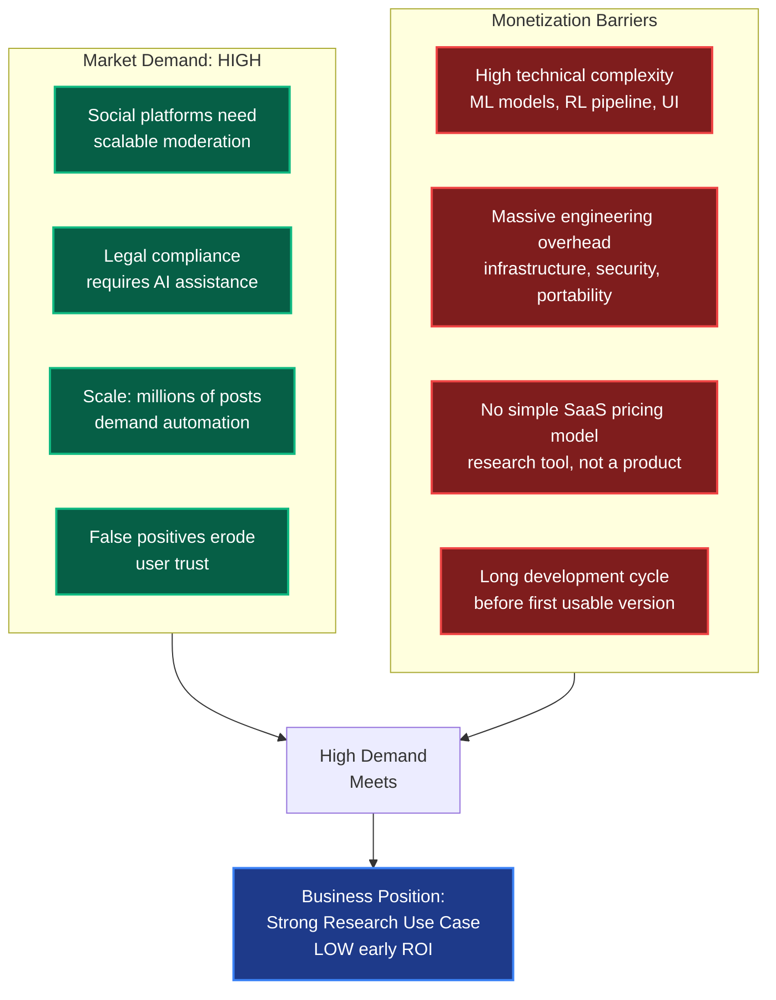

| Business Dimension       | Assessment                                                                           |
| ------------------------ | ------------------------------------------------------------------------------------ |
| **Market Demand**        | HIGH — social platforms urgently need scalable, accurate content moderation.         |
| **Complexity**           | HIGH — tiered tasks, ML integration, RL grading, infrastructure overhaul.           |
| **Early ROI**            | LOW — harder to monetize early; no immediate SaaS revenue path.                     |
| **Best Use**             | Strong research use case — academic, T&S team training, RL experimentation.         |

---

## Comparative Business Evaluation

The business context of TrustOps-Env is best understood by comparing it against the alternative project ideas evaluated alongside it. The sources provide a direct comparison matrix that reveals exactly why TrustOps is positioned differently from conventional SaaS products.

### The FINAL CONCLUSION Matrix

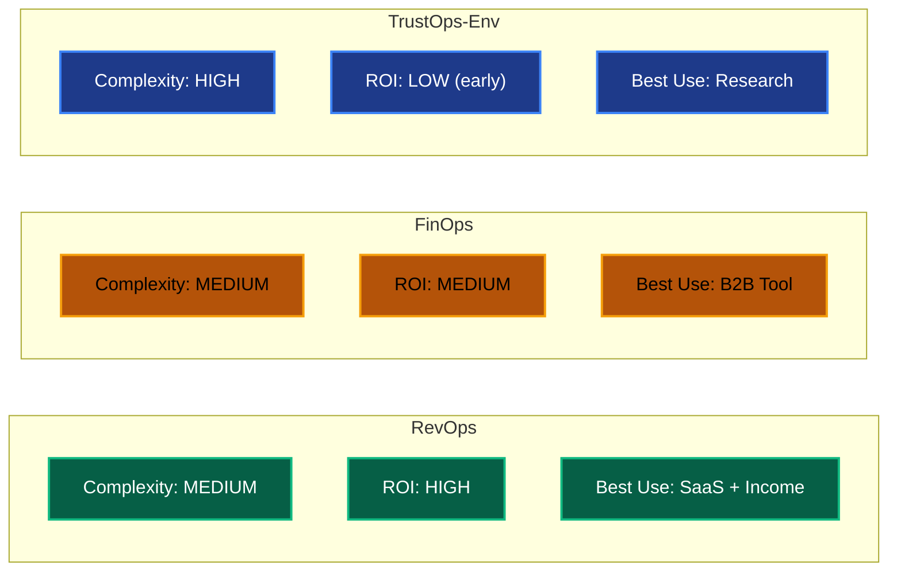

| Project         | Complexity  | ROI             | Best Use           | Monetization Path                        | Time to Revenue     |
| --------------- | :---------: | :-------------: | :----------------: | ---------------------------------------- | :-----------------: |
| **RevOps**      | Medium      | HIGH            | SaaS + Income      | Monthly subscriptions, immediate cashflow.| Weeks to months     |
| **FinOps**      | Medium      | MEDIUM          | B2B Tool           | Enterprise licensing, per-seat pricing.   | Months              |
| **TrustOps-Env**| **HIGH**    | **LOW (early)** | **Research**       | Academic licensing, grants, long-term.    | **Months to years** |

> **The Defining Contrast:** RevOps and FinOps both offer medium complexity with immediate or near-term commercial returns. TrustOps-Env sits at the opposite end — its high complexity demands extensive upfront engineering before the platform is even functional, and its value is realized through long-term research impact rather than short-term revenue generation.

---

### Why TrustOps Diverges from the SaaS Model

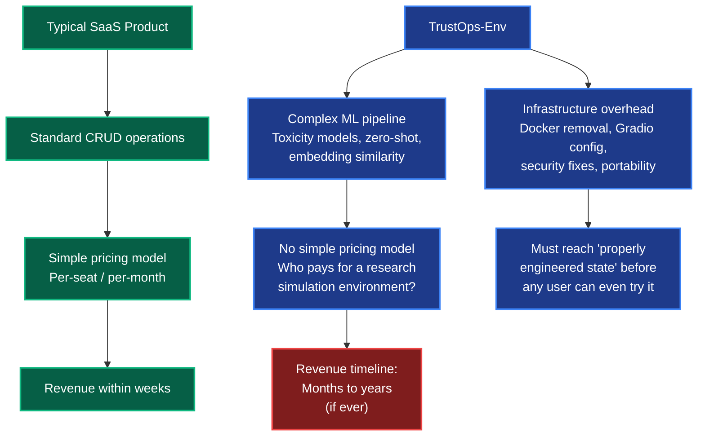

| SaaS Characteristic              | RevOps / FinOps                              | TrustOps-Env                                                   |
| -------------------------------- | -------------------------------------------- | --------------------------------------------------------------- |
| **User onboarding**              | Sign up, start using immediately.            | Clone repo, set up env vars, configure API tokens.              |
| **Pricing model**                | Simple monthly/annual subscription.          | No clear pricing — research grants, academic licenses.          |
| **Value delivery**               | Instant — solves a known business problem.   | Gradual — reveals insights through extended experimentation.    |
| **Target audience**              | Business teams, revenue operators.           | AI researchers, T&S teams, policy analysts.                     |
| **Revenue predictability**       | High — recurring subscription revenue.       | Low — dependent on grants, institutional adoption.              |

---

## ROI: Low (Early Stage) — Deep Dive

The "LOW (early)" Return on Investment is the most commercially significant assessment of TrustOps-Env. Despite operating in a high-demand market, the project cannot generate immediate financial returns because the engineering investment required to build, deploy, and maintain the system far exceeds any near-term revenue opportunity.

### Why the ROI is Low

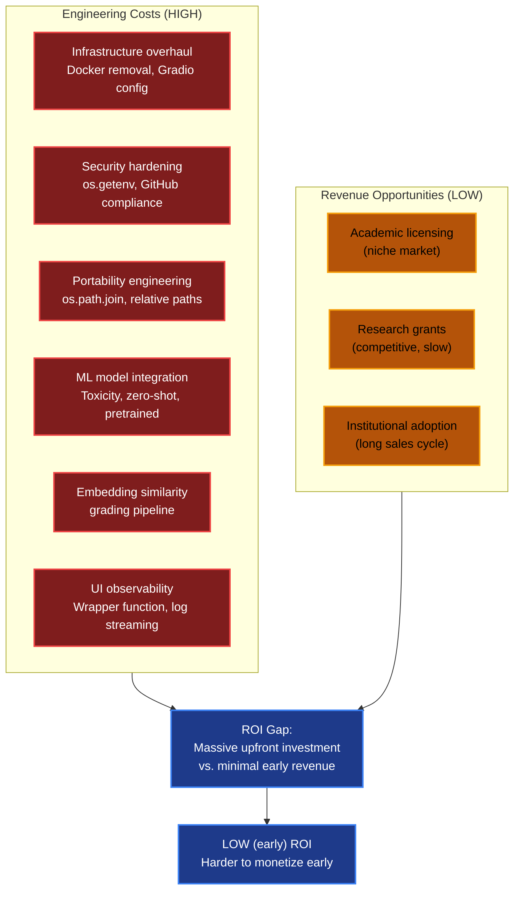

**The Cost-Revenue Imbalance:**

| Cost Category                      | Engineering Effort Required                                                           | Revenue Generated          |
| ---------------------------------- | ------------------------------------------------------------------------------------- | :------------------------: |
| **Infrastructure overhaul**        | Delete Docker, configure `sdk: gradio`, establish Python runtime.                     | $0                         |
| **Security hardening**             | Remove hardcoded tokens, implement `os.getenv`, full keyword audit.                   | $0                         |
| **Portability engineering**        | Replace absolute paths with `os.path.join` dynamic resolution.                        | $0                         |
| **ML model integration**           | Integrate HuggingFace toxicity models, zero-shot classifiers, pretrained baselines.   | $0                         |
| **Grading pipeline**               | Build rule-based + embedding similarity grading across EASY/MEDIUM/HARD tiers.        | $0                         |
| **UI observability**               | Build Gradio wrapper function, implement START/STEP/END log streaming.                | $0                         |
| **Reward system**                  | Design +0.5/+0.3/+0.2/-0.2/-0.1 scoring architecture with asymmetric penalties.      | $0                         |
| **TOTAL**                          | Months of intensive engineering.                                                       | **$0 (early stage)**       |

> **The Business Reality:** Every single engineering component described in the project documentation — from fixing the Docker runtime to building the embedding similarity grader — represents pure cost with zero immediate revenue. The ROI is low not because the product lacks value, but because the value is **deferred** — realized through long-term research impact and institutional adoption rather than monthly subscription fees.

### When ROI Begins to Materialize

The "LOW (early)" designation implies that ROI is expected to improve over time as the research community adopts and validates the platform.

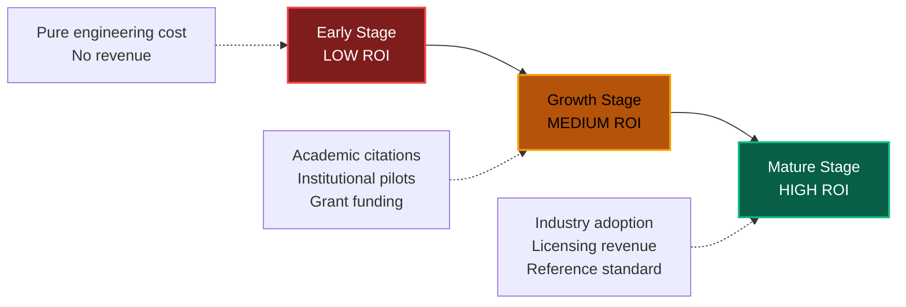

| Stage          | Timeline        | Revenue Sources                                      | ROI Level |
| -------------- | --------------- | ---------------------------------------------------- | :-------: |
| **Early**      | 0-6 months      | None — pure engineering investment.                  | LOW       |
| **Growth**     | 6-18 months     | Research grants, academic partnerships, pilot users. | MEDIUM    |
| **Mature**     | 18+ months      | Industry licensing, T&S team subscriptions, standard.| HIGH      |

---

## Complexity: High — Deep Dive

The "High" complexity assessment is the single most impactful factor shaping TrustOps-Env's business context. It simultaneously creates the project's research value (deep, rigorous evaluation) and its commercial challenge (expensive, slow to build).

### Drivers of High Complexity

The complexity is driven by two reinforcing categories: **operational demands** and **technical overhead**.

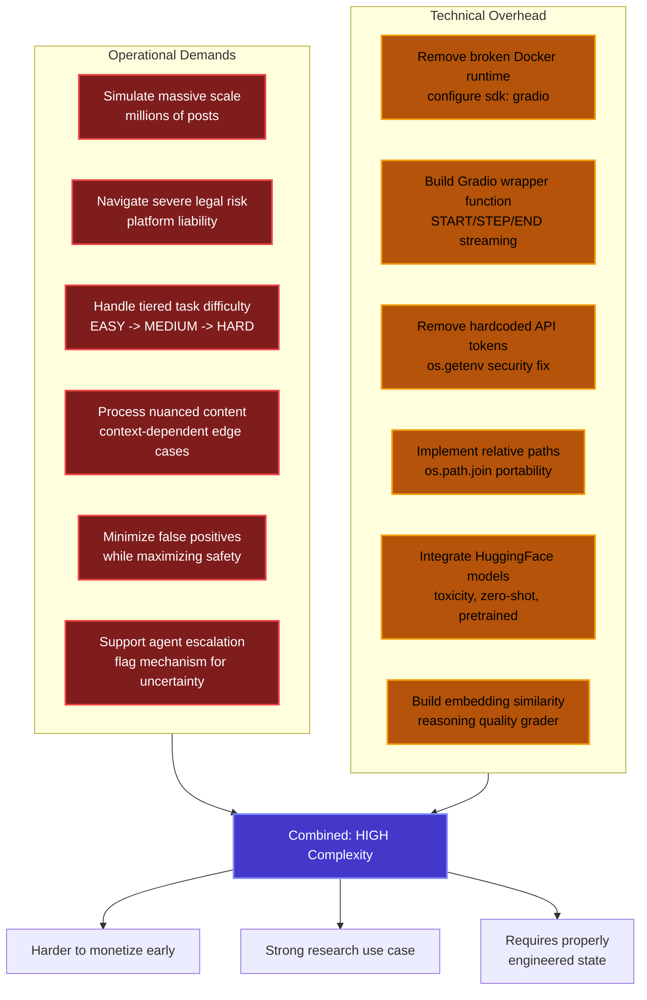

**Operational Complexity Breakdown:**

| Operational Demand               | Why It Adds Complexity                                                                     |
| -------------------------------- | ------------------------------------------------------------------------------------------ |
| **Scale simulation**             | Must model the pressure of millions of posts — queue management, episode length design.    |
| **Legal risk modeling**          | Reward system must reflect real-world legal consequences via asymmetric penalties.          |
| **Tiered task difficulty**       | Three distinct evaluation tiers each requiring different grading mechanisms.                |
| **Context-dependent content**    | HARD tasks demand embedding similarity — computationally expensive, hard to implement.     |
| **False positive minimization**  | Dual penalty system (-0.2 FN / -0.1 FP) requires careful calibration.                     |
| **Escalation mechanics**         | `flag` action must be strategically incentivized through reward system math.               |

**Technical Complexity Breakdown:**

| Technical Component               | Engineering Effort                                                                        |
| ---------------------------------- | ----------------------------------------------------------------------------------------- |
| **Infrastructure overhaul**        | Delete hidden Dockerfile, configure Python/Gradio stack, remove `time.sleep()` hacks.     |
| **UI observability**               | Build async wrapper function to stream backend logs without blocking the event loop.      |
| **Security fixes**                 | Remove `hf_QOGz...` token, implement `os.getenv("HF_TOKEN")`, conduct full audit.        |
| **Portability fixes**              | Replace `/Users/anubhavgupta/...` with `os.path.join` dynamic resolution.                 |
| **ML model integration**           | Connect to HuggingFace Hub for three distinct model types (toxicity, zero-shot, pretrained).|
| **Advanced grading**               | Implement cosine similarity comparison between agent and expert reasoning embeddings.     |

> **The Complexity-Value Paradox:** The same features that make TrustOps-Env difficult and expensive to build are exactly what make it valuable as a research tool. A simpler system — one that only tested binary spam detection — would be easy to build but would have minimal research value. The high complexity is not a flaw; it is the source of the project's research significance.

### Complexity Comparison — TrustOps vs Alternatives

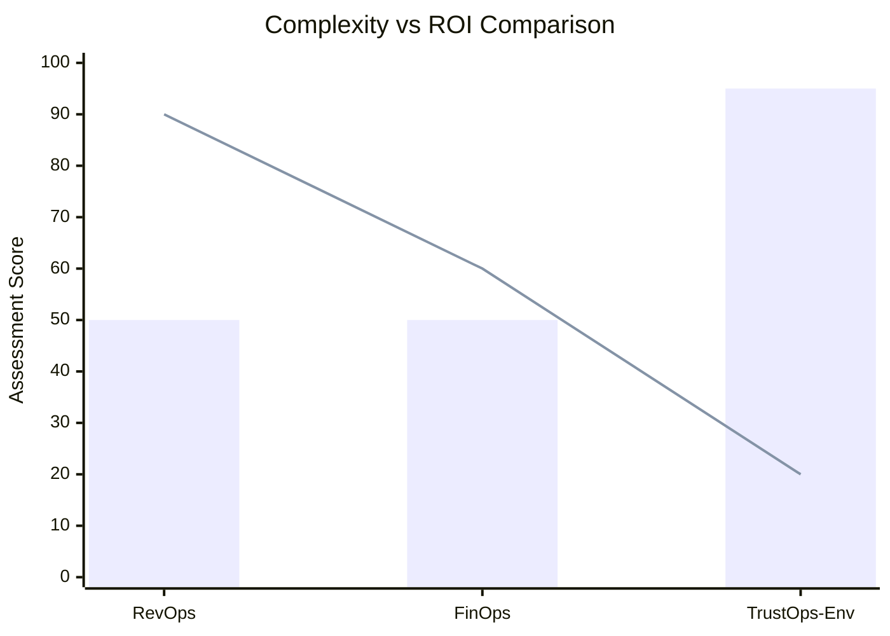

*Bar = Complexity | Line = Early ROI*

The chart illustrates the inverse relationship between complexity and early ROI. As complexity increases, the path to early monetization narrows — but the potential for long-term research and institutional value increases.

---

## Use Case: Research — Deep Dive

The definitive business conclusion positions TrustOps-Env's **"Best Use"** as **"Research"**. This is not a compromise or a failure to find commercial viability — it is the natural outcome of a system designed to rigorously test AI capabilities under extreme constraints.

### Why Research is the Best Use

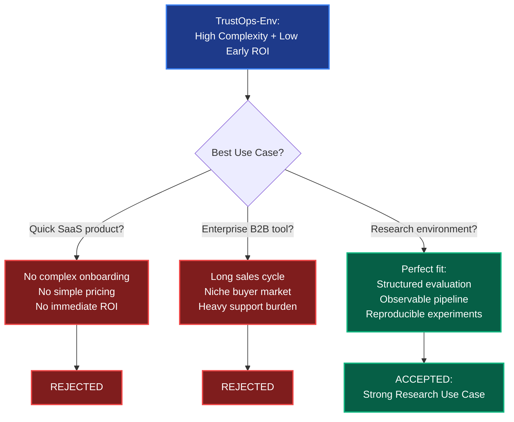

**Who Uses TrustOps-Env for Research:**

| Researcher Type                    | How They Use TrustOps-Env                                                           |
| ---------------------------------- | ------------------------------------------------------------------------------------ |
| **AI/ML Researchers**              | Train and evaluate RL agents on content moderation under structured reward systems.  |
| **Trust & Safety Teams**           | Simulate moderation scenarios to test policy enforcement without risking real users.  |
| **Policy Analysts**                | Observe how AI handles edge cases to inform platform policy development.             |
| **Ethics Researchers**             | Study bias, false negative asymmetry, and ethical implications of automated moderation.|
| **Academic Institutions**          | Use as a standardized benchmark for RL research in safety-critical domains.          |

### Research Value Proposition

What TrustOps-Env offers that no commercial SaaS product can:

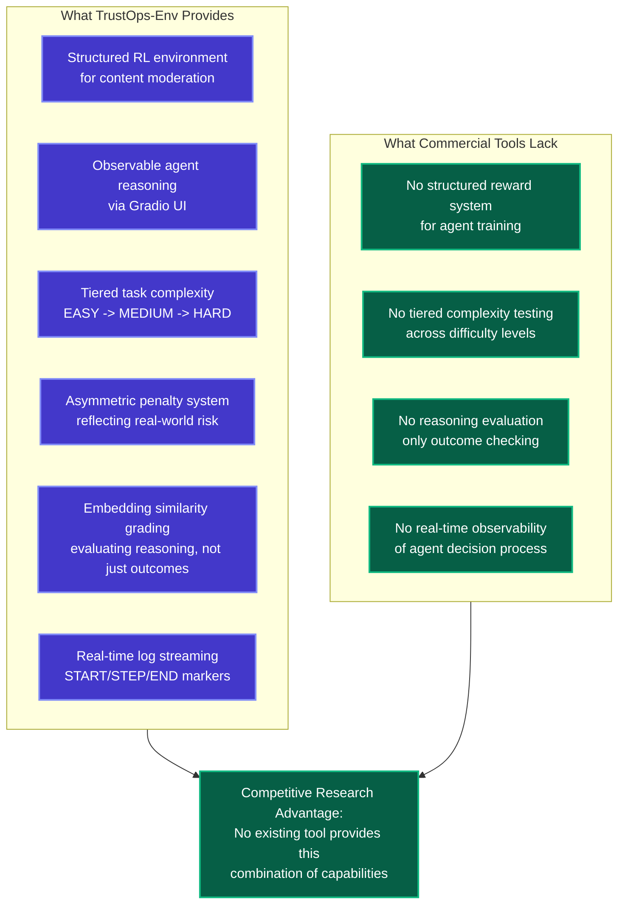

| Value Dimension                    | Detail                                                                              |
| ---------------------------------- | ----------------------------------------------------------------------------------- |
| **Structured RL Environment**      | Provides a complete simulation loop (Content → Observation → Action → Reward).      |
| **Observable Decision Pipeline**   | Every agent step is visible via START/STEP/END log streaming on Gradio dashboard.   |
| **Tiered Evaluation**              | Tests across EASY/MEDIUM/HARD with adaptive grading (rule-based → embedding).       |
| **Safety-First Design**            | Asymmetric penalties (-0.2 FN > -0.1 FP) encode real-world safety priorities.       |
| **Reasoning Assessment**           | Embedding similarity evaluates *how* agents think, not just *what* they decide.     |
| **Open-Source Accessibility**      | Freely available — any institution can clone, deploy, and experiment.               |

> **The Fundamental Trade-off:** TrustOps-Env is not designed to be a quick-to-market SaaS product. Its value is realized through rigorous academic research, long-term capability building for Trust & Safety teams, and advancing the state of the art in AI-driven content moderation. The high complexity is the price of genuine research depth — and it is exactly this depth that makes the project a "Strong research use case."

---

## Production & Optimization — Bridging Research and Deployment

Despite being positioned for research rather than commercial SaaS, the system still required transformation into a **"production based most optimised form"** and a **"properly engineered state"** to be usable by anyone — including researchers.

### The Production Optimization Path

```mermaid
flowchart LR
    classDef broken fill:#7F1D1D,stroke:#EF4444,stroke-width:2px,color:#fff
    classDef fix fill:#1E3A8A,stroke:#3B82F6,stroke-width:2px,color:#fff
    classDef production fill:#065F46,stroke:#10B981,stroke-width:2px,color:#fff

    subgraph Before ["Broken State"]
        B1["Hidden Dockerfile\nforces Docker runtime"]
        B2["Blank UI\nno visibility"]
        B3["Hardcoded API token\nhf_QOGz..."]
        B4["Hardcoded local path\n/Users/anubhavgupta/..."]
    end

    subgraph Optimization ["Engineering Optimization"]
        O1["Delete Dockerfile\nconfigure sdk: gradio"]
        O2["Build wrapper function\nSTART/STEP/END streaming"]
        O3["Implement os.getenv\nHF_TOKEN from environment"]
        O4["Implement os.path.join\ndynamic relative paths"]
    end

    subgraph After ["Production State"]
        A1["Clean Python/Gradio\nruntime"]
        A2["Observable Gradio\ndashboard"]
        A3["Secure credential\nmanagement"]
        A4["Cross-machine\nportability"]
    end

    Before --> Optimization --> After

    class B1,B2,B3,B4 broken
    class O1,O2,O3,O4 fix
    class A1,A2,A3,A4 production
```

| Optimization Area            | What Changed                                         | Business Impact                                          |
| ---------------------------- | ---------------------------------------------------- | -------------------------------------------------------- |
| **Runtime Configuration**    | Docker → Python/Gradio (`sdk: gradio`)               | Platform actually renders a visible UI for researchers.  |
| **UI Observability**         | Blank page → Real-time log streaming                 | Researchers can observe agent reasoning live.            |
| **Security**                 | Hardcoded token → `os.getenv("HF_TOKEN")`            | GitHub push unblocked; code can be open-sourced.        |
| **Portability**              | Absolute path → `os.path.join` relative              | Any researcher on any machine can clone and deploy.     |

> **The Business Prerequisite:** None of the research value described in this document could be realized without first achieving the "properly engineered state." A broken deployment that shows a blank screen, leaks credentials, and crashes on non-developer machines has zero research value — regardless of how sophisticated the underlying AI evaluation pipeline is. The production optimization was the mandatory business prerequisite for the research use case to exist.

---

## ER Diagram — Business Context System

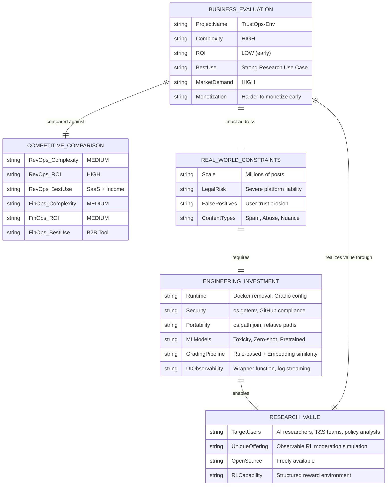

---

## Impact on the Broader System

The Business Context directly informs and is informed by every other documented component of TrustOps-Env:

| This Document Section             | Connects To                                             | Relationship                                                            |
| --------------------------------- | ------------------------------------------------------- | ----------------------------------------------------------------------- |
| **Market Demand**                 | [Core Concept](./core_concept.md)                       | Real-world moderation challenges drive the demand assessment.           |
| **High Complexity**               | [Technical Architecture](./Technical_Architecture.md)   | Tiered tasks, ML integration, and RL pipeline drive complexity up.      |
| **Production Optimization**       | [Security & Portability](./securityandportability.md)   | Infrastructure hardening was mandatory before any value could be realized.|
| **UI Observability**              | [UI](./UI.md)                                           | Without observable UI, research use case cannot function.               |
| **Evaluation Depth**              | [Evaluation & Research](./EvaluationandResearch.md)     | The depth of evaluation creates research value but also cost.           |
| **Low Early ROI**                 | All documents                                           | Every engineering effort represents cost with deferred return.          |
| **Research Use Case**             | All documents                                           | The entire system's purpose is validated through this business position.|

> **The Complete Business Picture:** TrustOps-Env occupies a unique position in the market — it addresses high-demand content moderation challenges with a rigorous, research-grade simulation environment, but its high complexity and specialized audience make traditional SaaS monetization impractical in the early stages. Its value is strategic and long-term: advancing the science of AI-driven moderation, training Trust & Safety teams, and establishing a reference standard for evaluating content moderation agents. The "Strong research use case" designation is not a limitation — it is the project's definitive competitive advantage.
