---

# TrustOps-Env : Evaluation & Research

---

## Overview

This document details the **Research & Evaluation** framework that positions TrustOps-Env as a rigorous, academically valuable simulation environment. It covers the structured **Task Complexity** tiers that define what the agent faces, the **Grading Metrics** that measure how well the agent performs, the **Evaluation Metrics** that quantify agent intelligence through the reward system, and the **Challenges** that researchers must navigate when using and extending the system.

> While the [Core Concept](./core_concept.md) covers the project's problem statement and strategic positioning, the [Technical Architecture](./Technical_Architecture.md) details the data models and evaluation pipeline internals, the [UI](./UI.md) explains observability, and [Security & Portability](./securityandportability.md) documents the deployment hardening — this document focuses on the **research-facing evaluation framework**: how task difficulty drives grading method selection, how the reward system quantifies agent intelligence, and what inherent limitations and risks researchers must account for.

---

## Task Complexity — The Research Foundation

Task Complexity is the organizing principle of the entire TrustOps-Env evaluation system. The environment explicitly structures its content moderation challenges into **three escalating tiers** — EASY, MEDIUM, and HARD — each testing progressively deeper cognitive capabilities in the AI agent.

This tiered complexity is precisely what makes the project a **"Strong research use case"**. Because the overall project is categorized as having "High" complexity, evaluating the agent's performance requires mechanisms that can dynamically adapt to the difficulty of the task it is handling.

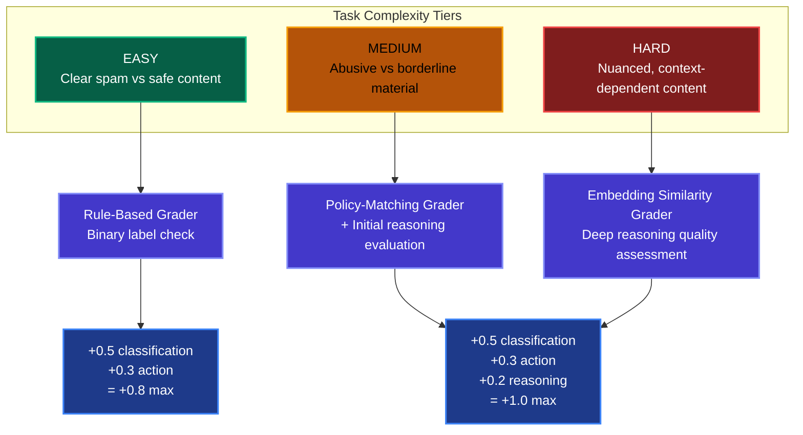
```mermaid
flowchart TD
    classDef easy fill:#065F46,stroke:#10B981,stroke-width:2px,color:#fff
    classDef medium fill:#B45309,stroke:#F59E0B,stroke-width:2px,color:#000
    classDef hard fill:#7F1D1D,stroke:#EF4444,stroke-width:2px,color:#fff
    classDef grader fill:#4338CA,stroke:#818CF8,stroke-width:2px,color:#fff
    classDef reward fill:#1E3A8A,stroke:#3B82F6,stroke-width:2px,color:#fff

    subgraph TaskTiers ["Task Complexity Tiers"]
        T1["EASY\nClear spam vs safe content"]
        T2["MEDIUM\nAbusive vs borderline material"]
        T3["HARD\nNuanced, context-dependent content"]
    end

    T1 --> G1["Rule-Based Grader\nBinary label check"]
    T2 --> G2["Policy-Matching Grader\n+ Initial reasoning evaluation"]
    T3 --> G3["Embedding Similarity Grader\nDeep reasoning quality assessment"]

    G1 --> R1["+0.5 classification\n+0.3 action\n= +0.8 max"]
    G2 --> R2["+0.5 classification\n+0.3 action\n+0.2 reasoning\n= +1.0 max"]
    G3 --> R2

    class T1 easy
    class T2 medium
    class T3 hard
    class G1,G2,G3 grader
    class R1,R2 reward
```

| Tier        | Content Type                       | Cognitive Demand           | Grading Method          | Max Reward | Escalation Probability |
| ----------- | ---------------------------------- | -------------------------- | ----------------------- | :--------: | :--------------------: |
| **EASY**    | Clear spam vs. safe content        | Binary classification      | Rule-based              | `+0.8`     | ~0%                    |
| **MEDIUM**  | Abusive vs. borderline material    | Policy-aware reasoning     | Policy-matching         | `+1.0`     | ~30-50%                |
| **HARD**    | Nuanced, context-dependent content | Deep contextual analysis   | Embedding similarity    | `+1.0`     | ~60-80%                |

> **Why Three Tiers?** Real-world content moderation is not a uniform problem — some decisions are trivially obvious (spam), some require policy expertise (borderline abuse), and some demand deep cultural and contextual understanding (coded language, satire, whistleblower content). Testing an agent on only one tier would produce misleading evaluation results. The three-tier structure ensures the research evaluation captures the **full spectrum of moderation difficulty**.

---

### EASY: Spam vs Safe

The EASY tier is the **baseline evaluation level** — the agent must distinguish between clear spam and clearly safe content. This tier tests the fundamental mechanics of the moderation pipeline: can the agent correctly classify, select the right action, and log its decision?

**Content Characteristics:**

| Attribute              | Detail                                                                             |
| ---------------------- | ---------------------------------------------------------------------------------- |
| **Content Type**       | Obvious spam (scam links, ALL CAPS promotions) vs. clearly safe (casual posts).    |
| **Ambiguity Level**    | None — the correct answer is unambiguously clear.                                  |
| **Agent Challenge**    | Binary classification; minimal reasoning required.                                 |
| **Expected Actions**   | `approve` (safe) or `remove` (spam). `flag` is rarely appropriate at this tier.    |
| **Grading Method**     | Rule-based label matching — straightforward binary check.                          |

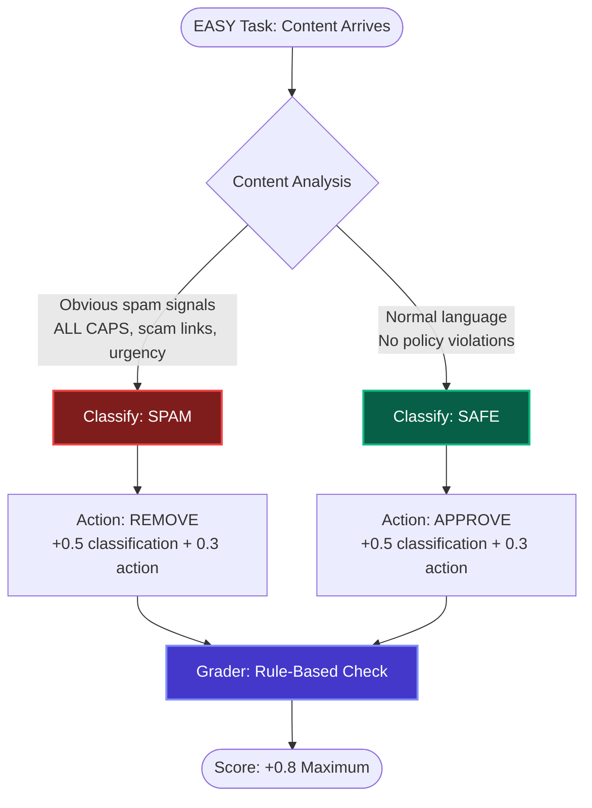
```mermaid
flowchart TD
    classDef spam fill:#7F1D1D,stroke:#EF4444,stroke-width:2px,color:#fff
    classDef safe fill:#065F46,stroke:#10B981,stroke-width:2px,color:#fff
    classDef grader fill:#4338CA,stroke:#818CF8,stroke-width:2px,color:#fff

    A([EASY Task: Content Arrives]) --> B{Content Analysis}

    B -->|"Obvious spam signals\nALL CAPS, scam links, urgency"| C["Classify: SPAM"]
    B -->|"Normal language\nNo policy violations"| D["Classify: SAFE"]

    C --> E["Action: REMOVE\n+0.5 classification + 0.3 action"]
    D --> F["Action: APPROVE\n+0.5 classification + 0.3 action"]

    E --> G["Grader: Rule-Based Check"]
    F --> G
    G --> H([Score: +0.8 Maximum])

    class C spam
    class D safe
    class G grader
```

**Reward Mechanics at EASY:**

| Outcome                             | Score   | Description                                               |
| ----------------------------------- | ------- | --------------------------------------------------------- |
| Correctly identify & remove spam    | `+0.8`  | `+0.5` classification + `+0.3` action.                    |
| Correctly identify & approve safe   | `+0.8`  | `+0.5` classification + `+0.3` action.                    |
| Allow spam to pass (false negative) | `-0.2`  | Even easy spam failures trigger the heaviest penalty.     |
| Block safe content (false positive) | `-0.1`  | Over-moderation — less severe but still penalized.         |

> **Research Purpose:** Mastering EASY spam filtering proves the agent can handle the fundamental mechanics of the pipeline — classifying, acting, and logging — before being tested on the ambiguous, high-risk edge cases of higher tiers. An agent that fails at EASY tasks has no business attempting MEDIUM or HARD content.

---

### MEDIUM: Abusive vs Borderline

The MEDIUM tier introduces the **first true layer of subjective ambiguity** into the research evaluation. The agent must differentiate between explicitly abusive content and borderline material that approaches — but does not necessarily violate — platform safety thresholds.

**Content Characteristics:**

| Attribute              | Detail                                                                                  |
| ---------------------- | --------------------------------------------------------------------------------------- |
| **Content Type**       | Outright abuse (direct threats, slurs) vs. borderline (aggressive tone, sarcasm).       |
| **Ambiguity Level**    | Moderate — intent, tone, and context blur the line between safe and harmful.             |
| **Agent Challenge**    | Requires policy knowledge and contextual interpretation; tone and sarcasm matter.       |
| **Expected Actions**   | All three actions are viable. `flag` becomes strategically critical at this tier.        |
| **Grading Method**     | Policy-matching + initial reasoning quality evaluation.                                 |

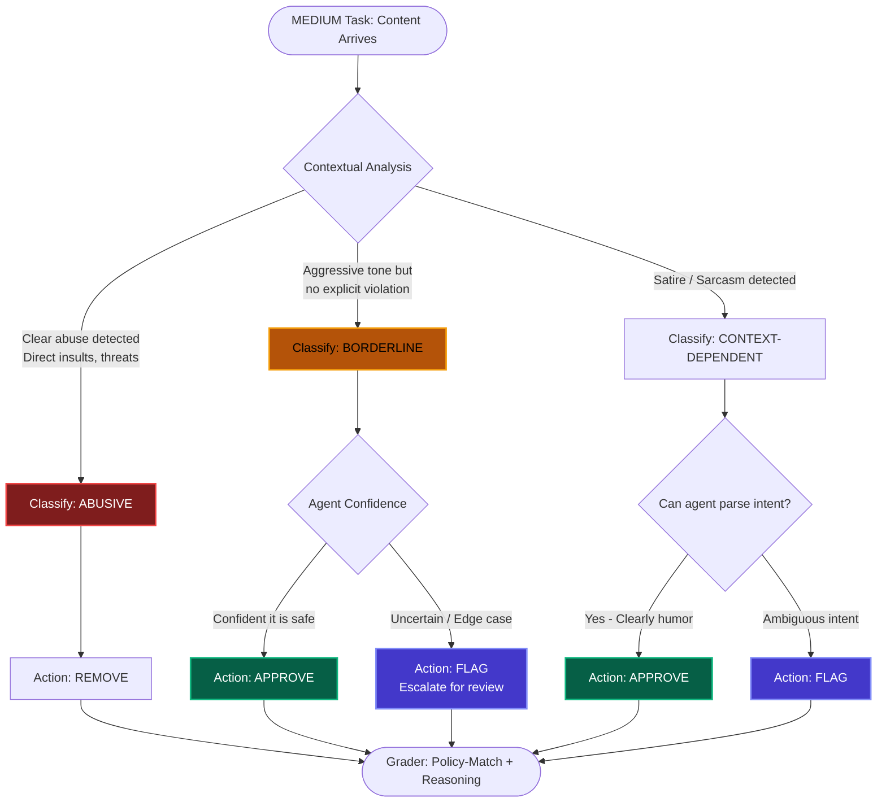
```mermaid
flowchart TD
    classDef abuse fill:#7F1D1D,stroke:#EF4444,stroke-width:2px,color:#fff
    classDef borderline fill:#B45309,stroke:#F59E0B,stroke-width:2px,color:#000
    classDef escalate fill:#4338CA,stroke:#818CF8,stroke-width:2px,color:#fff
    classDef safe fill:#065F46,stroke:#10B981,stroke-width:2px,color:#fff

    A([MEDIUM Task: Content Arrives]) --> B{Contextual Analysis}

    B -->|"Clear abuse detected\nDirect insults, threats"| C["Classify: ABUSIVE"]
    C --> D["Action: REMOVE"]

    B -->|"Aggressive tone but\nno explicit violation"| E["Classify: BORDERLINE"]
    E --> F{Agent Confidence}
    F -->|"Confident it is safe"| G["Action: APPROVE"]
    F -->|"Uncertain / Edge case"| H["Action: FLAG\nEscalate for review"]

    B -->|"Satire / Sarcasm detected"| I["Classify: CONTEXT-DEPENDENT"]
    I --> J{Can agent parse intent?}
    J -->|"Yes - Clearly humor"| K["Action: APPROVE"]
    J -->|"Ambiguous intent"| L["Action: FLAG"]

    D --> M([Grader: Policy-Match + Reasoning])
    G --> M
    H --> M
    K --> M
    L --> M

    class C abuse
    class E borderline
    class H,L escalate
    class G,K safe
```

**Why MEDIUM is the Critical Research Bridge:**

The MEDIUM tier is the evaluation tier where the agent's true capabilities begin to emerge. It sits at the intersection of two fundamentally different evaluation paradigms:

| Transition Direction | From                                              | To                                                        |
| -------------------- | ------------------------------------------------- | --------------------------------------------------------- |
| **Upward from EASY** | Definitive binary answers; rule-based grading.    | Subjective ambiguity; policy knowledge required.          |
| **Downward from HARD**| Fully context-dependent; embedding-based grading.| Initial training ground for ambiguity and escalation.     |

**The Escalation Trigger:**

When navigating MEDIUM content, the agent encounters its first genuine dilemma between making a definitive binary decision and the safer option of escalation. The reward system's asymmetric penalties make this tier the training ground for learning *when* to flag:

- Approving borderline abuse → risk of `-0.2` false negative (harmful allowed).
- Removing borderline safe content → risk of `-0.1` false positive (user trust erosion).
- Flagging uncertain content → `0.0` penalty risk (safe escalation to human review).

> **Research Significance:** MEDIUM tasks are where researchers can observe whether the agent has developed **policy fluency** — the ability to apply nuanced platform rules rather than relying on surface-level pattern matching. An agent that correctly flags borderline sarcasm demonstrates genuine evaluative capability, not just spam-detection mechanics.

---

### HARD: Nuanced Context

The HARD tier represents the **peak of evaluation complexity** — the agent must process content where meaning and intent can only be determined through deep cultural, linguistic, and situational awareness. There are no clear-cut answers at this tier.

**Content Characteristics:**

| Attribute              | Detail                                                                                  |
| ---------------------- | --------------------------------------------------------------------------------------- |
| **Content Type**       | Cultural expressions, coded language, whistleblower content, context-dependent toxicity. |
| **Ambiguity Level**    | Very High — meaning depends entirely on context, culture, and subtext.                  |
| **Agent Challenge**    | Demands deep contextual reasoning, cultural sensitivity, and understanding of subtext.  |
| **Expected Actions**   | `flag` is strategically optimal. `approve`/`remove` carry severe risk.                  |
| **Grading Method**     | Embedding similarity for reasoning quality evaluation.                                  |

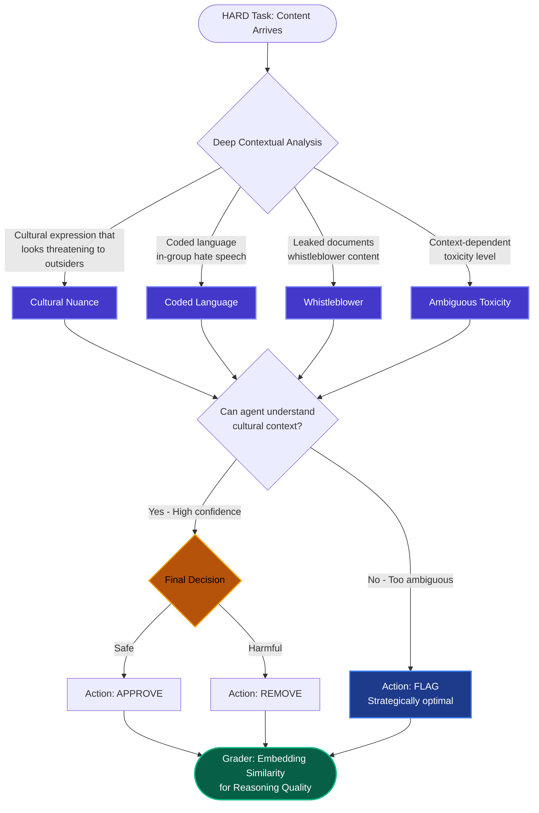
```mermaid
flowchart TD
    classDef nuance fill:#4338CA,stroke:#818CF8,stroke-width:2px,color:#fff
    classDef decision fill:#B45309,stroke:#F59E0B,stroke-width:2px,color:#000
    classDef flag fill:#1E3A8A,stroke:#3B82F6,stroke-width:2px,color:#fff
    classDef grader fill:#065F46,stroke:#10B981,stroke-width:2px,color:#fff

    A([HARD Task: Content Arrives]) --> B{Deep Contextual Analysis}

    B -->|"Cultural expression that\nlooks threatening to outsiders"| C["Cultural Nuance"]
    B -->|"Coded language\nin-group hate speech"| D["Coded Language"]
    B -->|"Leaked documents\nwhistleblower content"| E["Whistleblower"]
    B -->|"Context-dependent\ntoxicity level"| F["Ambiguous Toxicity"]

    C --> G{Can agent understand\ncultural context?}
    D --> G
    E --> G
    F --> G

    G -->|"Yes - High confidence"| H{Final Decision}
    H -->|Safe| I["Action: APPROVE"]
    H -->|Harmful| J["Action: REMOVE"]

    G -->|"No - Too ambiguous"| K["Action: FLAG\nStrategically optimal"]

    I --> L([Grader: Embedding Similarity\nfor Reasoning Quality])
    J --> L
    K --> L

    class C,D,E,F nuance
    class H decision
    class K flag
    class L grader
```

**The Reasoning Quality Premium (+0.2):**

For HARD tasks, the `+0.2` reasoning quality bonus becomes the most architecturally significant metric. Unlike EASY tasks where a rule-based grader simply checks the label, HARD tasks are evaluated using **embedding similarity scoring** — the system compares the agent's reasoning chain against expert-level reasoning embeddings.

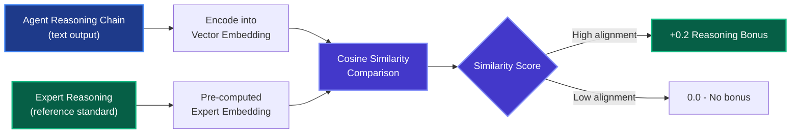
```mermaid
flowchart LR
    classDef agent fill:#1E3A8A,stroke:#3B82F6,stroke-width:2px,color:#fff
    classDef expert fill:#065F46,stroke:#10B981,stroke-width:2px,color:#fff
    classDef eval fill:#4338CA,stroke:#818CF8,stroke-width:2px,color:#fff

    A["Agent Reasoning Chain\n(text output)"] --> B["Encode into\nVector Embedding"]
    C["Expert Reasoning\n(reference standard)"] --> D["Pre-computed\nExpert Embedding"]

    B --> E["Cosine Similarity\nComparison"]
    D --> E

    E --> F{Similarity Score}
    F -->|"High alignment"| G["+0.2 Reasoning Bonus"]
    F -->|"Low alignment"| H["0.0 - No bonus"]

    class A agent
    class C expert
    class E,F eval
    class G expert
```

| Grading Dimension      | Method                    | What It Evaluates                                          |
| ---------------------- | ------------------------- | ---------------------------------------------------------- |
| **Classification**     | Label match               | Did the agent categorize the content correctly?            |
| **Action**             | Policy alignment          | Did the agent take the right operational step?             |
| **Reasoning Quality**  | Embedding similarity      | *How* did the agent reason? Does it demonstrate understanding? |

> **Why Embedding Similarity for HARD Tasks?** The system does not merely check if the agent's answer is right — it evaluates whether the agent's thought process aligns with expert-level reasoning. An agent that gets the right answer by luck scores lower than an agent that demonstrates genuine contextual understanding. This is what makes TrustOps-Env a **reinforcement learning research environment**, not just a test bench.

---

### Task Complexity — Comparative Progression

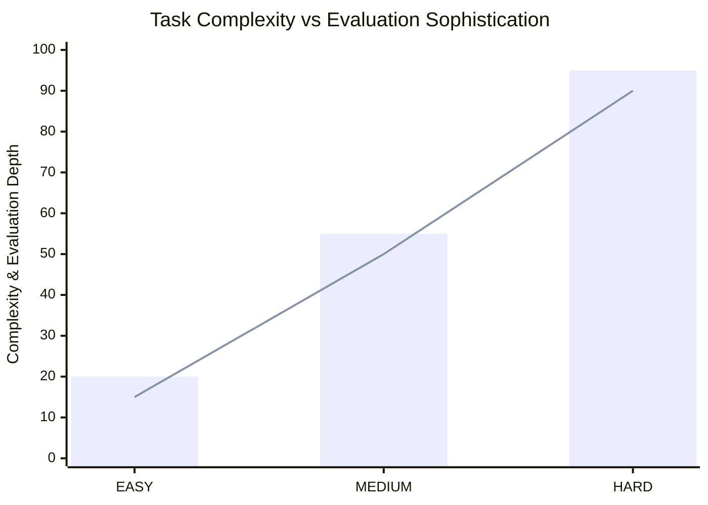
```mermaid
xychart-beta
title "Task Complexity vs Evaluation Sophistication"
x-axis ["EASY", "MEDIUM", "HARD"]
y-axis "Complexity & Evaluation Depth" 0 --> 100
bar [20, 55, 95]
line [15, 50, 90]
```

| Metric                       | EASY        | MEDIUM           | HARD                    |
| ---------------------------- | ----------- | ---------------- | ----------------------- |
| **Content Ambiguity**        | None        | Moderate         | Very High               |
| **Reasoning Required**       | Minimal     | Policy-aware     | Deep contextual         |
| **Optimal Action Spread**    | Binary      | All three        | Heavily favors `flag`   |
| **Grading Method**           | Rule-based  | Policy-matching  | Embedding similarity    |
| **Reasoning Bonus Impact**   | None        | Initial          | Critical (+0.2)         |
| **Escalation Probability**   | ~0%         | ~30-50%          | ~60-80%                 |
| **Risk of Wrong Decision**   | Low         | Medium           | Very High               |
| **Research Value**           | Baseline    | Policy fluency   | Cognitive depth         |

---

## Grading Metrics — The Evaluation Engine

Grading Metrics are the specific technical mechanisms used to evaluate the AI agent's performance. They serve as the foundation for the simulation's broader Research & Evaluation goals — without accurate grading, the entire reward system produces meaningless data.

The grading architecture is not monolithic — it **dynamically adapts** based on the complexity of the task being evaluated.

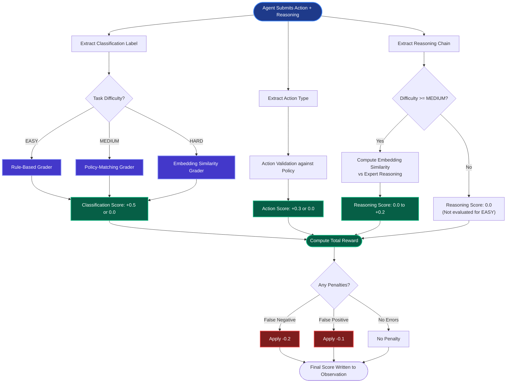
```mermaid
flowchart TD
    classDef input fill:#1E3A8A,stroke:#3B82F6,stroke-width:2px,color:#fff
    classDef grader fill:#4338CA,stroke:#818CF8,stroke-width:2px,color:#fff
    classDef score fill:#065F46,stroke:#10B981,stroke-width:2px,color:#fff
    classDef penalty fill:#7F1D1D,stroke:#EF4444,stroke-width:2px,color:#fff

    A([Agent Submits Action + Reasoning]) --> B["Extract Classification Label"]
    A --> C["Extract Action Type"]
    A --> D["Extract Reasoning Chain"]

    B --> E{Task Difficulty?}

    E -->|EASY| F["Rule-Based Grader"]
    E -->|MEDIUM| G["Policy-Matching Grader"]
    E -->|HARD| H["Embedding Similarity Grader"]

    F --> I["Classification Score: +0.5 or 0.0"]
    G --> I
    H --> I

    C --> J["Action Validation against Policy"]
    J --> K["Action Score: +0.3 or 0.0"]

    D --> L{Difficulty >= MEDIUM?}
    L -->|Yes| M["Compute Embedding Similarity\nvs Expert Reasoning"]
    L -->|No| N["Reasoning Score: 0.0\n(Not evaluated for EASY)"]
    M --> O["Reasoning Score: 0.0 to +0.2"]

    I --> P([Compute Total Reward])
    K --> P
    O --> P
    N --> P

    P --> Q{Any Penalties?}
    Q -->|False Negative| R["Apply -0.2"]
    Q -->|False Positive| S["Apply -0.1"]
    Q -->|No Errors| T["No Penalty"]

    R --> U([Final Score Written to Observation])
    S --> U
    T --> U

    class A input
    class F,G,H grader
    class I,K,O,P score
    class R,S penalty
```

---

### Rule-Based Logic

Rule-based logic is the foundational grading mechanism — the designated evaluator for **straightforward, clear-cut moderation decisions** found in the EASY tier.

**How Rule-Based Grading Works:**

The grader compares the agent's output label against the known ground truth using a **deterministic binary check**. There is no interpretation, no similarity scoring, no reasoning evaluation — the answer is either right or wrong.

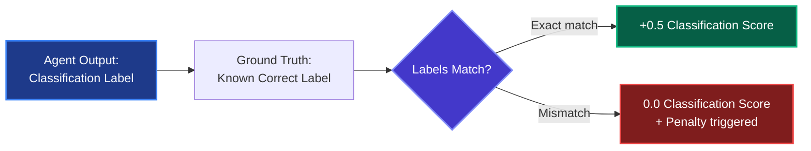
```mermaid
flowchart LR
    classDef input fill:#1E3A8A,stroke:#3B82F6,stroke-width:2px,color:#fff
    classDef check fill:#4338CA,stroke:#818CF8,stroke-width:2px,color:#fff
    classDef correct fill:#065F46,stroke:#10B981,stroke-width:2px,color:#fff
    classDef wrong fill:#7F1D1D,stroke:#EF4444,stroke-width:2px,color:#fff

    A["Agent Output:\nClassification Label"] --> B["Ground Truth:\nKnown Correct Label"]

    B --> C{Labels Match?}
    C -->|"Exact match"| D["+0.5 Classification Score"]
    C -->|"Mismatch"| E["0.0 Classification Score\n+ Penalty triggered"]

    class A input
    class C check
    class D correct
    class E wrong
```

| Aspect                    | Rule-Based Grader                                                  |
| ------------------------- | ------------------------------------------------------------------ |
| **Used For**              | EASY tasks — clear spam vs. safe content.                          |
| **Method**                | Deterministic label matching against ground truth.                 |
| **Reasoning Evaluated?**  | No — reasoning is not assessed at this tier.                       |
| **Speed**                 | Instant — simple comparison, no model inference required.          |
| **Limitation**            | Cannot handle ambiguity, subjectivity, or context-dependent content.|

**Why Rule-Based Grading is Sufficient for EASY Tasks:**

EASY tasks have **unambiguous, objectively correct answers**. Content is either clearly spam ("BUY FOLLOWERS NOW!!!") or clearly safe ("Had a great lunch today"). There is no grey area that requires interpretation. A rule-based grader efficiently handles this binary evaluation, freeing the more computationally expensive embedding similarity mechanism for tasks that genuinely require it.

> **Architectural Efficiency:** By deploying rule-based logic for clear-cut decisions, the system avoids wasting computational resources on trivial evaluations. This functional baseline allows the architecture to **reserve embedding similarity** specifically for the subjective reasoning quality assessments required by MEDIUM and HARD tasks.

---

### Embedding Similarity

Embedding similarity is the **advanced evaluation technique** used to measure the agent's reasoning quality on MEDIUM and HARD tasks. It is the mechanism that transforms TrustOps-Env from a simple pass/fail test into a genuine research environment capable of evaluating *how* the agent thinks.

**How Embedding Similarity Grading Works:**

1. The agent's reasoning chain (text output) is encoded into a vector embedding.
2. Expert-level reasoning for the same content is pre-computed as a reference embedding.
3. The system computes the **cosine similarity** between the two embeddings.
4. If the similarity exceeds the configured threshold, the agent earns the `+0.2` reasoning quality bonus.

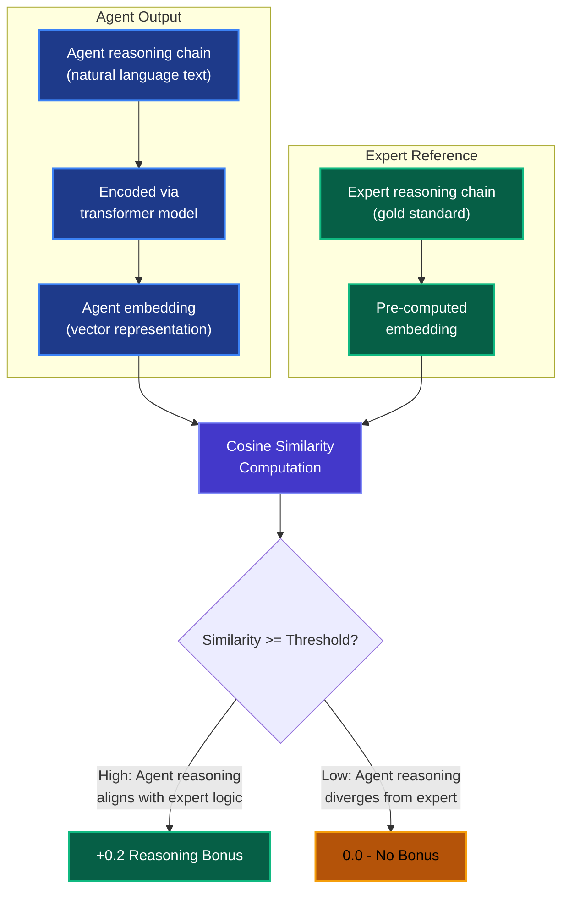
```mermaid
flowchart TD
    classDef agent fill:#1E3A8A,stroke:#3B82F6,stroke-width:2px,color:#fff
    classDef expert fill:#065F46,stroke:#10B981,stroke-width:2px,color:#fff
    classDef compute fill:#4338CA,stroke:#818CF8,stroke-width:2px,color:#fff
    classDef result fill:#B45309,stroke:#F59E0B,stroke-width:2px,color:#000

    subgraph AgentSide ["Agent Output"]
        A1["Agent reasoning chain\n(natural language text)"]
        A2["Encoded via\ntransformer model"]
        A3["Agent embedding\n(vector representation)"]
        A1 --> A2 --> A3
    end

    subgraph ExpertSide ["Expert Reference"]
        E1["Expert reasoning chain\n(gold standard)"]
        E2["Pre-computed\nembedding"]
        E1 --> E2
    end

    A3 --> SIM["Cosine Similarity\nComputation"]
    E2 --> SIM

    SIM --> T{Similarity >= Threshold?}
    T -->|"High: Agent reasoning\naligns with expert logic"| R1["+0.2 Reasoning Bonus"]
    T -->|"Low: Agent reasoning\ndiverges from expert"| R2["0.0 - No Bonus"]

    class A1,A2,A3 agent
    class E1,E2 expert
    class SIM compute
    class R1 expert
    class R2 result
```

**Rule-Based vs Embedding Similarity — Comparative Analysis:**

| Dimension                  | Rule-Based Grader                          | Embedding Similarity Grader                          |
| -------------------------- | ------------------------------------------ | ---------------------------------------------------- |
| **Applied To**             | EASY tasks                                 | MEDIUM + HARD tasks                                  |
| **Evaluates**              | Whether the answer is correct.             | Whether the reasoning process is correct.            |
| **Method**                 | Deterministic label match.                 | Semantic vector comparison via cosine similarity.    |
| **Reasoning Assessed?**    | No                                         | Yes — full reasoning chain evaluation.               |
| **Computational Cost**     | Negligible                                 | High — requires embedding model inference.           |
| **Can Handle Ambiguity?**  | No                                         | Yes — captures semantic meaning, not just labels.    |
| **Max Additional Reward**  | 0.0 (no reasoning bonus)                  | +0.2 (reasoning quality bonus)                       |

**ML Models Supporting Embedding Similarity:**

The embedding similarity grader does not operate in isolation — it is supported by the HuggingFace ML integration layer that provides the baseline models for comparison:

| Model Component           | Role in Embedding Similarity Evaluation                                     |
| ------------------------- | --------------------------------------------------------------------------- |
| **Toxicity Model**        | Provides baseline toxicity scores for content — agent must match or exceed. |
| **Zero-Shot Classifier**  | Tests generalization — can the agent evaluate unseen content categories?    |
| **Pretrained Classifier** | Baseline reference — the agent must outperform this standard model.        |

> **Research Significance:** Embedding similarity is the grading mechanism that gives TrustOps-Env its research value. Without it, the environment could only test *what* the agent decides — not *why* it decides it. By evaluating the reasoning process itself, researchers can distinguish between agents that achieve correct outcomes through genuine understanding versus those that achieve them through surface-level pattern matching or luck.

---

### Grading Metrics — Observability

The grading metrics are only valuable for research if they are **visible to the researcher**. As documented in the [UI](./UI.md) and [Technical Architecture](./Technical_Architecture.md), the developer heavily optimized the platform to enhance research visibility.

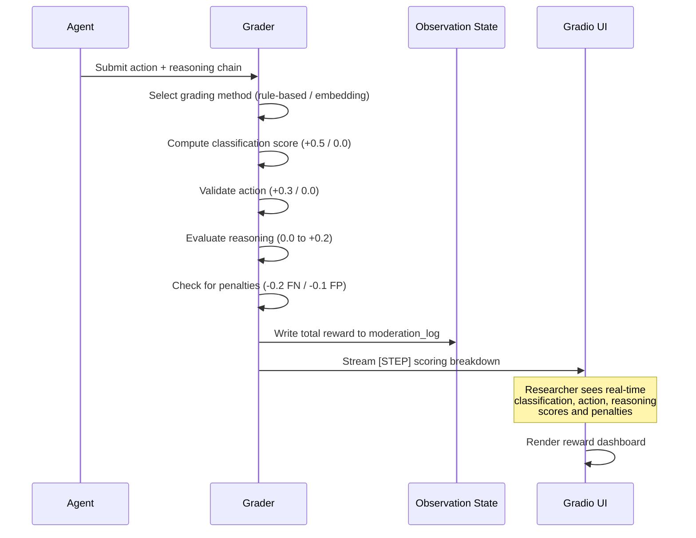
```mermaid
sequenceDiagram
    participant AGT as Agent
    participant GRD as Grader
    participant OBS as Observation State
    participant UI as Gradio UI

    AGT->>GRD: Submit action + reasoning chain
    GRD->>GRD: Select grading method (rule-based / embedding)
    GRD->>GRD: Compute classification score (+0.5 / 0.0)
    GRD->>GRD: Validate action (+0.3 / 0.0)
    GRD->>GRD: Evaluate reasoning (0.0 to +0.2)
    GRD->>GRD: Check for penalties (-0.2 FN / -0.1 FP)
    GRD->>OBS: Write total reward to moderation_log
    GRD->>UI: Stream [STEP] scoring breakdown
    Note over UI: Researcher sees real-time<br/>classification, action, reasoning<br/>scores and penalties
    UI->>UI: Render reward dashboard
```

By configuring the clean `sdk: gradio` runtime and building the custom wrapper function, the developer ensured that the agent's step-by-step logic and performance metrics are visibly rendered on the user interface as `[START]`, `[STEP]`, and `[END]` markers — guaranteeing that grading metrics are fully observable for real-time research and debugging.

---
---

## Evaluation Metrics — The Reward System as Content Moderation Assessment

Evaluation Metrics are the mathematically structured scoring components within TrustOps-Env's strict **Reward** system. While the Grading Metrics section above describes *how* the system evaluates (rule-based vs. embedding similarity), this section details *what* the system evaluates — the specific operational capabilities being scored and the penalties that enforce real-world platform safety constraints.

The evaluation metrics are designed to assess how well the AI agent fulfills its primary content moderation objectives: to **classify content**, **decide on an action**, and **escalate uncertain edge cases** — all under the immense pressure of managing massive scale, avoiding legal risk, and minimizing false positives.

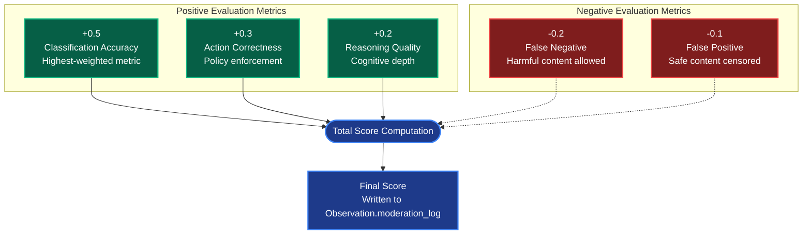
```mermaid
flowchart TD
    classDef positive fill:#065F46,stroke:#10B981,stroke-width:2px,color:#fff
    classDef penalty fill:#7F1D1D,stroke:#EF4444,stroke-width:2px,color:#fff
    classDef total fill:#1E3A8A,stroke:#3B82F6,stroke-width:2px,color:#fff

    subgraph Rewards ["Positive Evaluation Metrics"]
        R1["+0.5\nClassification Accuracy\nHighest-weighted metric"]
        R2["+0.3\nAction Correctness\nPolicy enforcement"]
        R3["+0.2\nReasoning Quality\nCognitive depth"]
    end

    subgraph Penalties ["Negative Evaluation Metrics"]
        P1["-0.2\nFalse Negative\nHarmful content allowed"]
        P2["-0.1\nFalse Positive\nSafe content censored"]
    end

    R1 --> T([Total Score Computation])
    R2 --> T
    R3 --> T
    P1 -.-> T
    P2 -.-> T

    T --> O["Final Score\nWritten to Observation.moderation_log"]

    class R1,R2,R3 positive
    class P1,P2 penalty
    class T,O total
```

| Metric                        | Weight  | Type     | Evaluated Across        | What It Measures                                        |
| ----------------------------- | ------- | -------- | ----------------------- | ------------------------------------------------------- |
| **Classification Accuracy**   | `+0.5`  | Reward   | All tiers               | Can the agent correctly identify content nature?        |
| **Action Correctness**        | `+0.3`  | Reward   | All tiers               | Does the agent enforce the right operational response?  |
| **Reasoning Quality**         | `+0.2`  | Reward   | MEDIUM + HARD only      | Does the agent demonstrate genuine understanding?       |
| **False Negative Penalty**    | `-0.2`  | Penalty  | All tiers               | Did the agent allow harmful content to pass?            |
| **False Positive Penalty**    | `-0.1`  | Penalty  | All tiers               | Did the agent wrongly censor safe content?              |

---

### Classification Accuracy (+0.5) — The Foundation Metric

Classification accuracy carries the **highest reward weight** in the entire evaluation system at `+0.5` — mathematically valued higher than action correctness (+0.3) and reasoning quality (+0.2). This scoring hierarchy reflects that accurately assessing the true nature of the content is the agent's **foundational, primary objective** — it must correctly classify before it can properly act or reason.

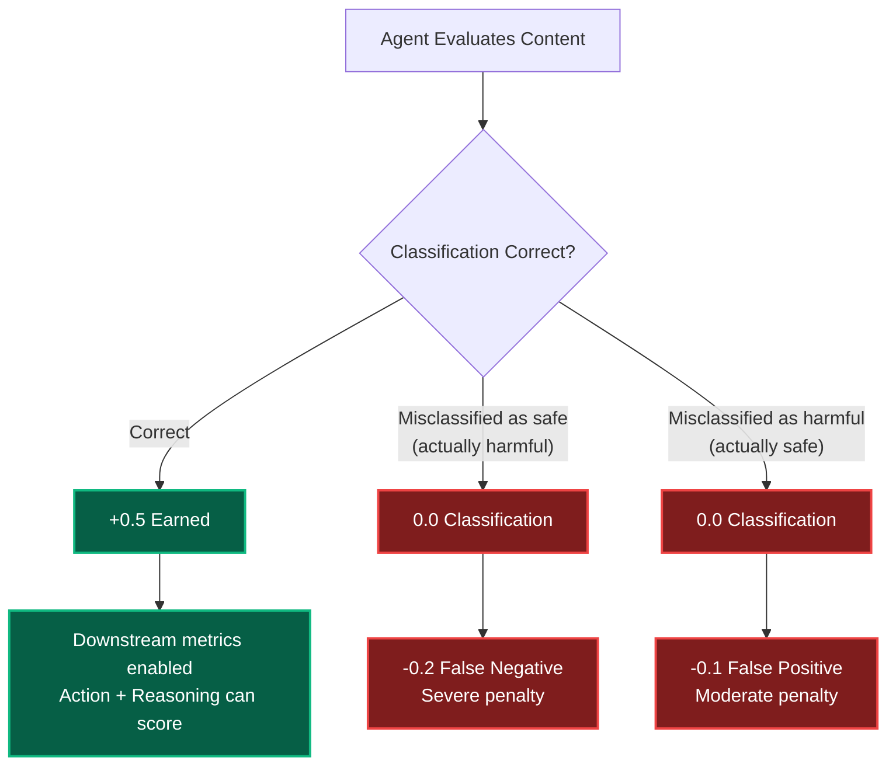
```mermaid
flowchart TD
    classDef classify fill:#065F46,stroke:#10B981,stroke-width:2px,color:#fff
    classDef downstream fill:#1E3A8A,stroke:#3B82F6,stroke-width:2px,color:#fff
    classDef penalty fill:#7F1D1D,stroke:#EF4444,stroke-width:2px,color:#fff

    A["Agent Evaluates Content"] --> B{Classification Correct?}

    B -->|"Correct"| C["+0.5 Earned"]
    C --> D["Downstream metrics enabled\nAction + Reasoning can score"]

    B -->|"Misclassified as safe\n(actually harmful)"| E["0.0 Classification"]
    E --> F["-0.2 False Negative\nSevere penalty"]

    B -->|"Misclassified as harmful\n(actually safe)"| G["0.0 Classification"]
    G --> H["-0.1 False Positive\nModerate penalty"]

    class C,D classify
    class E,F penalty
    class G,H penalty
```

**Why +0.5 is the Highest Weight:**

Classification is the **prerequisite for everything else** in the evaluation pipeline. If the agent misclassifies content, the entire downstream evaluation collapses:
- A wrong classification leads to a wrong action → no +0.3 earned.
- A wrong classification invalidates reasoning → no +0.2 earned.
- A wrong classification triggers penalties → -0.2 FN or -0.1 FP applied.

**How Classification Accuracy is Measured:**

| Task Level | Method                             | Baseline Models Used                                      |
| ---------- | ---------------------------------- | --------------------------------------------------------- |
| **EASY**   | Rule-based label matching          | Pretrained classifier as basic reference.                 |
| **MEDIUM** | Policy-matching against rules      | HF toxicity model + zero-shot classifier.                 |
| **HARD**   | Embedding similarity evaluation    | All baselines: toxicity, zero-shot, pretrained + expert.  |

> **The Mathematical Reality:** Achieving high classification accuracy is the only way the agent can avoid the environment's severe penalties. The +0.5 reward for correct classification represents 50% of the maximum possible score — making it the single most impactful metric in determining agent quality.

---

### Action Correctness (+0.3) — The Enforcement Metric

Action correctness evaluates whether the agent **executed the right operational response** — choosing `approve`, `remove`, or `flag` — after classifying the content. At +0.3, it is the second-highest positive metric, positioned between classification (+0.5) and reasoning (+0.2).

**The Scoring Hierarchy:**

The +0.3 reward for correct action is deliberately weighted below classification (+0.5) because action is a **downstream consequence** of understanding. While taking the right operational action is critical, accurately categorizing the content in the first place remains the highest-weighted priority.

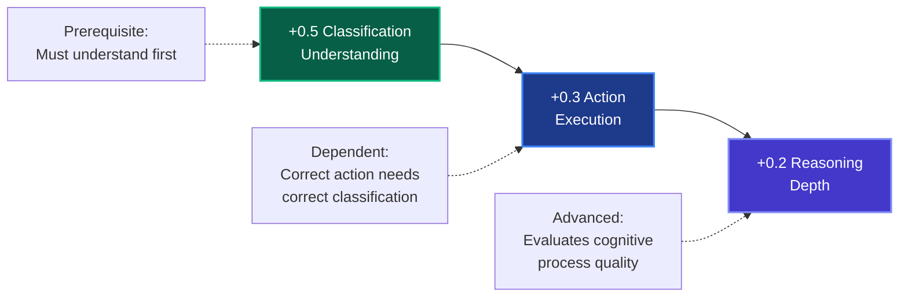
```mermaid
flowchart LR
    classDef high fill:#065F46,stroke:#10B981,stroke-width:2px,color:#fff
    classDef mid fill:#1E3A8A,stroke:#3B82F6,stroke-width:2px,color:#fff
    classDef low fill:#4338CA,stroke:#818CF8,stroke-width:2px,color:#fff

    A["+0.5 Classification\nUnderstanding"] --> B["+0.3 Action\nExecution"] --> C["+0.2 Reasoning\nDepth"]

    A2["Prerequisite:
Must understand first"] -.-> A
    B2["Dependent:\nCorrect action needs\ncorrect classification"] -.-> B
    C2["Advanced:\nEvaluates cognitive\nprocess quality"] -.-> C

    class A high
    class B mid
    class C low
```

**Action Outcomes and Their Scores:**

| Classification Result       | Agent Action | Action Score | Outcome                                           |
| --------------------------- | ------------ | :----------: | ------------------------------------------------- |
| Correctly identified safe   | `approve`    | `+0.3` ✅     | Correct enforcement — safe content passes.        |
| Correctly identified harm   | `remove`     | `+0.3` ✅     | Correct enforcement — dangerous content removed.  |
| Correctly sensed ambiguity  | `flag`       | `+0.3` ✅     | Correct escalation — edge case safely routed.     |
| Misclassified → wrong action| any          | `0.0`        | Wrong enforcement — penalty cascade triggered.    |

**The Penalty Counterbalance:**

The true necessity of action correctness is underscored by the heavy penalties the metrics impose when the agent makes an incorrect operational choice:

- Incorrectly approving harmful content → `-0.2` false negative penalty (the most severe).
- Incorrectly removing safe content → `-0.1` false positive penalty.
- Correctly flagging uncertain content → `0.0` penalty (safe escalation).

> **Evaluating Operational Mandates:** The +0.3 action correctness metric directly evaluates whether the AI agent is fulfilling its core operational mandates — to "decide action" and "escalate uncertain cases." By granting points for appropriate actions, particularly the strategic use of `flag` for edge cases, the metrics measure how well the agent enforces platform policies without triggering failure penalties.

---

### Reasoning Quality (+0.2) — The Cognitive Depth Metric

Reasoning quality is the most specialized evaluation metric in the reward system. At +0.2, it is the lowest-weighted positive metric — but it is architecturally the **most significant** because it evaluates *how* the agent thinks, not just *what* it decides.

**When Reasoning Quality is Evaluated:**

| Task Tier  | Reasoning Evaluated? | Why                                                                      |
| ---------- | :------------------: | ------------------------------------------------------------------------ |
| **EASY**   | ❌ No                | Clear-cut tasks have unambiguous answers — reasoning adds no insight.    |
| **MEDIUM** | ✅ Initial           | Borderline cases require policy-aware logic to navigate ambiguity.       |
| **HARD**   | ✅ Full              | Context-dependent nuance demands deep comprehension — the +0.2 is critical. |

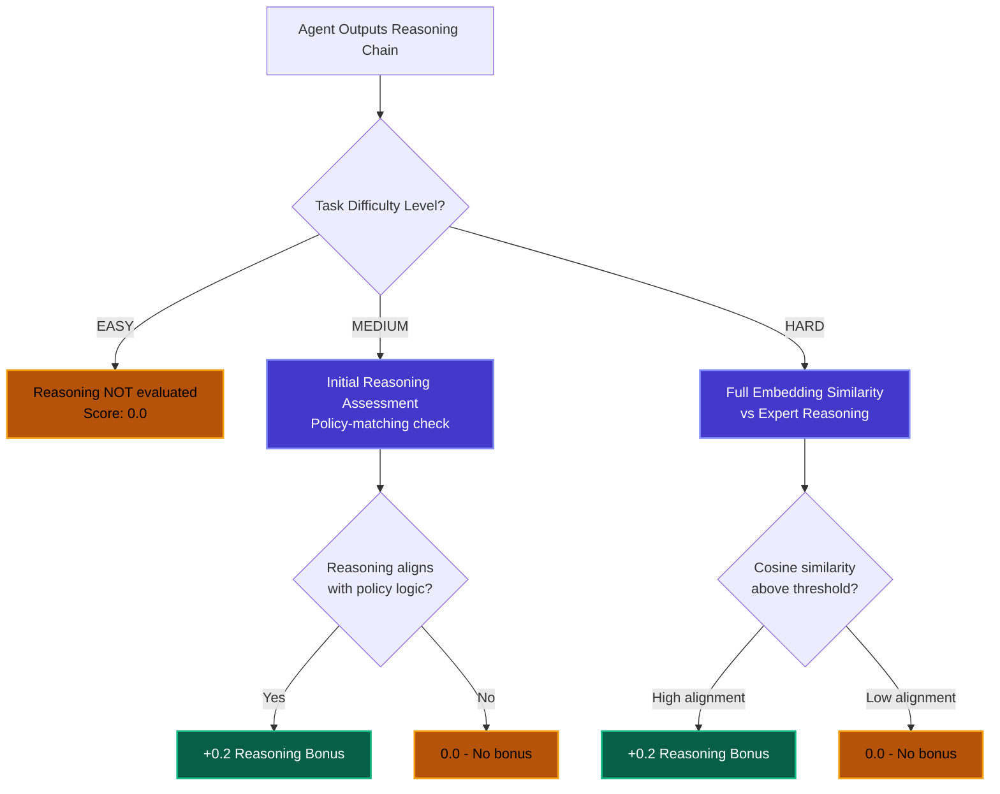
```mermaid
flowchart TD
    classDef eval fill:#4338CA,stroke:#818CF8,stroke-width:2px,color:#fff
    classDef reward fill:#065F46,stroke:#10B981,stroke-width:2px,color:#fff
    classDef noreward fill:#B45309,stroke:#F59E0B,stroke-width:2px,color:#000

    A["Agent Outputs Reasoning Chain"] --> B{Task Difficulty Level?}

    B -->|EASY| C["Reasoning NOT evaluated\nScore: 0.0"]
    B -->|MEDIUM| D["Initial Reasoning Assessment\nPolicy-matching check"]
    B -->|HARD| E["Full Embedding Similarity\nvs Expert Reasoning"]

    D --> F{Reasoning aligns\nwith policy logic?}
    F -->|Yes| G["+0.2 Reasoning Bonus"]
    F -->|No| H["0.0 - No bonus"]

    E --> I{Cosine similarity\nabove threshold?}
    I -->|High alignment| J["+0.2 Reasoning Bonus"]
    I -->|Low alignment| K["0.0 - No bonus"]

    class D,E eval
    class G,J reward
    class C,H,K noreward
```

**Observability of the Reasoning Process:**

Emphasizing reasoning quality drove significant engineering optimizations. The developer overhauled the broken HuggingFace Space deployment to use a clean Python + Gradio stack (`sdk: gradio`) and implemented a custom wrapper function specifically so that the agent's step-by-step reasoning — the very logic being graded — is visibly rendered on the user interface as `[START]`, `[STEP]`, and `[END]` markers.

This ensures researchers can **observe the reasoning process in real-time**, not just the final score — making the +0.2 reasoning quality metric a transparent, auditable component of the evaluation rather than a hidden backend calculation.

> **Why +0.2 is Architecturally Significant Despite Being the Lowest Weight:** The +0.2 metric is what separates TrustOps-Env from a simple classification test. Without reasoning evaluation, the system could only measure outcomes — correct or incorrect. With it, the system measures **understanding** — whether the agent genuinely comprehends context or merely pattern-matches to correct answers. This is the metric that makes TrustOps-Env a reinforcement learning research environment.

---

### False Negative Penalty (-0.2) — The Safety Enforcement Metric

The false negative penalty is the **most severe metric** in the entire evaluation system. At -0.2, it is triggered whenever the agent incorrectly allows harmful material to remain on the platform ("harmful allowed") — and it is **twice as harsh** as the false positive penalty (-0.1).

**Why -0.2 is Twice as Harsh as -0.1:**

This asymmetric penalty structure directly reflects the severe **legal risk** and broader **ethical/legal implications** that real social platforms face if they fail to detect and remove dangerous content.

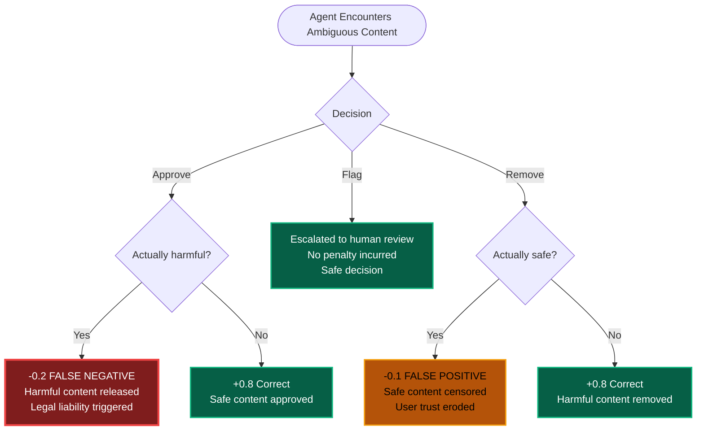
```mermaid
flowchart TD
    classDef severe fill:#7F1D1D,stroke:#EF4444,stroke-width:3px,color:#fff
    classDef moderate fill:#B45309,stroke:#F59E0B,stroke-width:2px,color:#000
    classDef safe fill:#065F46,stroke:#10B981,stroke-width:2px,color:#fff

    A([Agent Encounters Ambiguous Content]) --> B{Decision}

    B -->|"Approve"| C{Actually harmful?}
    C -->|Yes| D["-0.2 FALSE NEGATIVE\nHarmful content released\nLegal liability triggered"]
    C -->|No| E["+0.8 Correct\nSafe content approved"]

    B -->|"Flag"| F["Escalated to human review\nNo penalty incurred\nSafe decision"]

    B -->|"Remove"| G{Actually safe?}
    G -->|Yes| H["-0.1 FALSE POSITIVE\nSafe content censored\nUser trust eroded"]
    G -->|No| I["+0.8 Correct\nHarmful content removed"]

    class D severe
    class H moderate
    class E,F,I safe
```

| Failure Type       | Penalty | Severity | Real-World Consequence                                                |
| ------------------ | :-----: | :------: | --------------------------------------------------------------------- |
| **False Negative** | `-0.2`  | 🔴 High  | Harmful content reaches users — legal liability, platform destruction.|
| **False Positive** | `-0.1`  | 🟡 Med   | Safe content wrongly removed — user frustration, censorship claims.   |

**How the False Negative Penalty Shapes Agent Behavior:**

The constant threat of -0.2 fundamentally shapes the agent's decision-making strategy across all task tiers:

1. **EASY tasks:** The agent can make confident binary decisions — content is unambiguously clear.
2. **MEDIUM tasks:** If content sits on a policy boundary, the agent is **mathematically incentivized to flag** rather than risk approving potential harm.
3. **HARD tasks:** The escalation incentive is strongest — the cost of guessing wrong (-0.2) far exceeds the cost of flagging (0.0).

> **The Escalation Incentive:** Because false negatives (-0.2) are penalized more heavily than the absence of a positive reward (+0.3 forgone by flagging instead of approving), the agent is naturally incentivized to escalate uncertain cases rather than guess. This ensures the system errs toward safety — directly mirroring how production-grade moderation pipelines operate at major platforms.

---

### Evaluation Metrics — Complete Scoring Matrix

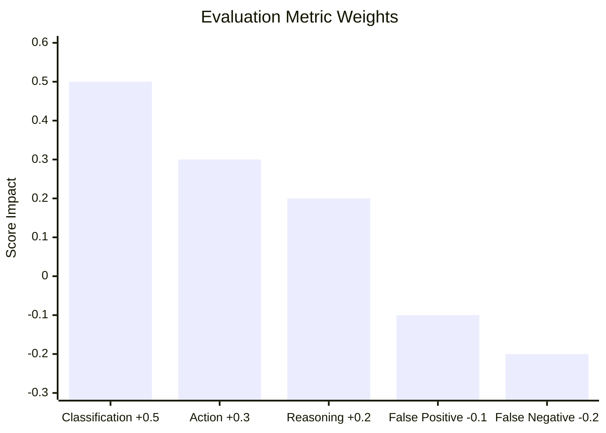
```mermaid
xychart-beta
title "Evaluation Metric Weights"
x-axis ["Classification +0.5", "Action +0.3", "Reasoning +0.2", "False Positive -0.1", "False Negative -0.2"]
y-axis "Score Impact" -0.3 --> 0.6
bar [0.5, 0.3, 0.2, -0.1, -0.2]
```

| Scenario                                   | Classification | Action | Reasoning | Penalty | **Total** |
| ------------------------------------------ | :----------: | :----: | :-------: | :-----: | :-------: |
| Perfect HARD task execution                | +0.5         | +0.3   | +0.2      | 0.0     | **+1.0**  |
| Perfect EASY task execution                | +0.5         | +0.3   | 0.0       | 0.0     | **+0.8**  |
| Correct classification, wrong action       | +0.5         | 0.0    | 0.0       | 0.0     | **+0.5**  |
| False negative on harmful content          | 0.0          | 0.0    | 0.0       | -0.2    | **-0.2**  |
| False positive on safe content             | 0.0          | 0.0    | 0.0       | -0.1    | **-0.1**  |
| Correct flag on ambiguous content          | +0.5         | +0.3   | +0.2      | 0.0     | **+1.0**  |

---
---

## Challenges — Limitations & Risk Factors

The TrustOps-Env evaluation framework is not without significant challenges. These limitations are inherent to the ambitious scope of simulating content moderation and must be transparently acknowledged for the research to maintain credibility.

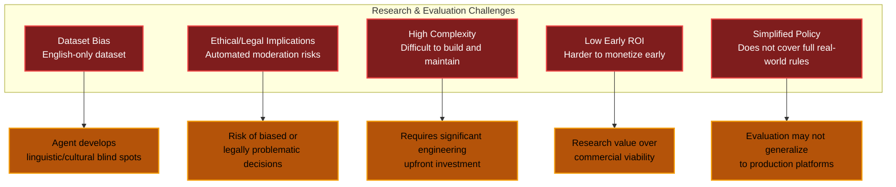
```mermaid
flowchart TD
    classDef challenge fill:#7F1D1D,stroke:#EF4444,stroke-width:2px,color:#fff
    classDef impact fill:#B45309,stroke:#F59E0B,stroke-width:2px,color:#000
    classDef context fill:#1E3A8A,stroke:#3B82F6,stroke-width:2px,color:#fff

    subgraph Challenges ["Research & Evaluation Challenges"]
        C1["Dataset Bias\nEnglish-only dataset"]
        C2["Ethical/Legal Implications\nAutomated moderation risks"]
        C3["High Complexity\nDifficult to build and maintain"]
        C4["Low Early ROI\nHarder to monetize early"]
        C5["Simplified Policy\nDoes not cover full real-world rules"]
    end

    C1 --> I1["Agent develops\nlinguistic/cultural blind spots"]
    C2 --> I2["Risk of biased or\nlegally problematic decisions"]
    C3 --> I3["Requires significant engineering\nupfront investment"]
    C4 --> I4["Research value over\ncommercial viability"]
    C5 --> I5["Evaluation may not generalize\nto production platforms"]

    class C1,C2,C3,C4,C5 challenge
    class I1,I2,I3,I4,I5 impact
```

---

### Dataset Bias

**"Bias in dataset"** is explicitly identified as one of the primary risks of the TrustOps-Env simulation. This risk stems directly from the foundational assumptions the environment is built upon.

**The Root Cause:**

The simulation relies on two constraining assumptions:
1. **English-only dataset** — All content evaluated by the agent is in English.
2. **Simplified policy** — The moderation rules are deliberately simplified to isolate RL mechanics.

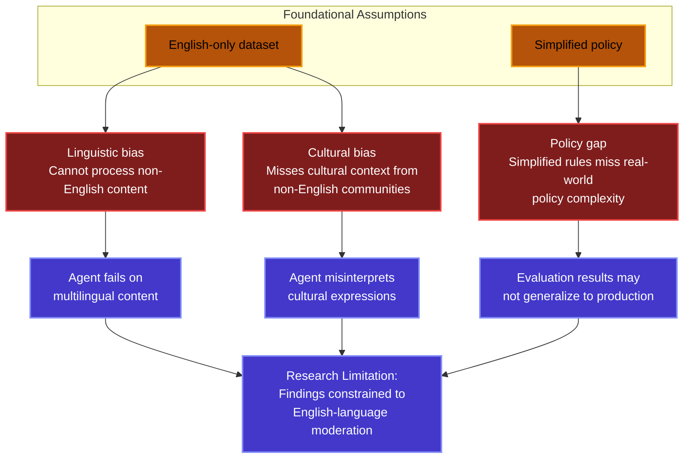
```mermaid
flowchart TD
    classDef assumption fill:#B45309,stroke:#F59E0B,stroke-width:2px,color:#000
    classDef bias fill:#7F1D1D,stroke:#EF4444,stroke-width:2px,color:#fff
    classDef impact fill:#4338CA,stroke:#818CF8,stroke-width:2px,color:#fff

    subgraph Assumptions ["Foundational Assumptions"]
        A1["English-only dataset"]
        A2["Simplified policy"]
    end

    A1 --> B1["Linguistic bias\nCannot process non-English content"]
    A1 --> B2["Cultural bias\nMisses cultural context from\nnon-English communities"]
    A2 --> B3["Policy gap\nSimplified rules miss real-world\npolicy complexity"]

    B1 --> C1["Agent fails on\nmultilingual content"]
    B2 --> C2["Agent misinterprets\ncultural expressions"]
    B3 --> C3["Evaluation results may\nnot generalize to production"]

    C1 --> D["Research Limitation:\nFindings constrained to\nEnglish-language moderation"]
    C2 --> D
    C3 --> D

    class A1,A2 assumption
    class B1,B2,B3 bias
    class C1,C2,C3,D impact
```

**How Dataset Bias Impacts Task Performance:**

| Task Tier  | Impact of Bias                                                                                       |
| ---------- | ---------------------------------------------------------------------------------------------------- |
| **EASY**   | Minimal — spam patterns are relatively language-agnostic.                                            |
| **MEDIUM** | Moderate — borderline abuse depends on cultural and linguistic norms that vary across languages.     |
| **HARD**   | Severe — context-dependent nuance is fundamentally tied to culture, language, and community meaning. |

> **Research Transparency:** The English-only dataset and simplified policy are deliberate design choices — not oversights. They exist to **isolate the reinforcement learning mechanics** from the overwhelming complexity of real-world legal and multilingual challenges. However, researchers must explicitly acknowledge these constraints when publishing findings based on TrustOps-Env evaluations. Results are valid within the scope of English-language moderation under simplified policy assumptions — generalizing beyond this scope requires additional validation.

---

### Ethical Implications

**"Ethical/legal implications"** are explicitly identified as major risks inherent to simulating automated content moderation. These concerns are not theoretical — they directly affect how the agent is evaluated and what the research findings mean.

**The Ethical Risk Landscape:**

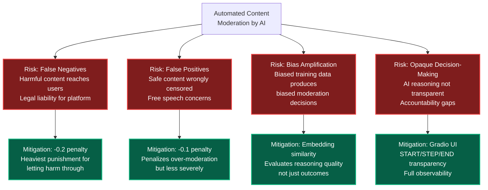
```mermaid
flowchart TD
    classDef risk fill:#7F1D1D,stroke:#EF4444,stroke-width:2px,color:#fff
    classDef mitigation fill:#065F46,stroke:#10B981,stroke-width:2px,color:#fff
    classDef context fill:#1E3A8A,stroke:#3B82F6,stroke-width:2px,color:#fff

    A["Automated Content\nModeration by AI"] --> B["Risk: False Negatives\nHarmful content reaches users\nLegal liability for platform"]
    A --> C["Risk: False Positives\nSafe content wrongly censored\nFree speech concerns"]
    A --> D["Risk: Bias Amplification\nBiased training data produces\nbiased moderation decisions"]
    A --> E["Risk: Opaque Decision-Making\nAI reasoning not transparent\nAccountability gaps"]

    B --> F["Mitigation: -0.2 penalty\nHeaviest punishment for\nletting harm through"]
    C --> G["Mitigation: -0.1 penalty\nPenalizes over-moderation\nbut less severely"]
    D --> H["Mitigation: Embedding similarity\nEvaluates reasoning quality\nnot just outcomes"]
    E --> I["Mitigation: Gradio UI\nSTART/STEP/END transparency\nFull observability"]

    class B,C,D,E risk
    class F,G,H,I mitigation
```

| Ethical Concern                  | Real-World Consequence                                                    | TrustOps-Env Mitigation                                              |
| -------------------------------- | ------------------------------------------------------------------------- | --------------------------------------------------------------------- |
| **False negatives allowing harm**| Legal liability, user safety risks, platform trust destruction.           | Heaviest penalty (-0.2) to mathematically prioritize safety.          |
| **False positives censoring**    | Free speech concerns, user frustration, legal disputes.                   | Penalty (-0.1) for over-moderation; lighter than false negatives.     |
| **Bias in automated decisions**  | Discriminatory moderation patterns against specific communities.          | Acknowledged as known limitation; simplified policy isolates this.    |
| **Opaque AI reasoning**         | No accountability for why content was removed or approved.                | Full observability via Gradio UI; reasoning chains visible.           |

**The Asymmetric Penalty as Ethical Design:**

The reward system's decision to penalize false negatives (-0.2) twice as heavily as false positives (-0.1) is itself an **ethical design choice**. It encodes the principle that allowing genuinely harmful content to reach users is always more damaging than over-moderating safe content — directly mirroring how real-world platforms calibrate their moderation systems.

> **Research Responsibility:** Researchers using TrustOps-Env must account for the ethical dimensions of their findings. An agent trained and evaluated in this system inherits the biases of its dataset, the priorities of its reward system, and the limitations of its simplified policy. Publishing results without acknowledging these ethical dimensions would be methodologically incomplete.

---

### High Complexity / Low Early ROI

The overarching project assessment concludes that TrustOps-Env possesses **High Complexity** and **Low (early) ROI** — making it primarily suited as a research tool rather than an immediate commercial product.

**The Complexity Challenge:**

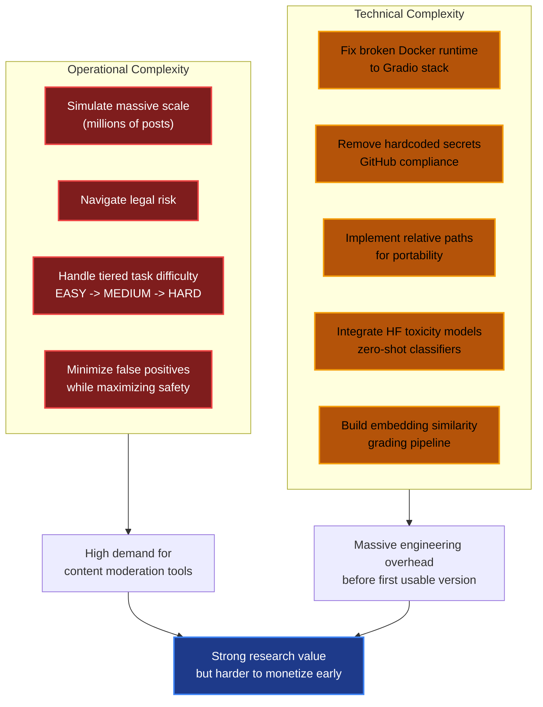
```mermaid
flowchart TD
    classDef operational fill:#7F1D1D,stroke:#EF4444,stroke-width:2px,color:#fff
    classDef technical fill:#B45309,stroke:#F59E0B,stroke-width:2px,color:#000
    classDef result fill:#1E3A8A,stroke:#3B82F6,stroke-width:2px,color:#fff

    subgraph Operational ["Operational Complexity"]
        O1["Simulate massive scale\n(millions of posts)"]
        O2["Navigate legal risk"]
        O3["Handle tiered task difficulty\nEASY -> MEDIUM -> HARD"]
        O4["Minimize false positives\nwhile maximizing safety"]
    end

    subgraph Technical ["Technical Complexity"]
        T1["Fix broken Docker runtime\nto Gradio stack"]
        T2["Remove hardcoded secrets\nGitHub compliance"]
        T3["Implement relative paths\nfor portability"]
        T4["Integrate HF toxicity models\nzero-shot classifiers"]
        T5["Build embedding similarity\ngrading pipeline"]
    end

    Operational --> R1["High demand for\ncontent moderation tools"]
    Technical --> R2["Massive engineering overhead\nbefore first usable version"]

    R1 --> V["Strong research value\nbut harder to monetize early"]
    R2 --> V

    class O1,O2,O3,O4 operational
    class T1,T2,T3,T4,T5 technical
    class V result
```

**Comparative Project Assessment:**

| Dimension                  | TrustOps-Env                                    | Typical SaaS (e.g., RevOps)                     |
| -------------------------- | ----------------------------------------------- | ----------------------------------------------- |
| **Complexity**             | HIGH — tiered tasks, ML integration, RL grading.| MEDIUM — standard CRUD, API integrations.       |
| **Early ROI**              | LOW — research tool, no immediate revenue.      | HIGH — SaaS subscriptions, immediate income.    |
| **Market Demand**          | HIGH — content moderation is critical.          | HIGH — revenue operations always needed.        |
| **Monetization Path**      | Academic licensing, research grants, long-term. | Monthly subscriptions, immediate cash flow.     |
| **Engineering Investment** | Very High — ML models, grading pipeline, UI.    | Moderate — standard web development.            |
| **Research Value**         | Extremely High — novel RL environment.          | Low — solves existing problems, not new research.|

**Where the Value Lies:**

Despite the low early ROI, TrustOps-Env provides value that commercial tools cannot:

| Value Proposition                 | Detail                                                                              |
| --------------------------------- | ----------------------------------------------------------------------------------- |
| **Research & Academic Use**       | Provides a structured environment for RL research in content moderation.            |
| **Trust & Safety Training**       | Teams can simulate moderation scenarios without risking real users.                  |
| **Competitive Uniqueness**        | No existing tool provides real-time observable moderation simulation with rewards.  |
| **Open-Source Community**         | Freely available for academic institutions and independent researchers.             |

> **The Fundamental Trade-off:** TrustOps-Env is **not designed to be a quick-to-market SaaS product**. Its value is realized through rigorous academic research, long-term capability building for Trust & Safety teams, and advancing the state of the art in AI-driven content moderation. The high complexity is the price of genuine research depth — and it is exactly this depth that makes the project a "Strong research use case."

---

## Research Value — Positioning Summary

```mermaid
%%{init: {'theme': 'base', 'themeVariables': { 'pie1': '#1E3A8A', 'pie2': '#4C1D95', 'pie3': '#064E3B', 'pie4': '#78350F', 'pieTitleTextSize': '24px', 'pieTitleTextWeight': 'bold', 'pieLegendTextSize': '16px', 'pieSectionTextSize': '16px'}}}%%
pie title TrustOps-Env Research Value Distribution
    "Task Complexity Evaluation" : 30
    "Grading Metrics Depth" : 25
    "RL Research Capability" : 25
    "Observability & Transparency" : 20
```

---

## ER Diagram — Research & Evaluation System

```mermaid
erDiagram

TASK_COMPLEXITY {
    string TaskID PK
    string Tier "EASY / MEDIUM / HARD"
    string ContentType "spam, abuse, nuance"
    string AmbiguityLevel "None / Moderate / Very High"
    string ExpectedAction "approve / remove / flag"
    float EscalationProbability
}

GRADING_METRIC {
    string GraderID PK
    string Method "rule-based / policy-match / embedding"
    boolean ReasoningEvaluated
    float ClassificationWeight "+0.5"
    float ActionWeight "+0.3"
    float ReasoningWeight "0.0 to +0.2"
}

REWARD_OUTCOME {
    string RewardID PK
    float ClassificationScore
    float ActionScore
    float ReasoningScore
    float PenaltyApplied
    float TotalScore
}

RESEARCH_CHALLENGE {
    string ChallengeID PK
    string Type "Bias / Ethics / Complexity / ROI"
    string Description
    string Mitigation
    string Impact "Low / Medium / High"
}

DATASET_ASSUMPTION {
    string AssumptionID PK
    string Language "English-only"
    string Policy "Simplified"
    string BiasRisk "Linguistic and cultural"
}

ML_BASELINE {
    string ModelID PK
    string Type "Toxicity / Zero-Shot / Pretrained"
    string Source "HuggingFace Hub"
    string Role "Baseline comparison"
}

TASK_COMPLEXITY ||--|| GRADING_METRIC : "selects grading method"
GRADING_METRIC ||--o{ REWARD_OUTCOME : "computes"
GRADING_METRIC ||--o{ ML_BASELINE : "uses for comparison"
TASK_COMPLEXITY ||--o{ RESEARCH_CHALLENGE : "introduces"
DATASET_ASSUMPTION ||--o{ RESEARCH_CHALLENGE : "causes"
REWARD_OUTCOME }o--|| TASK_COMPLEXITY : "score depends on tier"
```

---

## Impact on the Broader System

The Research & Evaluation framework connects directly to every other documented component of TrustOps-Env:

| This Document Section             | Connects To                                             | Relationship                                                              |
| --------------------------------- | ------------------------------------------------------- | ------------------------------------------------------------------------- |
| **Task Complexity Tiers**         | [Technical Architecture](./Technical_Architecture.md)   | Tiers define which grading method the pipeline selects.                   |
| **Rule-Based Grading**            | [Technical Architecture](./Technical_Architecture.md)   | Implemented in the grading pipeline for EASY task evaluation.             |
| **Embedding Similarity**          | [Technical Architecture](./Technical_Architecture.md)   | Requires HuggingFace ML model integration for vector comparison.         |
| **Classification Accuracy (+0.5)**| [Technical Architecture](./Technical_Architecture.md)   | Highest-weighted reward; classification is the pipeline prerequisite.     |
| **Action Correctness (+0.3)**     | [Technical Architecture](./Technical_Architecture.md)   | Evaluates operational enforcement of approve/remove/flag decisions.       |
| **Reasoning Quality (+0.2)**      | [Technical Architecture](./Technical_Architecture.md)   | Embedding similarity grading for MEDIUM + HARD cognitive evaluation.      |
| **False Negative Penalty (-0.2)** | [Core Concept](./core_concept.md)                       | Asymmetric design reflects real-world legal risk prioritization.          |
| **Grading Observability**         | [UI](./UI.md)                                           | Scores rendered via Gradio wrapper as START/STEP/END.                     |
| **Dataset Bias**                  | [Core Concept](./core_concept.md)                       | Acknowledged limitations of the simplified research design.               |
| **Ethical Implications**          | [Core Concept](./core_concept.md)                       | Platform risk constraints that shape the reward system.                   |
| **High Complexity / Low ROI**     | [Security & Portability](./securityandportability.md)   | Engineering complexity required infrastructure overhaul to resolve.       |
| **ML Model Baselines**            | [Security & Portability](./securityandportability.md)   | Secure `os.getenv("HF_TOKEN")` required for baseline model API access.   |

> **The Complete Picture:** This Evaluation & Research document completes the TrustOps-Env documentation ecosystem. The [Core Concept](./core_concept.md) defines *what* the system is. The [Technical Architecture](./Technical_Architecture.md) explains *how* it works internally. The [UI](./UI.md) shows *how researchers see it*. [Security & Portability](./securityandportability.md) details *how it was made deployable*. And this document explains *how the system is evaluated and what it means for research*.
