---

# TrustOps-Env : Technical Architecture

---

## Overview

This document details the internal technical architecture that powers the TrustOps-Env simulation — the **Data Models**, **Action Space**, **Agent Task Tiers**, **Grading Pipeline**, **Model Integration**, and the **Infrastructure Layer** that makes the entire system observable, secure, and portable.

> While the [Core Concept](./core_concept.md) document covers the project's problem statement, deployment fixes, and high-level design, this document dives into the engineering-level systems: how data flows, how agents are evaluated, and how each component is structured to support production-grade moderation simulation.

---

## Data Models

The TrustOps-Env defines its internal state using strict `BaseModel` classes. These models ensure every piece of data flowing through the simulation is typed, validated, and traceable.

### Content Object

The `Content` object is the foundational data unit — every post that enters the moderation pipeline is represented as a Content instance.

| Field    | Type     | Description                                                |
| -------- | -------- | ---------------------------------------------------------- |
| `id`     | `string` | Unique identifier for the post entering the pipeline.      |
| `text`   | `string` | The actual written material that requires moderation.      |

```python
class Content(BaseModel):
    id: str      # Unique post identifier
    text: str    # The content text to be moderated
```

**Role in the Architecture:**
- The `Content` object is the **connective tissue** between the observation state and the agent's action output.
- It feeds into the `content_queue` within the `Observation` model.
- After the agent processes a `Content` item, the resulting decision links back to the original `Content.id` via the `Action` model.

---

### Observation Model

The `Observation` model represents the full environment state visible to the agent at any given step.

| Field             | Type             | Description                                                                      |
| ----------------- | ---------------- | -------------------------------------------------------------------------------- |
| `content_queue`   | `List[Content]`  | The pipeline of posts waiting to be moderated — simulates massive platform scale.|
| `moderation_log`  | `List[dict]`     | Full history of all agent actions, reasoning chains, and outcomes.                |
| `step_count`      | `int`            | Tracks how many moderation steps the agent has completed in the current episode. |

```python
class Observation(BaseModel):
    content_queue: List[Content]   # Posts awaiting moderation
    moderation_log: List[dict]     # History of all decisions and reasoning
    step_count: int                # Current step counter
```

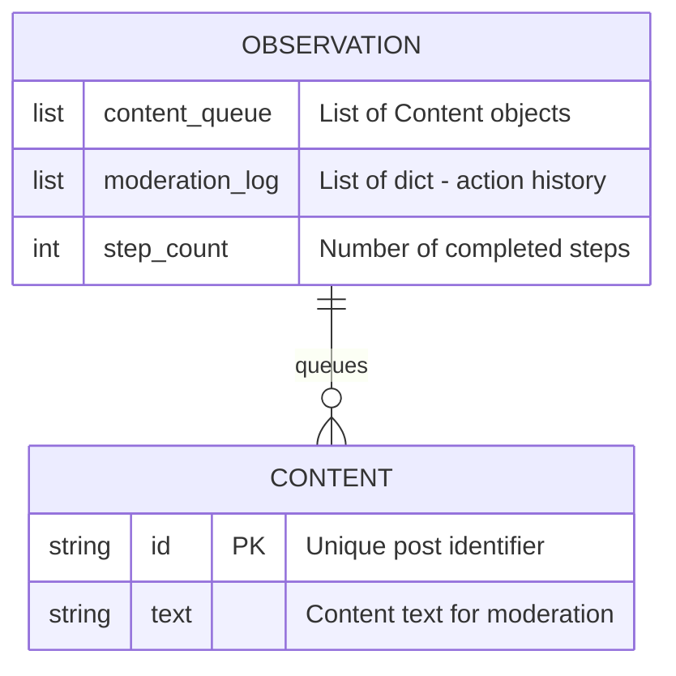
```mermaid
erDiagram
OBSERVATION {
    list content_queue "List of Content objects"
    list moderation_log "List of dict - action history"
    int step_count "Number of completed steps"
}

CONTENT {
    string id PK "Unique post identifier"
    string text "Content text for moderation"
}

OBSERVATION ||--o{ CONTENT : "queues"
```

> **Why `List[dict]` for moderation_log?** The moderation log stores heterogeneous entries — each entry can contain different combinations of action type, reasoning chain, reward score, and escalation status depending on the task outcome. Using dictionaries over a rigid model allows the log to capture the full spectrum of agent behavior without forcing a fixed schema across all possible outcomes.

---

### Action Model

The `Action` model defines the structured output the agent must produce after evaluating a `Content` item.

| Field         | Type     | Description                                                                    |
| ------------- | -------- | ------------------------------------------------------------------------------ |
| `content_id`  | `string` | Links the decision back to the specific `Content.id` that was evaluated.       |
| `action_type` | `string` | The agent's chosen action: `"approve"`, `"remove"`, or `"flag"`.               |

```python
class Action(BaseModel):
    content_id: str     # References Content.id
    action_type: str    # One of: "approve", "remove", "flag"
```

> **Design Constraint:** The `action_type` field is strictly limited to three values: `"approve"`, `"remove"`, and `"flag"`. This forces the agent to operate within the bounds of the defined Action Space, preventing arbitrary or undefined behavior during evaluation.

---

### Data Model Interconnection

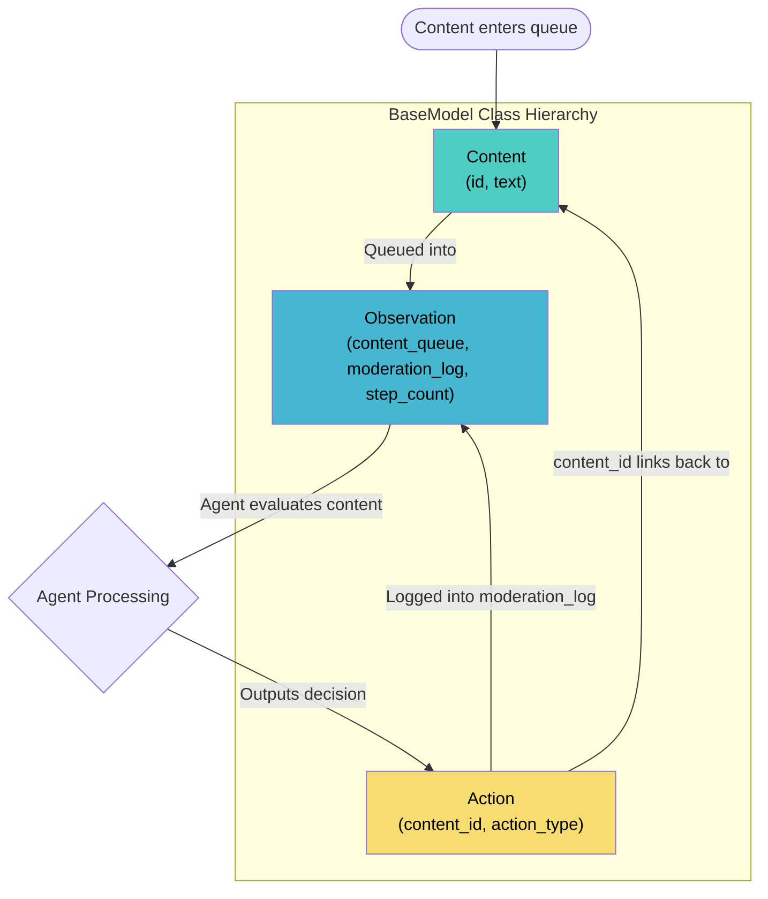
```mermaid
flowchart TD
    subgraph DataModels ["BaseModel Class Hierarchy"]
        A["Content\n(id, text)"]
        B["Observation\n(content_queue, moderation_log, step_count)"]
        C["Action\n(content_id, action_type)"]
    end

    D([Content enters queue]) --> A
    A -->|"Queued into"| B
    B -->|"Agent evaluates content"| E{Agent Processing}
    E -->|"Outputs decision"| C
    C -->|"content_id links back to"| A
    C -->|"Logged into moderation_log"| B

    style A fill:#4ecdc4,color:#000
    style B fill:#45b7d1,color:#000
    style C fill:#f7dc6f,color:#000
```

**Data Flow Summary:**
1. A `Content` object enters the system and is placed into `Observation.content_queue`.
2. The agent reads the current `Observation` state (including the content queue, its own logging history, and step count).
3. The agent evaluates the `Content.text` and outputs an `Action` specifying the `content_id` and its chosen `action_type`.
4. The environment records this action into `Observation.moderation_log`, increments `step_count`, and advances the queue.

---

## Action Space

The Action Space defines the **complete set of decisions** the AI agent is permitted to make. Every output the agent produces must be one of three strictly defined actions.

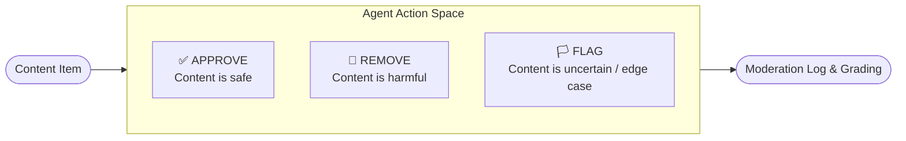
```mermaid
flowchart LR
    subgraph ActionSpace ["Agent Action Space"]
        direction TB
        AP["✅ APPROVE\nContent is safe"]
        RM["🚫 REMOVE\nContent is harmful"]
        FL["🏳️ FLAG\nContent is uncertain / edge case"]
    end

    CT([Content Item]) --> ActionSpace
    ActionSpace --> LOG([Moderation Log & Grading])
```

---

### Action: Approve

**Definition:** The agent selects `"approve"` when it determines the content is safe and does not violate the platform's policy.

| Aspect                     | Detail                                                                                                |
| -------------------------- | ----------------------------------------------------------------------------------------------------- |
| **When Used**              | Agent has high confidence that the content is safe and policy-compliant.                               |
| **Reward (Correct)**       | `+0.3` for correct action (paired with `+0.5` for correct classification = `+0.8` minimum).          |
| **Penalty (False Neg.)**   | `-0.2` — If the agent approves genuinely harmful content, this is the most severe failure mode.       |
| **Difficulty Sensitivity** | High confidence on EASY tasks (clear safe content). Risky on HARD tasks (nuanced, context-dependent). |

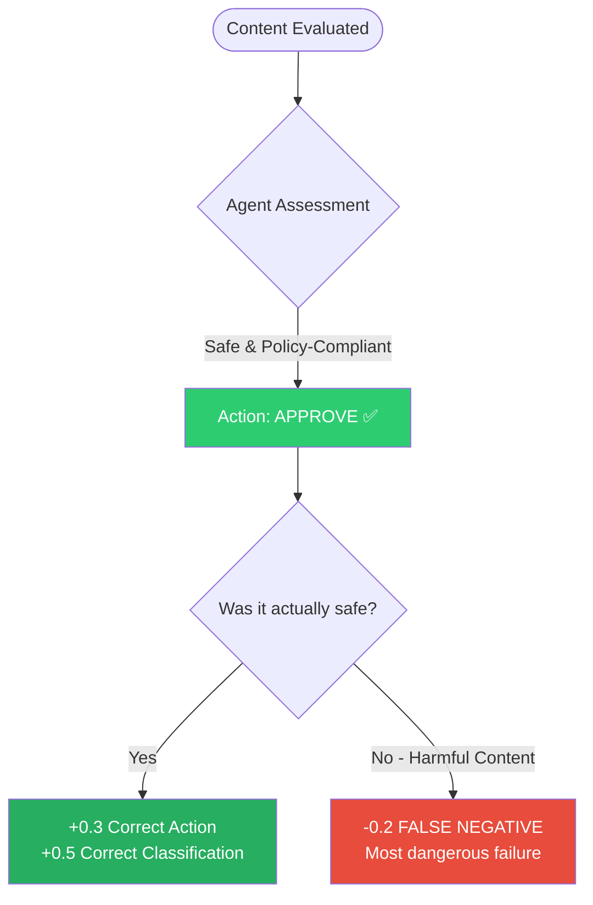
```mermaid
flowchart TD
    A([Content Evaluated]) --> B{Agent Assessment}
    B -->|"Safe & Policy-Compliant"| C["Action: APPROVE ✅"]
    C --> D{Was it actually safe?}
    D -->|Yes| E["+0.3 Correct Action\n+0.5 Correct Classification"]
    D -->|No - Harmful Content| F["-0.2 FALSE NEGATIVE\nMost dangerous failure"]

    style C fill:#2ecc71,color:#fff
    style E fill:#27ae60,color:#fff
    style F fill:#e74c3c,color:#fff
```

> **Risk Profile:** Approving content is a **high-confidence action**. On EASY tasks (spam vs. safe), the agent can approve safe content with near-certainty. On HARD tasks involving nuanced or context-dependent material, a hasty `approve` risks letting genuinely harmful content slip through, triggering the system's heaviest penalty (-0.2). This is why the Action Space includes `flag` as a safety valve.

---

### Action: Remove

**Definition:** The agent selects `"remove"` when it determines the content is harmful and must be eliminated from the platform.

| Aspect                     | Detail                                                                                                |
| -------------------------- | ----------------------------------------------------------------------------------------------------- |
| **When Used**              | Agent has high confidence the content is harmful, toxic, or violates platform policy.                 |
| **Reward (Correct)**       | `+0.3` for correct action.                                                                            |
| **Penalty (False Pos.)**   | `-0.1` — If the agent removes safe content, this erodes user trust and risks legal disputes.          |
| **Penalty (Inaction)**     | `-0.2` — If the agent fails to remove genuinely harmful content when it should have.                  |
| **Real-World Parallel**    | The agent is the active enforcement mechanism — `remove` is the primary tool for clearing danger.     |

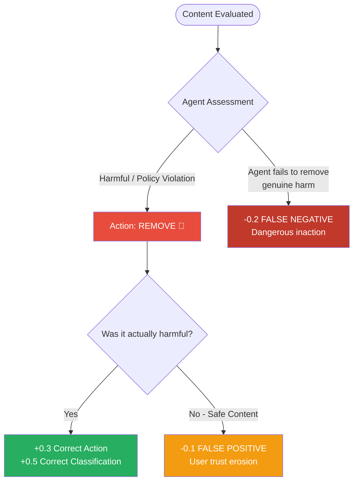
```mermaid
flowchart TD
    A([Content Evaluated]) --> B{Agent Assessment}
    B -->|"Harmful / Policy Violation"| C["Action: REMOVE 🚫"]
    C --> D{Was it actually harmful?}
    D -->|Yes| E["+0.3 Correct Action\n+0.5 Correct Classification"]
    D -->|No - Safe Content| F["-0.1 FALSE POSITIVE\nUser trust erosion"]

    B -->|"Agent fails to remove\ngenuine harm"| G["-0.2 FALSE NEGATIVE\nDangerous inaction"]

    style C fill:#e74c3c,color:#fff
    style E fill:#27ae60,color:#fff
    style F fill:#f39c12,color:#fff
    style G fill:#c0392b,color:#fff
```

> **The Enforcement Balancing Act:** `Remove` is the most impactful action in the space. Using it accurately clears genuinely dangerous material. Using it aggressively silences safe users and erodes platform trust. Because real-world moderation must manage both legal risk and false positives, the agent cannot simply default to removing everything — it must be precise. For ambiguous cases, the Action Space provides `flag` as an alternative.

---

### Action: Flag

**Definition:** The agent selects `"flag"` when it cannot confidently determine whether the content is safe or harmful — triggering escalation for human review.

| Aspect                     | Detail                                                                                                |
| -------------------------- | ----------------------------------------------------------------------------------------------------- |
| **When Used**              | Agent encounters ambiguity, edge cases, or context-dependent nuance.                                  |
| **Purpose**                | Direct implementation of the agent's objective to "escalate uncertain cases".                         |
| **Strategic Value**        | Avoids triggering -0.2 (false negative) or -0.1 (false positive) penalties on uncertain content.      |
| **Triggered By**           | HARD tasks (contextual nuance), MEDIUM boundary cases, low confidence scores.                         |

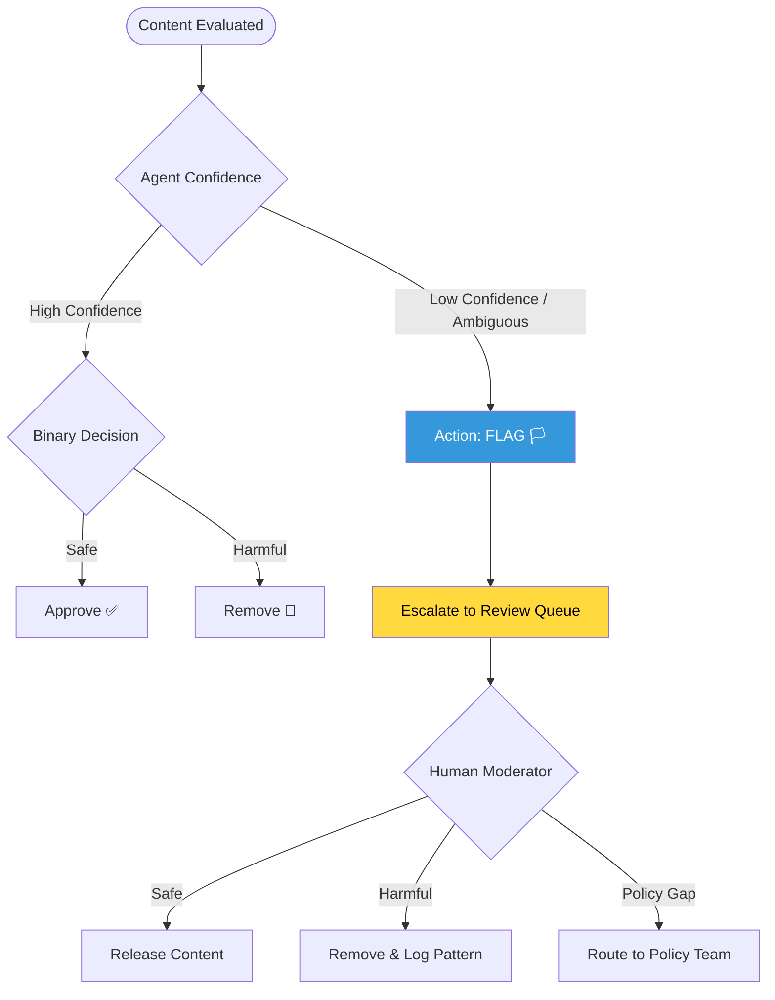
```mermaid
flowchart TD
    A([Content Evaluated]) --> B{Agent Confidence}
    
    B -->|"High Confidence"| C{Binary Decision}
    C -->|Safe| D[Approve ✅]
    C -->|Harmful| E[Remove 🚫]
    
    B -->|"Low Confidence / Ambiguous"| F["Action: FLAG 🏳️"]
    F --> G[Escalate to Review Queue]
    G --> H{Human Moderator}
    H -->|Safe| I[Release Content]
    H -->|Harmful| J[Remove & Log Pattern]
    H -->|"Policy Gap"| K[Route to Policy Team]

    style F fill:#3498db,color:#fff
    style G fill:#ffd93d,color:#000
```

> **Why Flag Matters:** The `flag` action is mathematically incentivized by the reward system's asymmetric penalties. Since false negatives (-0.2) and false positives (-0.1) both incur point deductions, but escalating does not carry a penalty, the agent is naturally encouraged to flag genuinely ambiguous content rather than guess. This mirrors how production-grade platforms operate — it is always safer to escalate an edge case than to make a potentially catastrophic binary decision on nuanced content.

---

### Action Space — Comparative Summary

| Action      | Confidence Required | Correct Reward | Wrong Penalty | Primary Risk                          |
| ----------- | ------------------- | -------------- | ------------- | ------------------------------------- |
| `approve`   | 🔴 High             | `+0.3`         | `-0.2` (FN)   | Allowing harmful content through.     |
| `remove`    | 🔴 High             | `+0.3`         | `-0.1` (FP)   | Silencing safe users / legal risk.    |
| `flag`      | 🟢 Any (Low/Med)    | `+0.3`*        | — (No penalty) | None — safely routes to human review. |

> *Flag earns `+0.3` when correctly used on genuinely ambiguous/edge-case content.

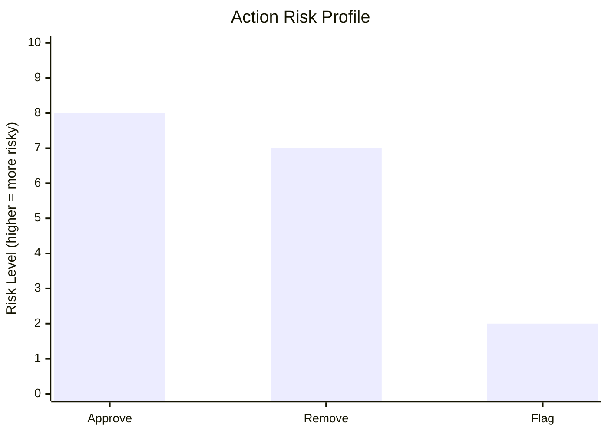
```mermaid
xychart-beta
title "Action Risk Profile"
x-axis ["Approve", "Remove", "Flag"]
y-axis "Risk Level (higher = more risky)" 0 --> 10
bar [8, 7, 2]
```

---

## Agent Tasks — Difficulty Tiers

The TrustOps-Env tests the AI agent across three escalating tiers of content moderation difficulty. Each tier defines the **type of content the agent faces**, the **specific challenge it poses**, the **grading method applied**, and the **strategic actions most likely to succeed**.

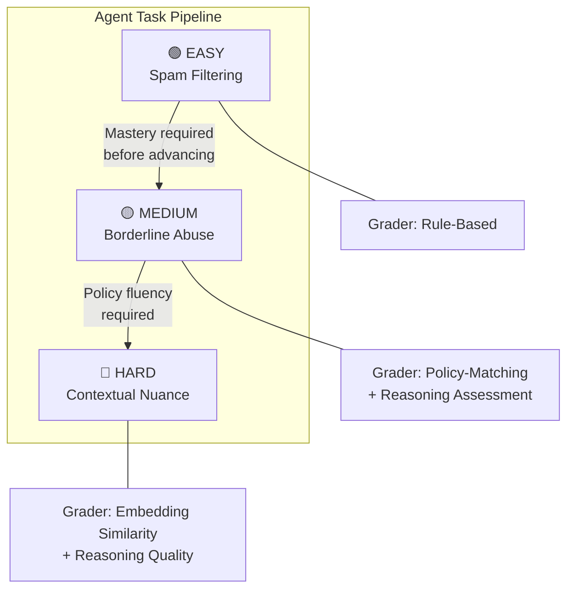
```mermaid
flowchart TD
    subgraph TaskPipeline ["Agent Task Pipeline"]
        direction LR
        T1["🟢 EASY\nSpam Filtering"]
        T2["🟡 MEDIUM\nBorderline Abuse"]
        T3["🔴 HARD\nContextual Nuance"]
    end

    T1 -->|"Mastery required\nbefore advancing"| T2
    T2 -->|"Policy fluency\nrequired"| T3

    T1 --- G1["Grader: Rule-Based"]
    T2 --- G2["Grader: Policy-Matching\n+ Reasoning Assessment"]
    T3 --- G3["Grader: Embedding Similarity\n+ Reasoning Quality"]
```

---

### EASY: Spam Filtering

**Definition:** The baseline difficulty — the agent must separate **clear spam from clearly safe content**.

| Dimension              | Detail                                                                                            |
| ---------------------- | ------------------------------------------------------------------------------------------------- |
| **Content Type**       | Clear spam vs. clearly safe content.                                                              |
| **Example (Spam)**     | `"BUY CHEAP FOLLOWERS NOW!!! 💰💰💰 CLICK HERE!!!"`                                             |
| **Example (Safe)**     | `"Had a great lunch today — the new café is amazing."`                                            |
| **Agent Challenge**    | Binary classification; minimal reasoning needed. Tests fundamental mechanics.                     |
| **Grading Method**     | **Rule-based** grader for clear cases. No embedding similarity required.                          |
| **Expected Action**    | `approve` (safe) or `remove` (spam) — `flag` rarely needed at this tier.                          |

**Reward Mechanics for EASY Tasks:**

| Outcome                              | Score   | Description                                              |
| ------------------------------------ | ------- | -------------------------------------------------------- |
| Correctly identify & remove spam     | `+0.8`  | `+0.5` classification + `+0.3` action.                   |
| Correctly identify & approve safe    | `+0.8`  | `+0.5` classification + `+0.3` action.                   |
| Allow spam to pass (false negative)  | `-0.2`  | Even easy spam failures trigger heavy penalties.          |
| Block safe content (false positive)  | `-0.1`  | Over-moderation, less severe but still penalized.         |

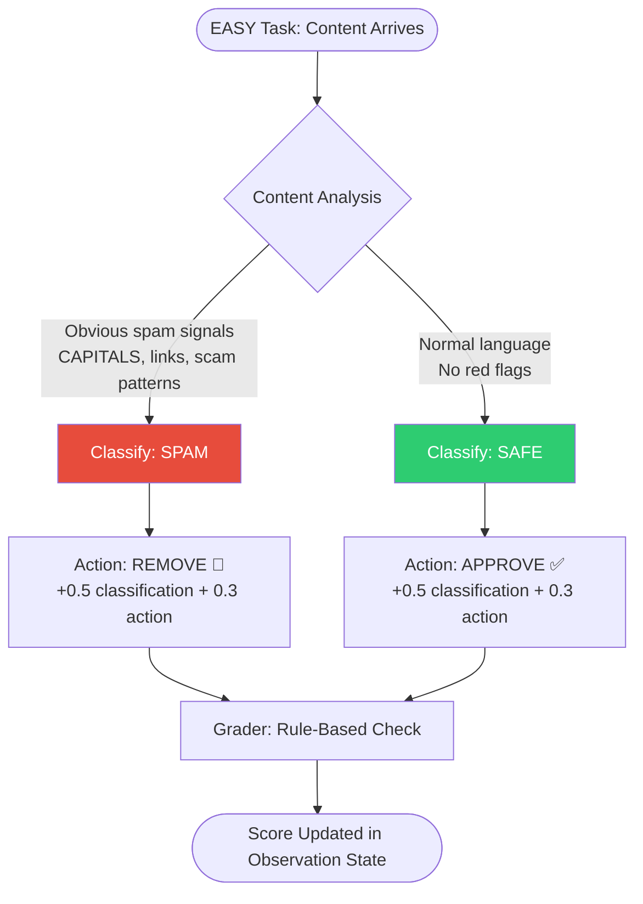
```mermaid
flowchart TD
    A([EASY Task: Content Arrives]) --> B{Content Analysis}
    B -->|"Obvious spam signals\nCAPITALS, links, scam patterns"| C[Classify: SPAM]
    B -->|"Normal language\nNo red flags"| D[Classify: SAFE]
    
    C --> E["Action: REMOVE 🚫\n+0.5 classification + 0.3 action"]
    D --> F["Action: APPROVE ✅\n+0.5 classification + 0.3 action"]
    
    E --> G[Grader: Rule-Based Check]
    F --> G
    G --> H([Score Updated in Observation State])

    style C fill:#e74c3c,color:#fff
    style D fill:#2ecc71,color:#fff
```

> **Strategic Purpose:** Mastering EASY spam filtering proves that the agent can handle the fundamental mechanics of the moderation pipeline — correctly classifying, selecting the right action, and logging its decision — before being forced to tackle the ambiguous, high-risk edge cases of higher tiers.

---

### MEDIUM: Borderline Abuse

**Definition:** The agent must differentiate between **explicitly abusive content and borderline material** that sits on the edge of policy violations.

| Dimension              | Detail                                                                                            |
| ---------------------- | ------------------------------------------------------------------------------------------------- |
| **Content Type**       | Abusive content vs. borderline / ambiguous material.                                              |
| **Example (Abusive)**  | `"You're a worthless excuse for a human being and everyone hates you."`                           |
| **Example (Borderline)**| `"Your argument is so bad it physically hurts me to read it — try again, genius."`               |
| **Example (Satire)**   | `"I'm going to absolutely DESTROY you... in this chess game tonight 😂"`                         |
| **Agent Challenge**    | Requires policy knowledge and contextual interpretation — tone, intent, and sarcasm matter.       |
| **Grading Method**     | **Policy-matching** + initial reasoning quality evaluation.                                       |
| **Expected Actions**   | All three actions are viable. `flag` becomes strategically important at this tier.                 |

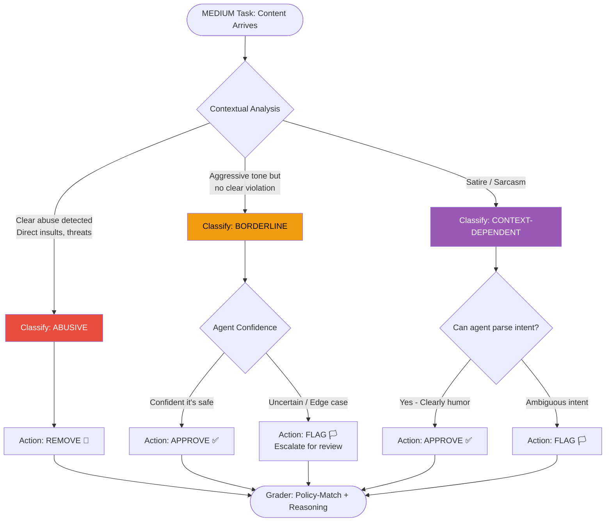
```mermaid
flowchart TD
    A([MEDIUM Task: Content Arrives]) --> B{Contextual Analysis}
    
    B -->|"Clear abuse detected\nDirect insults, threats"| C[Classify: ABUSIVE]
    C --> D["Action: REMOVE 🚫"]
    
    B -->|"Aggressive tone but\nno clear violation"| E[Classify: BORDERLINE]
    E --> F{Agent Confidence}
    F -->|"Confident it's safe"| G["Action: APPROVE ✅"]
    F -->|"Uncertain / Edge case"| H["Action: FLAG 🏳️\nEscalate for review"]
    
    B -->|"Satire / Sarcasm"| I[Classify: CONTEXT-DEPENDENT]
    I --> J{Can agent parse intent?}
    J -->|"Yes - Clearly humor"| K["Action: APPROVE ✅"]
    J -->|"Ambiguous intent"| L["Action: FLAG 🏳️"]

    D --> M([Grader: Policy-Match + Reasoning])
    G --> M
    H --> M
    K --> M
    L --> M

    style C fill:#e74c3c,color:#fff
    style E fill:#f39c12,color:#000
    style I fill:#9b59b6,color:#fff
```

**Why MEDIUM is the Critical Bridge:**
- **Upward from EASY:** EASY tasks have definitive answers; MEDIUM introduces subjectivity.
- **Downward from HARD:** HARD tasks are fully context-dependent; MEDIUM begins training the agent on ambiguity.
- **Escalation Training:** This tier directly exercises the agent's mandate to escalate uncertain cases instead of guessing and risking penalties.

| Scenario                               | Best Action | Risk if Wrong                                                    |
| -------------------------------------- | ----------- | ---------------------------------------------------------------- |
| Heated argument, aggressive tone       | `flag`      | `-0.2` if harmful allowed; `-0.1` if safe content over-censored. |
| Satire misread as genuine threat       | `approve`   | `-0.2` if actually threatening.                                   |
| Borderline insult with no slurs        | `flag`      | Safest route — avoids binary risk on ambiguous content.           |
| Clear policy violation (direct abuse)  | `remove`    | `-0.1` false positive if actually benign aggressive tone.         |

---

### HARD: Contextual Nuance

**Definition:** The agent must evaluate **nuanced, context-dependent content** where the meaning and intent can only be determined through deep cultural, linguistic, and situational awareness.

| Dimension              | Detail                                                                                            |
| ---------------------- | ------------------------------------------------------------------------------------------------- |
| **Content Type**       | Nuanced, context-dependent content.                                                               |
| **Example (Cultural)** | `"We're going to cook them" (sports fan slang vs. literal threat depending on context).`          |
| **Example (Coded)**    | Content using coded language that functions as hate speech only to an in-group audience.           |
| **Example (Whistleblower)** | Leaked internal documents exposing corruption — potentially harmful or critically important. |
| **Agent Challenge**    | Demands deep contextual reasoning, cultural sensitivity, and understanding of subtext.            |
| **Grading Method**     | **Embedding similarity** for reasoning quality evaluation. The agent is graded on *how* it thinks.|
| **Expected Actions**   | `flag` is the strategically optimal action for most HARD content. `approve`/`remove` carry high risk.|

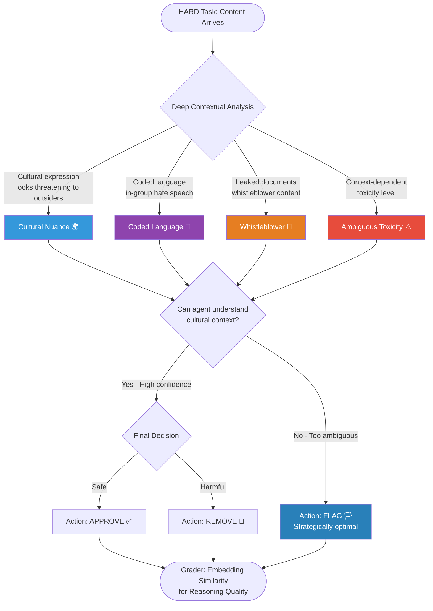
```mermaid
flowchart TD
    A([HARD Task: Content Arrives]) --> B{Deep Contextual Analysis}
    
    B -->|"Cultural expression\nlooks threatening to outsiders"| C["Cultural Nuance 🌍"]
    B -->|"Coded language\nin-group hate speech"| D["Coded Language 🔐"]
    B -->|"Leaked documents\nwhistleblower content"| E["Whistleblower 📄"]
    B -->|"Context-dependent\ntoxicity level"| F["Ambiguous Toxicity ⚠️"]
    
    C --> G{Can agent understand\ncultural context?}
    D --> G
    E --> G
    F --> G
    
    G -->|"Yes - High confidence"| H{Final Decision}
    H -->|Safe| I["Action: APPROVE ✅"]
    H -->|Harmful| J["Action: REMOVE 🚫"]
    
    G -->|"No - Too ambiguous"| K["Action: FLAG 🏳️\nStrategically optimal"]

    I --> L([Grader: Embedding Similarity\nfor Reasoning Quality])
    J --> L
    K --> L

    style C fill:#3498db,color:#fff
    style D fill:#8e44ad,color:#fff
    style E fill:#e67e22,color:#fff
    style F fill:#e74c3c,color:#fff
    style K fill:#2980b9,color:#fff
```

**The Reasoning Quality Premium (+0.2):**

For HARD tasks, the `+0.2` reasoning quality bonus becomes critical. Unlike EASY tasks where a rule-based grader simply checks the label, HARD tasks are evaluated using **embedding similarity scoring** — the system compares the agent's reasoning chain against expert-level reasoning embeddings.

| Grading Dimension           | Method                         | What It Evaluates                                              |
| --------------------------- | ------------------------------ | -------------------------------------------------------------- |
| **Classification**          | Label match                    | Did the agent categorize the content correctly?                |
| **Action**                  | Policy alignment               | Did the agent take the right operational step?                 |
| **Reasoning Quality**       | Embedding similarity           | *How* did the agent reason? Does it demonstrate understanding? |

> **Why embedding similarity?** The system does not merely check if the agent's answer is right — it evaluates whether the agent's thought process aligns with expert-level reasoning. An agent that gets the right answer by luck scores lower than an agent that demonstrates genuine contextual understanding through its reasoning chain. This is what makes TrustOps-Env a **reinforcement learning research environment**, not just a test bench.

---

### Task Difficulty — Comparative Progression

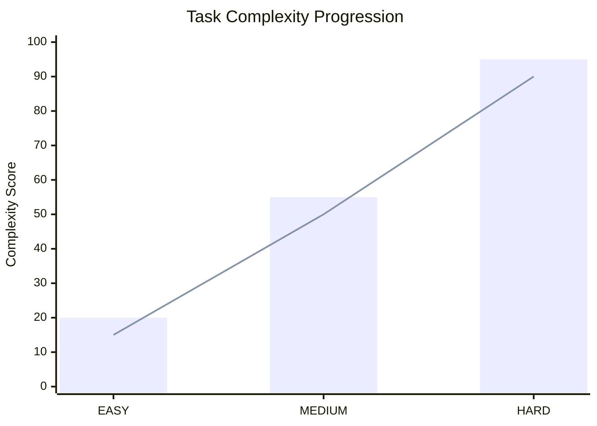
```mermaid
xychart-beta
title "Task Complexity Progression"
x-axis ["EASY", "MEDIUM", "HARD"]
y-axis "Complexity Score" 0 --> 100
bar [20, 55, 95]
line [15, 50, 90]
```

| Metric                       | EASY       | MEDIUM          | HARD                   |
| ---------------------------- | ---------- | --------------- | ---------------------- |
| **Content Ambiguity**        | None       | Moderate        | Very High              |
| **Reasoning Required**       | Minimal    | Policy-aware    | Deep contextual        |
| **Optimal Action Spread**    | Binary     | All three       | Heavily favors `flag`  |
| **Grading Method**           | Rule-based | Policy-matching | Embedding similarity   |
| **Reasoning Bonus Impact**   | Low        | Moderate        | Critical (+0.2)        |
| **Escalation Probability**   | ~0%        | ~30-50%         | ~60-80%                |
| **Risk of Wrong Decision**   | Low        | Medium          | Very High              |

---

## Grading Pipeline

The grading pipeline is the multi-layered evaluation system that converts the agent's raw output into a structured reward score. It adapts its evaluation method based on task difficulty.

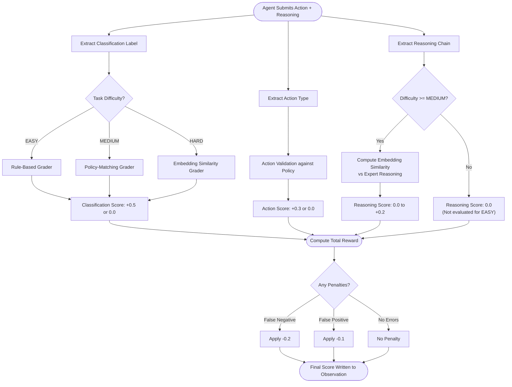
```mermaid
flowchart TD
    A([Agent Submits Action + Reasoning]) --> B[Extract Classification Label]
    A --> C[Extract Action Type]
    A --> D[Extract Reasoning Chain]

    B --> E{Task Difficulty?}
    
    E -->|EASY| F[Rule-Based Grader]
    E -->|MEDIUM| G[Policy-Matching Grader]
    E -->|HARD| H[Embedding Similarity Grader]

    F --> I[Classification Score: +0.5 or 0.0]
    G --> I
    H --> I

    C --> J[Action Validation against Policy]
    J --> K[Action Score: +0.3 or 0.0]

    D --> L{Difficulty >= MEDIUM?}
    L -->|Yes| M[Compute Embedding Similarity\nvs Expert Reasoning]
    L -->|No| N["Reasoning Score: 0.0\n(Not evaluated for EASY)"]
    M --> O[Reasoning Score: 0.0 to +0.2]

    I --> P([Compute Total Reward])
    K --> P
    O --> P
    N --> P

    P --> Q{Any Penalties?}
    Q -->|False Negative| R[Apply -0.2]
    Q -->|False Positive| S[Apply -0.1]
    Q -->|No Errors| T[No Penalty]

    R --> U([Final Score Written to Observation])
    S --> U
    T --> U
```

### Grading Tiers — Method Selection

| Task Level | Primary Grader              | Reasoning Evaluated? | Baselines Used                                          |
| ---------- | --------------------------- | -------------------- | ------------------------------------------------------- |
| **EASY**   | Rule-based label matching   | ❌ No                | Pretrained classifier as a basic baseline.              |
| **MEDIUM** | Policy-matching + reasoning | ✅ Initial           | HF toxicity model + zero-shot classifier.               |
| **HARD**   | Embedding similarity        | ✅ Full evaluation   | All baselines: toxicity, zero-shot, pretrained + expert embeddings. |

---

## Model Integration Layer

To give the agent the capability to process varying task difficulties, the architecture integrates specific machine learning tools from the HuggingFace ecosystem.

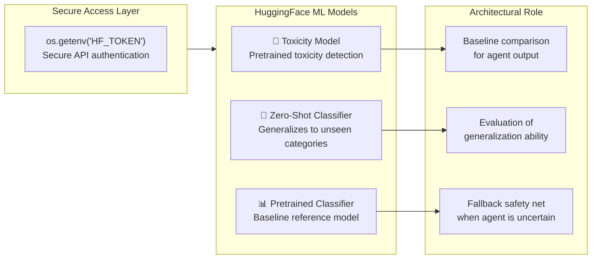
```mermaid
flowchart LR
    subgraph Models ["HuggingFace ML Models"]
        direction TB
        TOX["🧪 Toxicity Model\nPretrained toxicity detection"]
        ZS["🎯 Zero-Shot Classifier\nGeneralizes to unseen categories"]
        PC["📊 Pretrained Classifier\nBaseline reference model"]
    end

    subgraph Usage ["Architectural Role"]
        direction TB
        U1["Baseline comparison\nfor agent output"]
        U2["Evaluation of\ngeneralization ability"]
        U3["Fallback safety net\nwhen agent is uncertain"]
    end

    TOX --> U1
    ZS --> U2
    PC --> U3

    subgraph Security ["Secure Access Layer"]
        SEC["os.getenv('HF_TOKEN')\nSecure API authentication"]
    end

    Security --> Models
```

| Model Component              | Source           | Role in Architecture                                                       |
| ---------------------------- | ---------------- | -------------------------------------------------------------------------- |
| **Toxicity Model**           | HuggingFace Hub  | Pretrained classifier used as a baseline reference for toxicity scoring.   |
| **Zero-Shot Classifier**     | HuggingFace Hub  | Tests the agent's ability to generalize to content categories not explicitly seen during training. |
| **Pretrained Classifier**    | HuggingFace Hub  | Serves as the baseline — the environment measures whether the agent performs better than this reference model. |

> **Security:** All HuggingFace model access was refactored from hardcoded API tokens (which triggered GitHub security blocks) to secure environment variables via `os.getenv("HF_TOKEN")`. This was a critical architectural fix documented in the production flow.

---

## Content Flow — End-to-End Pipeline

This diagram traces a single piece of content through the entire technical architecture, from ingestion to final score.

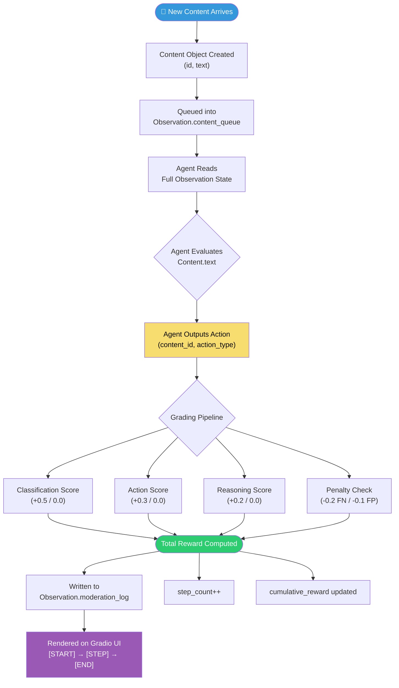
```mermaid
flowchart TD
    A([📝 New Content Arrives]) --> B["Content Object Created\n(id, text)"]
    
    B --> C["Queued into\nObservation.content_queue"]
    
    C --> D["Agent Reads\nFull Observation State"]
    
    D --> E{Agent Evaluates\nContent.text}
    
    E --> F["Agent Outputs Action\n(content_id, action_type)"]
    
    F --> G{Grading Pipeline}
    
    G --> H["Classification Score\n(+0.5 / 0.0)"]
    G --> I["Action Score\n(+0.3 / 0.0)"]
    G --> J["Reasoning Score\n(+0.2 / 0.0)"]
    G --> K["Penalty Check\n(-0.2 FN / -0.1 FP)"]
    
    H --> L([Total Reward Computed])
    I --> L
    J --> L
    K --> L
    
    L --> M["Written to\nObservation.moderation_log"]
    L --> N["step_count++"]
    L --> O["cumulative_reward updated"]
    
    M --> P["Rendered on Gradio UI\n[START] → [STEP] → [END]"]
    
    style A fill:#3498db,color:#fff
    style F fill:#f7dc6f,color:#000
    style L fill:#2ecc71,color:#fff
    style P fill:#9b59b6,color:#fff
```

---

## Observation Lifecycle

The `Observation` state evolves throughout the agent's episode, tracking the complete trajectory of the simulation.

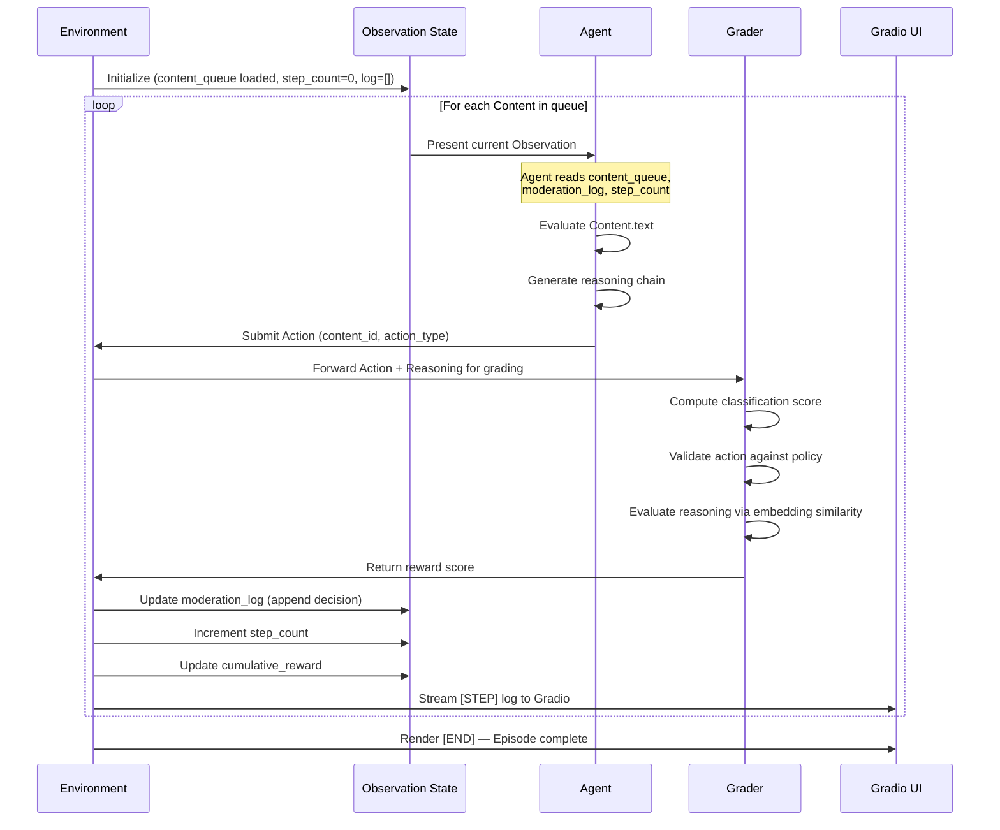
```mermaid
sequenceDiagram
    participant ENV as Environment
    participant OBS as Observation State
    participant AGT as Agent
    participant GRD as Grader
    participant UI as Gradio UI

    ENV->>OBS: Initialize (content_queue loaded, step_count=0, log=[])
    
    loop For each Content in queue
        OBS->>AGT: Present current Observation
        Note over AGT: Agent reads content_queue,<br/>moderation_log, step_count
        
        AGT->>AGT: Evaluate Content.text
        AGT->>AGT: Generate reasoning chain
        AGT->>ENV: Submit Action (content_id, action_type)
        
        ENV->>GRD: Forward Action + Reasoning for grading
        GRD->>GRD: Compute classification score
        GRD->>GRD: Validate action against policy
        GRD->>GRD: Evaluate reasoning via embedding similarity
        GRD->>ENV: Return reward score
        
        ENV->>OBS: Update moderation_log (append decision)
        ENV->>OBS: Increment step_count
        ENV->>OBS: Update cumulative_reward
        
        ENV->>UI: Stream [STEP] log to Gradio
    end
    
    ENV->>UI: Render [END] — Episode complete
```

---

## Infrastructure Layer — Architecture Supporting Agent Tasks

The Infrastructure represents the foundational deployment stack and runtime environment that supports the system's broader Technical Architecture. Building a secure, portable, and highly observable infrastructure was the **mandatory engineering prerequisite** to successfully running and evaluating the complex Agent Tasks within the simulation.

### The Initial Infrastructure Failure

When deployed to HuggingFace Spaces, the application was improperly relying on a hidden `Dockerfile`, which forced an incorrect Docker runtime (indicated by a `?docker=true` parameter in the URL). This flawed infrastructure, combined with blocking backend code hacks like `time.sleep()`, resulted in a **completely blank UI** — making the entire research tool unusable.

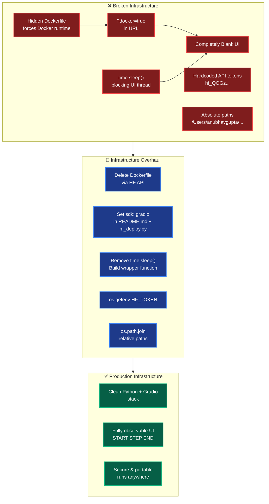
```mermaid
flowchart TD
    classDef broken fill:#7F1D1D,stroke:#EF4444,stroke-width:2px,color:#fff
    classDef fixed fill:#065F46,stroke:#10B981,stroke-width:2px,color:#fff
    classDef process fill:#1E3A8A,stroke:#3B82F6,stroke-width:2px,color:#fff

    subgraph Before ["❌ Broken Infrastructure"]
        B1["Hidden Dockerfile\nforces Docker runtime"]
        B2["?docker=true\nin URL"]
        B3["time.sleep()\nblocking UI thread"]
        B4["Hardcoded API tokens\nhf_QOGz..."]
        B5["Absolute paths\n/Users/anubhavgupta/..."]
        B1 --> B2 --> B6["Completely Blank UI"]
        B3 --> B6
    end

    subgraph Fix ["🔧 Infrastructure Overhaul"]
        F1["Delete Dockerfile\nvia HF API"]
        F2["Set sdk: gradio\nin README.md + hf_deploy.py"]
        F3["Remove time.sleep()\nBuild wrapper function"]
        F4["os.getenv HF_TOKEN"]
        F5["os.path.join\nrelative paths"]
    end

    subgraph After ["✅ Production Infrastructure"]
        A1["Clean Python + Gradio\nstack"]
        A2["Fully observable UI\nSTART STEP END"]
        A3["Secure & portable\nruns anywhere"]
    end

    Before --> Fix --> After

    class B1,B2,B3,B4,B5,B6 broken
    class F1,F2,F3,F4,F5 process
    class A1,A2,A3 fixed
```

| Before (Broken)                                   | After (Fixed)                                           |
| ------------------------------------------------- | ------------------------------------------------------- |
| Hidden Dockerfile → Docker runtime forced          | Dockerfile deleted → Python runtime enforced            |
| `?docker=true` in deployed URL                    | Clean Gradio app renders correctly                      |
| `time.sleep()` blocked UI event loop               | Wrapper function captures logs asynchronously           |
| Hardcoded `hf_QOGz...` token in source code        | `os.getenv("HF_TOKEN")` via environment variables       |
| Absolute path `/Users/anubhavgupta/...`            | Dynamic `os.path.join` relative paths                   |
| GitHub Secret Scanning **blocked** code push       | Clean repo, all scans pass                              |

---

### Python Runtime

The Python runtime is the foundational layer of the application's overhauled deployment infrastructure. Because the system relies heavily on Python-based `BaseModel` classes to structure its Data Models (Content, Observation, Action), establishing a clean Python environment was a mandatory prerequisite for the simulation to function.

**The Runtime Conflict:**

During initial deployment, HuggingFace Spaces detected a hidden `Dockerfile` on the backend and mistakenly utilized a Docker runtime instead of the intended Python SDK. The deployment URL displayed `?docker=true`, confirming the misconfiguration.

**The Critical Nuance: `sdk: python` vs `sdk: gradio`**

Initially, the expectation was to set `sdk: python` in the README configuration. However, the developer identified a critical nuance: **simply declaring a Python SDK does not automatically render a user interface on HuggingFace.** To fix this, the configuration was updated to `sdk: gradio`. Because Gradio internally relies on Python, this configuration preserved the intent to use a Python runtime while simultaneously solving the UI rendering problem.

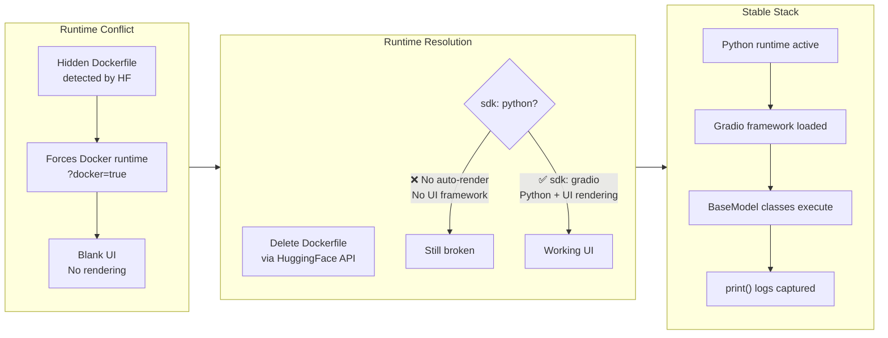
```mermaid
flowchart LR
    subgraph Problem ["Runtime Conflict"]
        P1["Hidden Dockerfile\ndetected by HF"]
        P2["Forces Docker runtime\n?docker=true"]
        P3["Blank UI\nNo rendering"]
        P1 --> P2 --> P3
    end

    subgraph Solution ["Runtime Resolution"]
        S1["Delete Dockerfile\nvia HuggingFace API"]
        S2{"sdk: python?"}
        S2 -->|"❌ No auto-render\nNo UI framework"| S3["Still broken"]
        S2 -->|"✅ sdk: gradio\nPython + UI rendering"| S4["Working UI"]
    end

    subgraph Result ["Stable Stack"]
        R1["Python runtime active"]
        R2["Gradio framework loaded"]
        R3["BaseModel classes execute"]
        R4["print() logs captured"]
        R1 --> R2 --> R3 --> R4
    end

    Problem --> Solution --> Result
```

| Configuration          | UI Renders? | Python Available? | Outcome                                           |
| ---------------------- | :---------: | :---------------: | ------------------------------------------------- |
| Hidden Dockerfile      | ❌          | ❌ (Docker)        | Application fails completely. Blank screen.       |
| `sdk: python`          | ❌          | ✅                 | Python runs but no UI framework renders content.  |
| **`sdk: gradio`**      | **✅**       | **✅**              | **Python executes + Gradio renders observable UI.**|

> **Why this matters for Data Models:** The Content, Observation, and Action `BaseModel` classes are Python-native structures. Without a clean Python runtime, these models cannot be instantiated, and the entire content queue / moderation log / action pipeline collapses before it even starts.

---

### Gradio UI Framework

The Gradio UI framework serves as the cornerstone of the overhauled infrastructure, bridging the gap between backend processing and user observability.

**The Observability Problem:**

Even after resolving the Docker/Python runtime conflict, the application still suffered from invisible backend execution. The original codebase used `time.sleep()` hacks that blocked the Python event loop, preventing any real-time output from reaching the user interface.

**The Wrapper Function Solution:**

The developer implemented a specialized **wrapper function** to capture backend `print()` logs and pipe them into the Gradio UI. This architectural improvement ensures that the step-by-step processing of the system — specifically the `[START]`, `[STEP]`, and `[END]` execution markers — becomes visibly rendered in real-time.

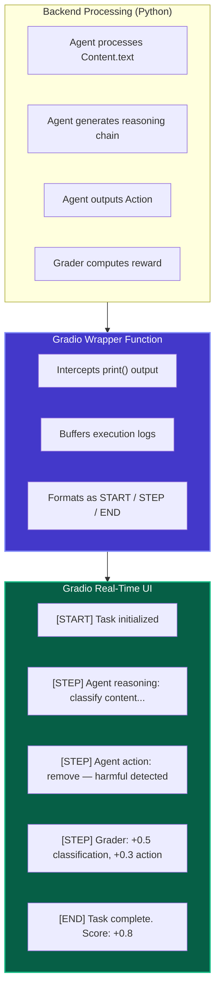
```mermaid
flowchart TD
    subgraph Backend ["Backend Processing (Python)"]
        A["Agent processes Content.text"]
        B["Agent generates reasoning chain"]
        C["Agent outputs Action"]
        D["Grader computes reward"]
    end

    subgraph WrapperFunction ["Gradio Wrapper Function"]
        W1["Intercepts print() output"]
        W2["Buffers execution logs"]
        W3["Formats as START / STEP / END"]
    end

    subgraph GradioUI ["Gradio Real-Time UI"]
        U1["[START] Task initialized"]
        U2["[STEP] Agent reasoning: classify content..."]
        U3["[STEP] Agent action: remove — harmful detected"]
        U4["[STEP] Grader: +0.5 classification, +0.3 action"]
        U5["[END] Task complete. Score: +0.8"]
    end

    Backend --> WrapperFunction --> GradioUI

    style WrapperFunction fill:#4338CA,stroke:#818CF8,stroke-width:2px,color:#fff
    style GradioUI fill:#065F46,stroke:#10B981,stroke-width:2px,color:#fff
```

**How the Wrapper Synchronization Protocol Works:**

| Stage                  | Mechanism                                                                                                 |
| ---------------------- | --------------------------------------------------------------------------------------------------------- |
| **1. Event Emitter**   | Heavy LLM inference normally blocks a Python thread. TrustOps uses a native event emitter that listens to standard output. |
| **2. Async Buffer**    | Reasoning logic inside the agent module is captured safely in an asynchronous buffer, decoupled from the UI thread.        |
| **3. Generator Flush** | The Gradio generator function `yield`s the captured buffer chunks, outputting the reasoning matrix (`[START] > [STEP] > [END]`) without freezing the interface. |

> **Why Gradio over raw Python SDK:** Simply specifying `sdk: python` gives you a Python environment but **zero rendering capability** on HuggingFace. Gradio provides the event loop, the streaming generator pattern, and the web UI components needed to turn invisible backend `print()` statements into a live, observable research dashboard. The `sdk: gradio` configuration is not a preference — it is a technical requirement for observability.

---

### HuggingFace Spaces Integration

HuggingFace serves a **dual purpose** within the system's infrastructure: it provides the machine learning models required for the agent to function (toxicity, zero-shot, pretrained classifiers), and it acts as the primary hosting environment (HuggingFace Spaces) where the application is deployed.

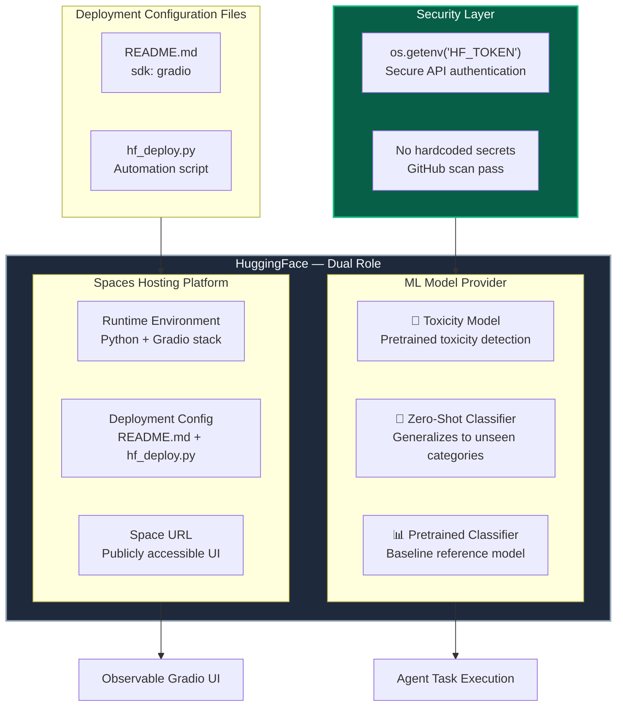
```mermaid
flowchart TD
    subgraph HFEcosystem ["HuggingFace — Dual Role"]
        subgraph MLProvider ["ML Model Provider"]
            M1["🧪 Toxicity Model\nPretrained toxicity detection"]
            M2["🎯 Zero-Shot Classifier\nGeneralizes to unseen categories"]
            M3["📊 Pretrained Classifier\nBaseline reference model"]
        end

        subgraph HostingPlatform ["Spaces Hosting Platform"]
            H1["Runtime Environment\nPython + Gradio stack"]
            H2["Deployment Config\nREADME.md + hf_deploy.py"]
            H3["Space URL\nPublicly accessible UI"]
        end
    end

    subgraph SecurityLayer ["Security Layer"]
        S1["os.getenv('HF_TOKEN')\nSecure API authentication"]
        S2["No hardcoded secrets\nGitHub scan pass"]
    end

    subgraph DeployConfig ["Deployment Configuration Files"]
        D1["README.md\nsdk: gradio"]
        D2["hf_deploy.py\nAutomation script"]
    end

    SecurityLayer --> MLProvider
    DeployConfig --> HostingPlatform
    MLProvider --> AGT["Agent Task Execution"]
    HostingPlatform --> UI["Observable Gradio UI"]

    style HFEcosystem fill:#1E293B,stroke:#94A3B8,stroke-width:2px,color:#F8FAFC
    style SecurityLayer fill:#065F46,stroke:#10B981,stroke-width:2px,color:#fff
```

**Deployment Configuration Updates:**

| File                | Change Made                                                                                             | Why It Matters                                                               |
| ------------------- | ------------------------------------------------------------------------------------------------------- | ---------------------------------------------------------------------------- |
| **README.md**       | Updated metadata to `sdk: gradio`                                                                      | Tells HuggingFace Spaces which runtime to boot — critical for UI rendering.  |
| **hf_deploy.py**    | Removed hardcoded `hf_QOGz...` API token; replaced with `os.getenv("HF_TOKEN")`                       | Prevents GitHub Secret Scanning blocks; enables secure automated deployment. |
| **Hidden Dockerfile** | Permanently deleted via HuggingFace API                                                                | Eliminates the Docker runtime conflict that caused the blank UI.             |

**Security Incident & Resolution:**

The automation script `hf_deploy.py` initially contained a hardcoded HuggingFace API key (`hf_QOGz...`). When the developer attempted to push to GitHub, **Secret Scanning blocked the push entirely**. The resolution involved:

1. Removing the hardcoded token from the source code.
2. Replacing it with `os.getenv("HF_TOKEN")` for runtime access.
3. Conducting a full repository scan to confirm no other secrets were leaked.
4. Replacing hardcoded local paths (`/Users/anubhavgupta/...`) with dynamic `os.path.join` relative paths.

> **Dual Dependency:** The agent requires HuggingFace both for its intelligence (ML models for toxicity detection, zero-shot classification, and pretrained baselines) and for its deployment (Spaces hosting). Breaking either side of this relationship — through leaked credentials or misconfigured runtimes — renders the entire system non-functional. The infrastructure overhaul addressed both simultaneously.

---

### Infrastructure-to-Architecture Dependency Chain

The infrastructure is not a separate concern — it is the **foundation upon which every architectural component depends**. This chain illustrates how infrastructure failures cascade upward through the entire system.

```mermaid
flowchart BT
    subgraph Layer1 ["Layer 1: Infrastructure"]
        I1["Python Runtime (sdk: gradio)"]
        I2["Secure API Access (os.getenv)"]
        I3["Portable Paths (os.path.join)"]
        I4["Gradio Wrapper Function"]
    end

    subgraph Layer2 ["Layer 2: Data Models"]
        D1["Content BaseModel"]
        D2["Observation BaseModel"]
        D3["Action BaseModel"]
    end

    subgraph Layer3 ["Layer 3: Agent Execution"]
        A1["Content Queue Processing"]
        A2["Action Decision Engine"]
        A3["Reasoning Chain Generation"]
    end

    subgraph Layer4 ["Layer 4: Evaluation"]
        E1["Grading Pipeline"]
        E2["Reward Computation"]
        E3["Embedding Similarity"]
    end

    subgraph Layer5 ["Layer 5: Observability"]
        O1["[START] [STEP] [END]\nReal-time on Gradio UI"]
    end

    Layer1 --> Layer2 --> Layer3 --> Layer4 --> Layer5

    style Layer1 fill:#1E3A8A,stroke:#3B82F6,color:#fff
    style Layer2 fill:#4338CA,stroke:#818CF8,color:#fff
    style Layer3 fill:#7C3AED,stroke:#A78BFA,color:#fff
    style Layer4 fill:#9333EA,stroke:#C084FC,color:#fff
    style Layer5 fill:#065F46,stroke:#10B981,color:#fff
```

| Layer                   | Depends On                      | Failure If Broken                                                         |
| ----------------------- | ------------------------------- | ------------------------------------------------------------------------- |
| **Data Models**         | Python Runtime                  | `BaseModel` classes cannot instantiate without Python.                     |
| **Agent Execution**     | Data Models + Secure API Access | Agent cannot read queue or call HF models without valid tokens.           |
| **Evaluation**          | Agent Execution + ML Models     | Grader requires agent output + baseline model comparisons to compute scores.|
| **Observability**       | Gradio Wrapper + All Above      | Without the wrapper, all processing is invisible regardless of correctness.|

> **The Core Dependency:** Without the infrastructure layer, the Agent Tasks cannot be observed, evaluated, or even executed in a deployed environment. Every improvement documented in the production flow — runtime correction, security hardening, portability fixes, and UI overhaul — exists to serve one purpose: making the agent's moderation tasks visible, auditable, and reproducible.

---

## Full System ER Diagram — Technical Architecture

```mermaid
erDiagram

CONTENT {
    string id PK "Unique post identifier"
    string text "Content text for moderation"
}

OBSERVATION {
    list content_queue "List of Content objects"
    list moderation_log "List of dict entries"
    int step_count "Current step counter"
    float cumulative_reward "Running reward total"
}

ACTION {
    string content_id FK "References Content.id"
    string action_type "approve / remove / flag"
}

AGENT {
    string AgentID PK
    string ReasoningChain "Step-by-step justification"
    float ConfidenceScore "Self-reported confidence"
}

GRADER {
    string GraderID PK
    string ToxicityModelRef "HF Toxicity Model"
    string ZeroShotRef "HF Zero-Shot Classifier"
    string PretrainedRef "Baseline Pretrained Model"
    float EmbeddingSimilarityThreshold
}

REWARD_RECORD {
    string RewardID PK
    float ClassificationScore "+0.5 or 0.0"
    float ActionScore "+0.3 or 0.0"
    float ReasoningScore "0.0 to +0.2"
    float PenaltyApplied "0.0 or -0.1 or -0.2"
    float TotalScore "Net reward for the step"
}

TASK_CONFIG {
    string TaskID PK
    string Difficulty "EASY / MEDIUM / HARD"
    string GradingMethod "rule-based / policy-match / embedding"
}

ESCALATION_QUEUE {
    string EscalationID PK
    string Reason "Low confidence / edge case / policy gap"
    string Status "Pending / Reviewed / Resolved"
}

OBSERVATION ||--o{ CONTENT : "queues"
AGENT ||--|| OBSERVATION : "reads"
AGENT ||--o{ ACTION : "produces"
ACTION ||--|| CONTENT : "references"
ACTION ||--|| OBSERVATION : "logged into moderation_log"
GRADER ||--o{ REWARD_RECORD : "computes"
AGENT ||--o{ REWARD_RECORD : "receives"
AGENT ||--o{ ESCALATION_QUEUE : "triggers when flagging"
TASK_CONFIG ||--|| GRADER : "selects grading method"
```

---
---

## Reward System — Deep Dive

The Reward System is the strict mathematical framework that governs agent evaluation across the entire TrustOps-Env simulation. While the Action Space sections above describe *what* each reward/penalty is, this section explores *why* each component is weighted the way it is, *how* they interact to shape agent behavior, and *what* architectural support is required to compute them.

### The +1.0 Maximum Score Pipeline

Every agent task is evaluated across three sequential dimensions that together form the maximum achievable score of **+1.0 per task**.

```mermaid
flowchart LR
    classDef high fill:#065F46,stroke:#10B981,stroke-width:2px,color:#fff
    classDef med fill:#1E3A8A,stroke:#3B82F6,stroke-width:2px,color:#fff
    classDef low fill:#4338CA,stroke:#818CF8,stroke-width:2px,color:#fff
    classDef penalty fill:#7F1D1D,stroke:#EF4444,stroke-width:2px,color:#fff
    classDef total fill:#B45309,stroke:#F59E0B,stroke-width:2px,color:#000

    A["+0.5\nClassification\nAccuracy"] --> B["+0.3\nAction\nCorrectness"] --> C["+0.2\nReasoning\nQuality"]
    
    C --> D["= +1.0\nMaximum Score"]

    E["-0.2\nFalse Negative"] -.->|"Overrides rewards"| D
    F["-0.1\nFalse Positive"] -.->|"Reduces score"| D

    class A high
    class B med
    class C low
    class D total
    class E,F penalty
```

| Component                | Weight  | % of Max | Evaluated At             | Evaluation Method             |
| ------------------------ | ------- | -------- | ------------------------ | ----------------------------- |
| **Classification**       | `+0.5`  | 50%      | All difficulty levels    | Rule-based (EASY) / Embedding (HARD) |
| **Action Correctness**   | `+0.3`  | 30%      | All difficulty levels    | Policy-to-action mapping      |
| **Reasoning Quality**    | `+0.2`  | 20%      | MEDIUM + HARD only       | Embedding similarity scoring  |
| **Total Maximum**        | `+1.0`  | 100%     | —                        | —                             |

---

### Classification Accuracy (+0.5) — Highest-Weighted Component

Classification accuracy is the **single most valuable achievement** in the reward system at +0.5 — more than the action reward (+0.3) and the reasoning bonus (+0.2) combined with the action reward.

**Why +0.5 is the highest weight:**

Classification is the **prerequisite for everything else**. If the agent misclassifies content, it will inevitably choose the wrong operational action, which triggers the penalty cascade:
- Misclassifying harmful material as safe → `-0.2` false negative (the most severe penalty).
- Misclassifying safe content as dangerous → `-0.1` false positive.

The entire downstream evaluation (action correctness, reasoning quality) becomes meaningless if the initial classification is wrong.

```mermaid
flowchart TD
    classDef correct fill:#065F46,stroke:#10B981,stroke-width:2px,color:#fff
    classDef wrong fill:#7F1D1D,stroke:#EF4444,stroke-width:2px,color:#fff
    classDef cascade fill:#B45309,stroke:#F59E0B,stroke-width:2px,color:#000

    A([Agent Evaluates Content]) --> B{Classification}
    
    B -->|"Correct Classification"| C["+0.5 Earned"]
    C --> D["Action has correct basis\nReward pipeline intact"]
    
    B -->|"Misclassified as Safe\n(actually harmful)"| E["Wrong Foundation"]
    E --> F["Agent selects APPROVE\n(based on wrong classification)"]
    F --> G["-0.2 False Negative Penalty"]
    
    B -->|"Misclassified as Harmful\n(actually safe)"| H["Wrong Foundation"]
    H --> I["Agent selects REMOVE\n(based on wrong classification)"]
    I --> J["-0.1 False Positive Penalty"]

    class C,D correct
    class E,F,G wrong
    class H,I,J cascade
```

**How Classification Accuracy is Measured Across Tiers:**

| Task Level | Grading Method                    | Baselines Used                                                     |
| ---------- | --------------------------------- | ------------------------------------------------------------------ |
| **EASY**   | Rule-based label matching         | Pretrained classifier as a basic reference point.                  |
| **MEDIUM** | Policy-matching against rules     | HF toxicity model + zero-shot classifier as comparison.            |
| **HARD**   | Embedding similarity evaluation   | All baselines: toxicity, zero-shot, pretrained + expert embeddings.|

> **Architecture Requirement:** To compute classification accuracy across all difficulty tiers, the system must maintain active connections to HuggingFace ML models (toxicity, zero-shot, pretrained). This is why securing API access via `os.getenv("HF_TOKEN")` was a critical infrastructure fix — without it, the grader cannot compute baseline comparisons for scoring.

---

### Action Correctness (+0.3) — The Enforcement Step

Action correctness measures whether the agent **executed the right operational response** after classifying content. It is the final, practical enforcement step that completes the +1.0 scoring pipeline.

**The Coupling with Classification:**

The +0.3 action reward does not exist in isolation — it is **sequentially dependent** on correct classification. The agent must first understand what the content is (+0.5) before it can choose the right response (+0.3).

| Classification Result      | Agent Action  | Action Score | Outcome                                     |
| -------------------------- | ------------- | ------------ | -------------------------------------------- |
| Correctly identified safe  | `approve`     | `+0.3` ✅    | Correct enforcement — content passes safely.  |
| Correctly identified harm  | `remove`      | `+0.3` ✅    | Correct enforcement — danger eliminated.       |
| Correctly sensed ambiguity | `flag`        | `+0.3` ✅    | Correct escalation — edge case safely routed.  |
| Misclassified → wrong action| `approve`/`remove` | `0.0` | Wrong enforcement — penalty cascade triggered. |

```mermaid
flowchart TD
    A["Classification: +0.5 ✅"] --> B{Select Action}
    
    B -->|"Matches policy\nfor this classification"| C["+0.3 Action Reward"]
    B -->|"Does NOT match\nexpected enforcement"| D["0.0 — No reward"]
    
    C --> E["Pipeline continues\nto Reasoning evaluation"]
    D --> F["Pipeline continues\nbut score already reduced"]
    
    A2["Classification: Wrong ❌"] --> B2{Select Action}
    B2 -->|"Action based on\nwrong classification"| G["0.0 + Penalty triggered\n-0.2 FN or -0.1 FP"]

    style C fill:#065F46,stroke:#10B981,color:#fff
    style D fill:#B45309,stroke:#F59E0B,color:#000
    style G fill:#7F1D1D,stroke:#EF4444,color:#fff
```

> **Why +0.3 and not higher?** Action correctness is weighted below classification because it is a downstream consequence. A correct action only has value if the classification was also correct. The reward system prioritizes *understanding* (+0.5) over *execution* (+0.3), which incentivizes agents to invest more cognitive effort in analyzing content before acting.

---

### Reasoning Quality (+0.2) — Embedding Similarity Evaluation

Reasoning quality is the most architecturally complex reward component. Unlike classification (label match) and action (policy check), reasoning quality requires the system to evaluate **how the agent thinks**, not just what it decides.

**When Reasoning is Evaluated:**

| Task Level | Reasoning Evaluated? | How                                                        |
| ---------- | -------------------- | ---------------------------------------------------------- |
| **EASY**   | ❌ No                | No reasoning evaluation — clear-cut tasks don't need it.   |
| **MEDIUM** | ✅ Initial           | Basic reasoning chain assessment alongside policy matching.|
| **HARD**   | ✅ Full evaluation   | Deep embedding similarity comparison vs expert reasoning.  |

**The Embedding Similarity Mechanism:**

The system does NOT simply check if the agent's answer is right — it evaluates whether the agent's reasoning chain demonstrates genuine understanding. This is done by computing the **cosine similarity between the agent's reasoning embedding and expert-level reasoning embeddings**.

```mermaid
flowchart TD
    A["Agent's Reasoning Chain\n(text output)"] --> B["Encode into\nVector Embedding"]
    
    C["Expert Reasoning\n(reference standard)"] --> D["Pre-computed\nExpert Embedding"]
    
    B --> E["Compute Cosine\nSimilarity Score"]
    D --> E
    
    E --> F{Similarity > Threshold?}
    F -->|"High similarity\nAgent reasoning aligns"| G["+0.2 Reasoning Bonus"]
    F -->|"Low similarity\nAgent reasoning diverges"| H["0.0 — No bonus"]
    
    subgraph WhyItMatters ["Why This Matters"]
        W1["Agent A: Gets right answer\nby pattern matching"]
        W2["Agent B: Gets right answer\nwith genuine understanding"]
        W1 --> W3["Low embedding similarity\n0.0 reasoning score"]
        W2 --> W4["High embedding similarity\n+0.2 reasoning bonus"]
    end

    style G fill:#065F46,stroke:#10B981,color:#fff
    style H fill:#B45309,stroke:#F59E0B,color:#000
    style W4 fill:#065F46,stroke:#10B981,color:#fff
    style W3 fill:#7F1D1D,stroke:#EF4444,color:#fff
```

> **Research Significance:** This is what transforms TrustOps-Env from a simple moderation test bench into a genuine reinforcement learning research environment. By rewarding *reasoning process* — not just *correct outcomes* — the system incentivizes agents to develop genuine contextual understanding rather than surface-level pattern matching. Agents that get right answers by luck will consistently score lower than agents that demonstrate expert-aligned thinking.

---

### False Negative Penalty (-0.2) — The Asymmetric Safety Design

The false negative penalty (-0.2) is the **most severe penalty** in the reward system — twice as harsh as the false positive penalty (-0.1). This asymmetric design is deliberate and reflects real-world platform priorities.

**What Triggers It:** The agent incorrectly allows genuinely harmful content to pass through moderation undetected. This happens when the agent classifies harmful content as safe and selects `approve`.

**Why -0.2 is Harsher Than -0.1:**

| Failure Type        | Penalty | Real-World Consequence                                                                          |
| ------------------- | ------- | ----------------------------------------------------------------------------------------------- |
| **False Negative**  | `-0.2`  | Harmful content reaches users — legal liability, user safety risks, platform trust destruction.  |
| **False Positive**  | `-0.1`  | Safe content wrongly removed — user frustration, legal disputes over censorship, trust erosion.  |

Both are bad, but **allowing genuinely harmful content is always more damaging than over-moderating**. This asymmetry directly mirrors how leading social platforms calibrate their moderation policies.

```mermaid
flowchart TD
    classDef severe fill:#7F1D1D,stroke:#EF4444,stroke-width:3px,color:#fff
    classDef moderate fill:#B45309,stroke:#F59E0B,stroke-width:2px,color:#000
    classDef safe fill:#065F46,stroke:#10B981,stroke-width:2px,color:#fff

    A([Agent Evaluates Ambiguous Content]) --> B{Decision}
    
    B -->|"Approve — risky guess"| C{Actual Content Type?}
    C -->|"Was actually safe"| D["✅ No penalty\n+0.5 + 0.3"]
    C -->|"Was actually harmful"| E["-0.2 FALSE NEGATIVE\n⚠️ Severe — harmful content released"]
    
    B -->|"Flag — safe escalation"| F["Content routed to\nhuman review"]
    F --> G["No penalty incurred\nEdge case handled safely"]
    
    B -->|"Remove — cautious guess"| H{Actual Content Type?}
    H -->|"Was actually harmful"| I["✅ Correct removal\n+0.5 + 0.3"]
    H -->|"Was actually safe"| J["-0.1 FALSE POSITIVE\n⚠️ Moderate — user trust eroded"]

    class E severe
    class J moderate
    class D,G,I safe
```

**How This Shapes Agent Behavior:**

The constant threat of the -0.2 false negative penalty fundamentally shapes the agent's decision-making strategy:

1. **On EASY tasks:** The agent can confidently make binary approve/remove decisions because the content is unambiguous.
2. **On MEDIUM tasks:** If the content sits on a policy boundary, the agent is **mathematically incentivized to flag** rather than risk approving potential harm.
3. **On HARD tasks:** The escalation incentive is strongest — the cost of guessing wrong (-0.2) far exceeds the cost of escalating to human review (0.0).

> **The Mathematical Incentive for Escalation:** Because false negatives (-0.2) are penalized more heavily than the *absence* of a positive reward (+0.3 forgone by flagging instead of approving), the agent is naturally incentivized to escalate uncertain cases rather than guess. This ensures the system errs toward safety, which mirrors how production-grade moderation pipelines operate at major platforms.

---

### Reward System — Full Interaction Matrix

```mermaid
xychart-beta
title "Reward & Penalty Distribution"
x-axis ["Classification (+0.5)", "Action (+0.3)", "Reasoning (+0.2)", "False Positive (-0.1)", "False Negative (-0.2)"]
y-axis "Score Impact" -0.3 --> 0.6
bar [0.5, 0.3, 0.2, -0.1, -0.2]
```

| Scenario                                             | Classification | Action | Reasoning | Penalty | **Total** |
| ---------------------------------------------------- | :-------: | :----: | :-------: | :-----: | :-------: |
| Perfect HARD task execution                          | +0.5      | +0.3   | +0.2      | 0.0     | **+1.0**  |
| Perfect EASY task execution                          | +0.5      | +0.3   | 0.0       | 0.0     | **+0.8**  |
| Correct classification, wrong action                 | +0.5      | 0.0    | 0.0       | 0.0     | **+0.5**  |
| False negative on harmful content                    | 0.0       | 0.0    | 0.0       | -0.2    | **-0.2**  |
| False positive on safe content                       | 0.0       | 0.0    | 0.0       | -0.1    | **-0.1**  |
| Correct flag on ambiguous content                    | +0.5      | +0.3   | +0.2      | 0.0     | **+1.0**  |

---
---

## Data Models — Architectural Significance

The Data Models are not just abstract data structures — they are **the architectural backbone that determines the system's runtime requirements, infrastructure dependencies, and computational loop**.

### Why BaseModel Requires the Python Runtime

The Content, Observation, and Action classes all inherit from Python's `BaseModel` (Pydantic). This design choice creates a **hard infrastructure dependency**: without a functioning Python runtime, none of these models can be instantiated, and the entire pipeline halts.

```mermaid
flowchart BT
    subgraph InfraDep ["Infrastructure Dependency"]
        IR["Python Runtime\n(sdk: gradio on HF Spaces)"]
    end

    subgraph DataDep ["Data Model Instantiation"]
        DM1["Content(id, text)\nBaseModel"]
        DM2["Observation(content_queue, moderation_log, step_count)\nBaseModel"]
        DM3["Action(content_id, action_type)\nBaseModel"]
    end

    subgraph PipelineDep ["Pipeline Execution"]
        PE1["Content enters queue"]
        PE2["Agent reads Observation"]
        PE3["Agent outputs Action"]
        PE4["Action logged to moderation_log"]
    end

    IR --> DM1
    IR --> DM2
    IR --> DM3
    DM1 --> PE1
    DM2 --> PE2
    DM3 --> PE3
    PE3 --> PE4

    style IR fill:#1E3A8A,stroke:#3B82F6,color:#fff
```

**This is exactly why the Docker runtime conflict was so devastating:** when HuggingFace forced a Docker runtime (via the hidden Dockerfile), the Python-based `BaseModel` classes could not reliably instantiate in the expected environment. Fixing the runtime to `sdk: gradio` was not just a UI fix — it was a **Data Model prerequisite**.

### Content as the Core Computational Loop Driver

The `Content` object drives the entire computational loop of the simulation. Every iteration of the agent's work consists of pulling a `Content` item from the `Observation.content_queue`, evaluating its `.text`, and outputting an `Action` that references its `.id`.

```mermaid
flowchart TD
    subgraph Loop ["Core Computational Loop (repeats per Content item)"]
        A["Content pulled from\nObservation.content_queue"] --> B["Agent evaluates\nContent.text"]
        B --> C["Agent outputs\nAction(content_id, action_type)"]
        C --> D["Action logged to\nObservation.moderation_log"]
        D --> E["step_count++"]
        E --> F["cumulative_reward updated\nvia Grading Pipeline"]
        F --> G{More Content\nin queue?}
        G -->|Yes| A
        G -->|No| H([Episode Complete])
    end

    style Loop fill:#1E293B,stroke:#94A3B8,color:#F8FAFC
    style H fill:#065F46,stroke:#10B981,color:#fff
```

> **Scale Simulation:** The `content_queue` (typed as `List[Content]`) is the architectural mechanism that simulates the real-world constraint of managing "millions of posts." The length of this queue directly determines the episode duration and the total reward opportunity available to the agent.

### Action as the Structural Safety Valve

The `Action` model's strict limitation to three `action_type` values (`"approve"`, `"remove"`, `"flag"`) serves a dual architectural purpose:

1. **Prevents arbitrary behavior:** The agent cannot invent new actions or produce undefined outputs — every decision must fit the defined schema.
2. **Enables the escalation mechanism:** The `"flag"` option exists specifically as a **structural safety valve** in the data model, giving the agent a way to express uncertainty without triggering the severe false negative (-0.2) or false positive (-0.1) penalties.

Without `"flag"` in the `Action` model's allowed values, the agent would be forced to make binary approve/remove decisions on every piece of content — including the HARD, nuanced, context-dependent content that even human moderators struggle with.

---
---

## Coverage Analysis — What Was Documented

> This table maps every topic discussed during project development to its documentation status in this Technical Architecture document.

| Topic                                                  | Covered In Sources | Documented Here | Mermaid Visual |
| ------------------------------------------------------ | :---: | :---: | :---: |
| **Data Models (Content, Observation, Action)**         | ✅ | ✅ | ✅ ER + Flowchart |
| **Content Object (id, text) — BaseModel**              | ✅ | ✅ | ✅ ER Diagram |
| **Observation Model (content_queue, moderation_log)**  | ✅ | ✅ | ✅ ER + Sequence |
| **Action Model (content_id, action_type)**             | ✅ | ✅ | ✅ Flowchart |
| **Data Model Interconnection**                         | ✅ | ✅ | ✅ Flow Diagram |
| **Data Models — Architectural Significance**           | ✅ | ✅ | ✅ Flowchart (NEW) |
| **Content as Core Computational Loop**                 | ✅ | ✅ | ✅ Loop Diagram (NEW) |
| **Action Space — Approve**                             | ✅ | ✅ | ✅ Flowchart |
| **Action Space — Remove**                              | ✅ | ✅ | ✅ Flowchart |
| **Action Space — Flag (Escalation)**                   | ✅ | ✅ | ✅ Flowchart |
| **Action Space — Comparative Risk Profile**            | ✅ | ✅ | ✅ Bar Chart |
| **EASY Task: Spam Filtering**                          | ✅ | ✅ | ✅ Flowchart |
| **MEDIUM Task: Borderline Abuse**                      | ✅ | ✅ | ✅ Flowchart |
| **HARD Task: Contextual Nuance**                       | ✅ | ✅ | ✅ Flowchart |
| **Task Difficulty Progression**                        | ✅ | ✅ | ✅ XY Chart |
| **Grading Pipeline (Rule-based / Policy / Embedding)** | ✅ | ✅ | ✅ Flowchart |
| **Grading Tier Selection Logic**                       | ✅ | ✅ | ✅ Table |
| **Model Integration (Toxicity, Zero-Shot, Pretrained)**| ✅ | ✅ | ✅ Flowchart |
| **Embedding Similarity Grading**                       | ✅ | ✅ | ✅ Flowchart (NEW) |
| **Reasoning Quality Evaluation (+0.2)**                | ✅ | ✅ | ✅ Flowchart (NEW) |
| **Content Flow — End-to-End Pipeline**                 | ✅ | ✅ | ✅ Flowchart |
| **Observation Lifecycle — Sequence**                   | ✅ | ✅ | ✅ Sequence Diagram |
| **Infrastructure — Initial Failure**                   | ✅ | ✅ | ✅ Before/After (NEW) |
| **Python Runtime (sdk:python vs sdk:gradio)**          | ✅ | ✅ | ✅ Flowchart (NEW) |
| **Gradio UI Framework (Wrapper Function)**             | ✅ | ✅ | ✅ Flowchart (NEW) |
| **HuggingFace Spaces Integration (Dual Role)**        | ✅ | ✅ | ✅ Flowchart (NEW) |
| **Infrastructure Dependency Chain (5 Layers)**         | ✅ | ✅ | ✅ Bottom-up Flow (NEW) |
| **Security Incident (GitHub Secret Scanning)**         | ✅ | ✅ | — (in text) |
| **Secure API Access (os.getenv)**                      | ✅ | ✅ | ✅ (in HF Integration) |
| **Simplified Policy Assumption**                       | ✅ | ✅ | — (in text) |
| **Reward System — Full Deep-Dive**                     | ✅ | ✅ | ✅ Multiple (NEW) |
| **Classification Accuracy (+0.5)**                     | ✅ | ✅ | ✅ Flowchart (NEW) |
| **Action Correctness (+0.3)**                          | ✅ | ✅ | ✅ Flowchart (NEW) |
| **Reasoning Quality (+0.2) — Embedding Similarity**    | ✅ | ✅ | ✅ Flowchart (NEW) |
| **False Negative Penalty (-0.2) — Asymmetric Design**  | ✅ | ✅ | ✅ Flowchart (NEW) |
| **Reward Interaction Matrix (+1.0 max)**               | ✅ | ✅ | ✅ XY Chart (NEW) |
| **Full System ER Diagram**                             | ✅ | ✅ | ✅ ER Diagram |
