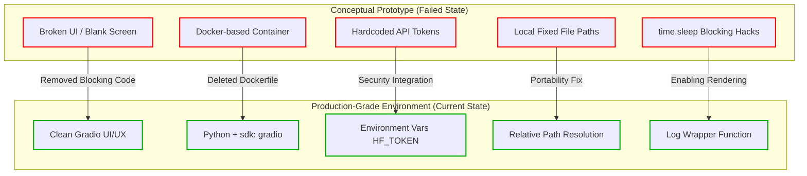
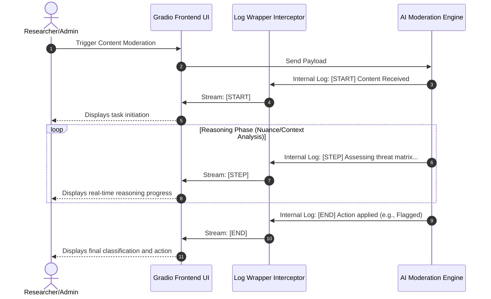

# TrustOps-Env: UI/UX & Engineering Optimization

## 1. Project Overview & Core Concept
**TrustOps-Env** is an Open Environment (OpenEnv) designed to simulate the sophisticated content moderation pipelines utilized by modern social media platforms. The central goal is to test, evaluate, and refine autonomous agents capable of managing harmful content at scale.

This project bridges the gap between high-level trust and safety research and a production-ready architecture. It challenges an autonomous agent to:
1. **Classify content** based on provided text inputs.
2. **Decide on actions** (e.g., *approve*, *remove*, or *flag*).
3. **Escalate uncertain cases** to specific nuance contexts.

### 1.1 Content Task Complexity Matrix
The moderation tasks simulate real-world challenges, divided into varying difficulty tiers:

*   **Easy Tasks:** Differentiating between outright spam and clearly safe content.
*   **Hard Tasks:** Navigating nuanced, context-dependent content where policies require deep reasoning.

### 1.2 Reward and Penalty Mechanism
To evaluate moderation agents accurately, the environment uses a specific scoring structure:
*   **Accuracy:** `+0.5` for correct classification.
*   **Reasoning Quality:** `+0.2` for detailed, logical reasoning.
*   **False Positives:** `-0.1` penalty.
*   **False Negatives:** `-0.2` penalty (weighted heavier due to the danger of allowing harmful content).

---

## 2. The Path to Production Optimization (Prototype vs. Production)
The initial prototype of TrustOps-Env was conceptual but functionally flawed—primarily facing UI blackouts. The journey to a production-grade environment required significant structural and infrastructure improvements.

### 2.1 Engineering Enhancements
*   **Infrastructure Shift:** Transitioned away from a problematic Docker-based runtime to a native Python + Gradio stack on HuggingFace Spaces.
*   **Security & Portability:** 
    *   *Hardcoded local file paths* were eliminated in favor of relative path execution (`os.path.abspath`), ensuring deployment flexibility.
    *   *Hardcoded API tokens* were removed to prevent major security leaks. They were replaced by secure environment variables (`os.getenv("HF_TOKEN")`), meeting proper production standards.

### 2.2 System Architecture Transformation Flow

---

## 3. UI/UX Transformation: Resolving Infrastructure Failures

UI/UX enhancements in TrustOps-Env were not purely cosmetic. They were **functional necessities** for creating an observable, secure, and debuggable environment.

### 3.1 Removing Blocking Execution Hacks
The root cause for the initial "blank screen" on HuggingFace Spaces was an infrastructural bottleneck. A `time.sleep()` hack inside the `inference.py` script physically blocked the frontend from loading entirely.
*   **Action Taken:** Developers completely removed these blocking hacks.
*   **Result:** Cleared the logical bottleneck, allowing the rendering of a smooth, reactive Gradio interface where logs could flow freely.

### 3.2 Setting the SDK to Gradio
Even when using Python, explicitly specifying the environment configuration as `sdk: gradio` was vital. 
*   **Why?** `sdk: python` does not automatically support UI rendering on HuggingFace Spaces. Changing this simple directive solved the core problem of invisible frontend layers.

---

## 4. Real-Time Observability & The Log Wrapper

In a system tracking agent reasoning on nuanced tasks, a "black box" backend is unacceptable. Researchers need real-time line-of-sight into the agent's logic to analyze its ethical decision frameworks.

### 4.1 Capturing Backend Status Updates
To achieve this absolute transparency, a custom **Log Wrapper Function** was conceptualized and developed.
*   The function acts as an interceptor between Python backend `print()` commands and frontend Gradio components.
*   It ensures that moderation status changes don't just appear in the cloud console, but actively stream and render on the user interface.

### 4.2 Status Tracking Markers: `[START]`, `[STEP]`, `[END]`
The environment mandates the output of distinct, readable markers integrated into the `moderation_log`. These act as audit points for the evaluation engine:

1.  **`[START]`**: Signals the beginning of a pipeline evaluation, indicating the queue process has commenced.
2.  **`[STEP]`**: Illustrates the agent's progressive logic, vital for auditing why a piece of content is classified as safe or harmful. Validating reasoning quality *(the +0.2 reward)* depends completely on verifying these logs. It represents the "thinking" metadata.
3.  **`[END]`**: Marks the ultimate decision and terminal action phase (*Approve, Remove, or Flag*).

### 4.3 Real-Time Observability Sequence Flow

---

## 5. Summary & Strategic Integrity

By treating UI/UX as an infrastructural foundation rather than a graphical afterthought, TrustOps-Env evolved from a stagnant prototype into a secure, portable, and transparent moderation tool. 

The successful implementation of **Real-time Log Rendering** and the systemic eradication of blocking mechanisms means the environment can now robustly support **high-complexity research constraints**. The UI allows absolute visibility into black-box AI reasoning, effectively capturing every deduction and penalty, proving critical for scalable ethics in AI decision models.
