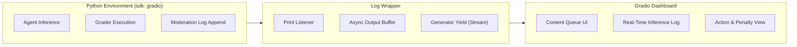
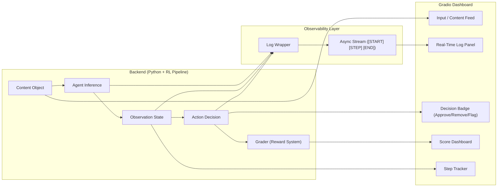

# TrustOps-Env: User Interface & Observability

## 1. Overview
In content moderation systems, operating at scale requires more than just a capable reinforcement learning agent—it requires absolute transparency. **TrustOps-Env** addresses the core problem of invisible AI decision-making. 

Where the *Core Concept* defines the moderation challenges and the *Technical Architecture* powers the backend evaluation pipeline, this UI document explains how these hidden components are made visible. The UI translates abstract neural processing into a real-time, interactive dashboard for AI Developers, Trust & Safety Researchers, and Policy Analysts.

## 2. UI Role in the System
The UI serves as the final, observable layer of the TrustOps-Env pipeline. It does not calculate rewards or enforce policies itself; instead, it provides a real-time window into the agent's logic. 

Because false negatives (allowing harmful content) carry severe real-world risk, observability is not just a feature—it is a critical safety requirement. The Gradio dashboard ensures that every step the agent takes, and every penalty it receives, is auditable and perfectly synchronized with the underlying Python architecture.

## 3. UI Architecture
The UI pipeline cleanly separates the backend heavy inference (the agent) from the frontend rendering (the dashboard) using a robust log streaming mechanism.

## 4. Component Mapping (Backend ↔ UI)
The UI directly maps to the `BaseModel` classes defined in the technical architecture. As the agent processes data, the UI continuously fetches and renders these structured objects.

| Backend Component | UI Representation | Purpose |
| :--- | :--- | :--- |
| **`Content` Object** | **Input Queue / Feed Panel** | Displays the `text` of the post under examination. |
| **`Observation` State** | **Sidebar / Live Metrics** | Renders the `step_count` progression and historical `moderation_log`. |
| **`Action` Model** | **Decision Badges** | Visually highlights the agent's output type (`approve`, `remove`, `flag`). |

## 5. Action Space Visualization
The agent operates within a strictly balanced Action Space. The UI visually reinforces the risk associated with these operational decisions.

*   `✅ APPROVE`: Rendered when content complies with policy. If evaluated as incorrect, the UI explicitly flashes a **-0.2 False Negative** penalty alert, reinforcing the danger of permitting harmful text.
*   `🚫 REMOVE`: Rendered when enforcing policy. If the content was benign, the UI logs a **-0.1 False Positive**, highlighting user-trust erosion.
*   `🏳️ FLAG`: Acts as the strategic escalation point. By clearly separating this status, researchers can trace when an agent successfully identifies edge cases without risking binary penalties.

## 6. Grading & Reward Visualization
TrustOps-Env evaluates tasks across varying complexities (EASY, MEDIUM, HARD). The UI demystifies the multi-layered grading pipeline by displaying a transparent scoring breakdown for every task:

1.  **Classification:** Base `+0.5` points if the agent accurately tags the content.
2.  **Action Logic:** Base `+0.3` points if the agent's operational choice aligns with policy constraints.
3.  **Reasoning Bonus:** For **HARD** tasks, the UI displays a `+0.2` bonus earned through vector comparisons. This proves to the researcher that the agent isn't guessing; it is correctly understanding contextual nuance.
4.  **This ensures that the UI not only displays outcomes but also validates the agent’s decision quality in alignment with the reward system defined in the core concept.
## 7. Observability & The Log System
The core feature of the UI is the native `Log Wrapper`. It captures text from the internal Large Language Model (LLM) and yields it to the web socket in real time, bypassing frozen execution threads. It categorizes logs into three formal checkpoints:

*   **`[START]`**: Acknowledges the agent has begun analyzing a new piece of content.
*   **`[STEP]`**: Captures the step-by-step cognitive logic, allowing researchers to validate the agent's reasoning before the final decision is reached.
*   **`[END]`**: Marks task completion, flushing the final action and triggering the reward score dashboard.

## 8. Engineering Decisions
To achieve a fully functional UI, several major infrastructural blockers were resolved:

*   **Removed the `Dockerfile`:** A hidden Docker config forced the app into a blind container (`?docker=true`). Deleting it restored native Python access.
*   **Enforced `sdk: gradio`:** Explicitly setting this configuration correctly mounted the interface on HuggingFace Spaces.
*   **Removed `time.sleep()`:** Blocking procedural code froze the server's event loop. Removing these blocks enabled the Gradio generator to stream logs asynchronously.
*   **Secure Baselines:** Hardcoded API tokens were replaced with `os.getenv("HF_TOKEN")`, ensuring the UI could securely query baseline toxicity models without risking repository locks.

## 9. Conclusion
The TrustOps-Env UI is not a detached graphical overlay; it is the exact visual representation of the system’s intelligence and decision pipeline. By cleanly mapping backend observation states, visualizing the risk mechanics of every action, and streaming native logic through the Log Wrapper, the UI successfully provides developers and policy teams with the real-time observability required to deploy ethical AI securely.
