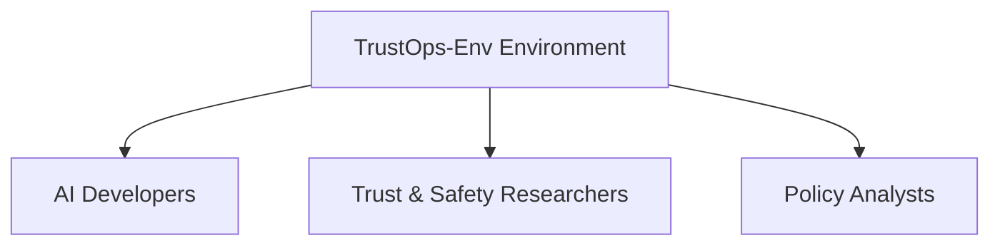
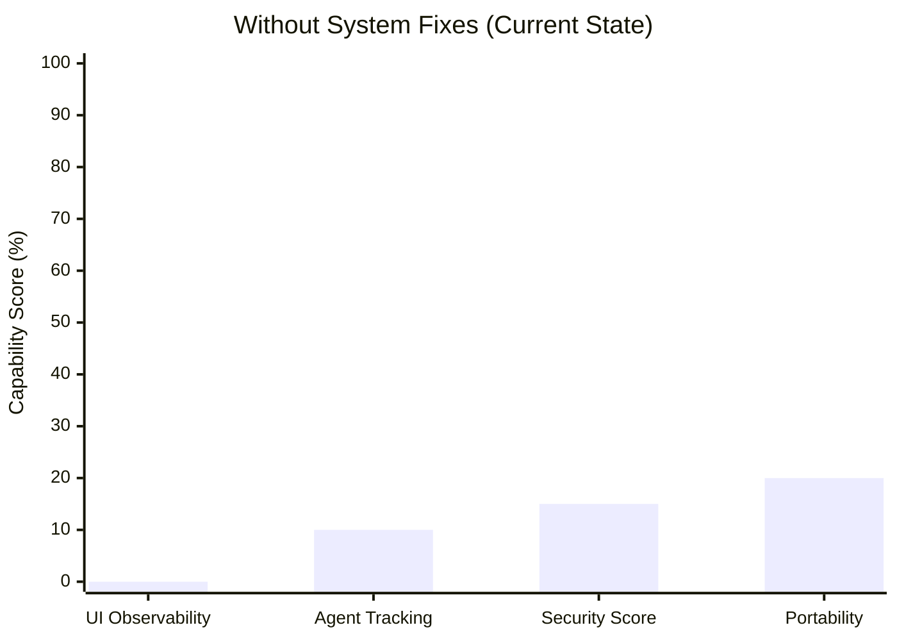
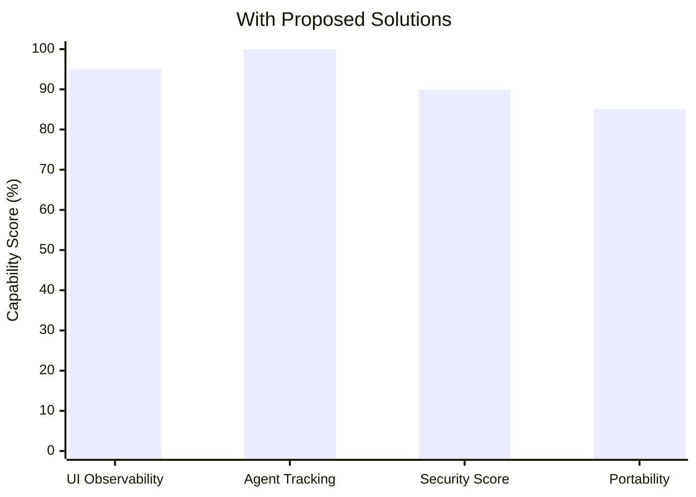
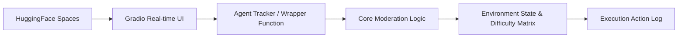
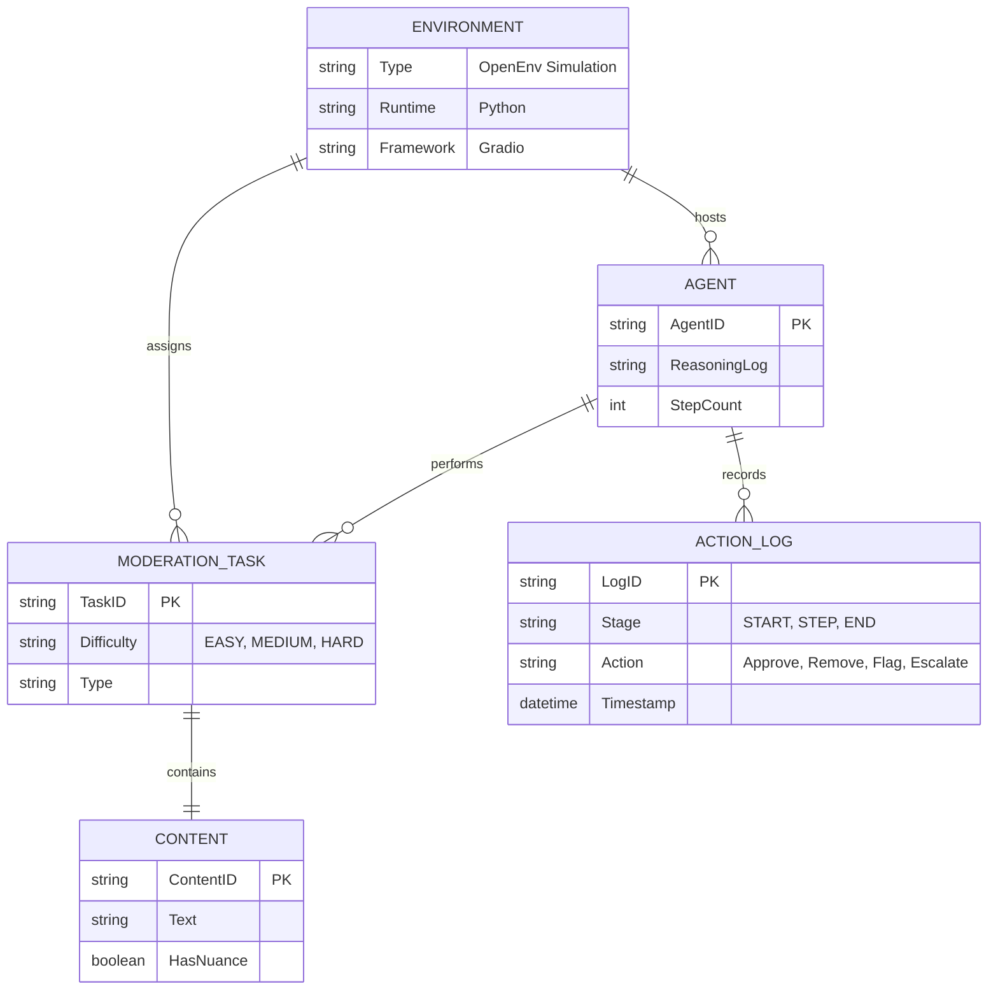

---

# TrustOps-Env : Content Moderation & Trust Safety Environment

---

### Core Concept & Problem Description

The TrustOps-Env is an open environment designed to simulate the content moderation pipelines used by major social platforms. The primary objective is to deploy an AI agent capable of detecting harmful content, enforcing policies, and escalating uncertain edge cases, while managing massive scales (millions of posts), legal risks, and false positives.

**The Core Problem:**
While the theoretical design of TrustOps-Env was robust, a major technical roadblock existed: the application was failing to render properly when deployed to HuggingFace Spaces, resulting in a completely blank UI. 

Because of its high complexity and ethical/legal risks, it was positioned primarily as an observable research tool. A blank UI meant observers couldn't see the tasks running. The system was incorrectly defaulting to a Docker runtime (indicated by a `?docker=true` URL parameter) instead of the intended Python environment.

| Challenge                               | Description                                                                                     | Impact on Researchers / Users                       |
| --------------------------------------- | ----------------------------------------------------------------------------------------------- | --------------------------------------------------- |
| **Blank UI / Rendering Failure**        | The system defaulted to a hidden Docker runtime instead of Python.                              | Application failed to load on HuggingFace Spaces.   |
| **Blocking Execution Code**             | Hardcoded `time.sleep()` UI hacks prevented real-time logs from showing.                        | Observers couldn't see the agent's reasoning steps. |
| **Security Risks & Hardcoded Paths**    | Hardcoded HF API tokens and local absolute paths were pushed to the repo.                       | Security blocks by GitHub and portability issues.   |

### Current Situation v/s Desired Outcome

| Current Situation (Broken State)      | Desired Outcome (Fixed State)                            |
| ------------------------------------- | -------------------------------------------------------- |
| Blank UI rendering on HuggingFace     | Clean, visually observable Gradio UI rendering           |
| Hidden Dockerfile forcing wrong env   | Correct Python environment setup (`sdk: gradio`)         |
| Hardcoded API Tokens triggering blocks| Secure environment variables for API keys                |
| Script blocked without showing logs   | Real-time logs (`[START]`, `[STEP]`, `[END]`) displayed  |

---

| Category                                 | Details                                                                                                                                                             |
| ---------------------------------------- | ------------------------------------------------------------------------------------------------------------------------------------------------------------------- |
| **Geographical Focus**                   | Global / AI Policy Sector                                                                                                                                           |
| **Type of Task Simulated**               | Moderation challenges of varying difficulties:  • EASY (spam vs. safe)  • MEDIUM (platform policy enforcement)  • HARD (nuanced, context-dependent content)|
| **Data Tracked & Generated**             | Agent Actions (approve, remove, flag, escalate), step count, and reasoning sequences.                                                                               |
| **Current Market Gap**                   | Lack of observable, step-by-step reinforcement learning environments simulating real-world, high-scale trust and safety moderation.                                 |
| **Opportunity Identified**               | A secure, portable research environment capable of real-time logging and reasoning tracking.                                                                        |

### Existing Gap vs TrustOps-Env Improvement

### Root Cause Analysis

| Problem Area             | Root Cause                                                       | Impact on Operations                                                |
| ------------------------ | ---------------------------------------------------------------- | ------------------------------------------------------------------- |
| **Incorrect Runtime**    | A hidden `Dockerfile` dictated incorrect environment deployment  | The UI failed to render, breaking HuggingFace deployment entirely.  |
| **Missing Log Renders**  | Blocking `time.sleep()` functions halted the event loop          | Real-time execution outputs were not rendered to the Gradio UI.     |
| **Environment Security** | HF API tokens were hardcoded inside the python file              | Application triggered GitHub Security flags and was unusable.       |

---

### Solution Strategy
1) **Runtime Correction**: Located and permanently deleted the hidden `Dockerfile`, forcing HuggingFace into its Python runtime. Updated `README` metadata to `sdk: gradio`.
2) **Agent Tracking Enablement**: Implemented a wrapper function to capture backend print logs to display real-time execution steps.
3) **UI Visibility**: Removed the blocking hack (`time.sleep()`), allowing the Gradio UI to stream log metrics (`[START]`, `[STEP]`, `[END]`).
4) **Security & Portability Setup**: Removed all hardcoded credentials and replaced them with secure `.env` variables and dynamic relative paths.

---

### System Workflow

### Architecture Flow

---

### ER Diagram

---

### End-to-End Workflow

1. **Initialization:** The environment starts by strictly relying on environment variables, utilizing relative paths to establish a portable baseline.
2. **Setup:** HuggingFace parses the configuration, correctly booting the Python runtime and launching the clean Gradio interface.
3. **Task Delegation:** A content moderation task is pulled from the system. It is immediately classified by an internal matrix ranging from EASY to HARD difficulty. 
4. **Execution Log (START):** Real-time monitoring captures the `[START]` phase of the task.
5. **Agent Action (STEP):** The agent decides to *approve, remove, flag, or escalate* the content. Each distinct step of its logic process is forwarded to the UI via a wrapper function, avoiding UI halts, generating a `[STEP]` print output.
6. **Completion (END):** Actions are appended to the main moderation log and the task counts are resolved, resulting in the final `[END]` state. 

---

### Hackathon / Deployment Deliverables Summary
- Eliminated Docker runtime blockers and established a flawless Python/Gradio instance on HuggingFace Spaces.
- Made the environment actively visual and secure by overhauling its logging system to render immediate reasoning states.
- Stabilized and open-sourced an environment capable of testing agents against robust socio-legal moderation challenges.

### Impact
- **Solves the Core Problem:** Transforms a completely broken, blind script into a seamlessly executing, fully observable application.
- **Enables Research:** Researchers can actually watch the agent's step-by-step reasoning and track actions immediately on the web instead of a local terminal.
- **Ensures Portability:** By purging hardcoded absolute paths and secrets, the TrustOps-Env project becomes instantly cloneable and safe across varying deployment modalities.
