---

# TrustOps-Env : Content Moderation & Trust Safety Environment

---

### Core Concept & Problem Description

The TrustOps-Env is an open environment designed to simulate the content moderation pipelines used by major social platforms. The primary objective is to deploy an AI agent capable of detecting harmful content, enforcing policies, and escalating uncertain edge cases, while managing massive scales (millions of posts), legal risks, and false positives.

**The Core Problem:**
While the theoretical design of TrustOps-Env was robust, a major technical roadblock existed: the application was failing to render properly when deployed to HuggingFace Spaces, resulting in a completely blank UI. 

Because of its high complexity and ethical/legal risks, it was positioned primarily as an observable research tool. A blank UI meant observers couldn't see the tasks running. The system was incorrectly defaulting to a Docker runtime (indicated by a `?docker=true` URL parameter) instead of the intended Python environment.

| Challenge                               | Description                                                                                     | Impact on Researchers / Users                       |
| --------------------------------------- | ----------------------------------------------------------------------------------------------- | --------------------------------------------------- |
| **Blank UI / Rendering Failure**        | The system defaulted to a hidden Docker runtime instead of Python.                              | Application failed to load on HuggingFace Spaces.   |
| **Blocking Execution Code**             | Hardcoded `time.sleep()` UI hacks prevented real-time logs from showing.                        | Observers couldn't see the agent's reasoning steps. |
| **Security Risks & Hardcoded Paths**    | Hardcoded HF API tokens and local absolute paths were pushed to the repo.                       | Security blocks by GitHub and portability issues.   |

### Current Situation v/s Desired Outcome

| Current Situation (Broken State)      | Desired Outcome (Fixed State)                            |
| ------------------------------------- | -------------------------------------------------------- |
| Blank UI rendering on HuggingFace     | Clean, visually observable Gradio UI rendering           |
| Hidden Dockerfile forcing wrong env   | Correct Python environment setup (`sdk: gradio`)         |
| Hardcoded API Tokens triggering blocks| Secure environment variables for API keys                |
| Script blocked without showing logs   | Real-time logs (`[START]`, `[STEP]`, `[END]`) displayed  |

---

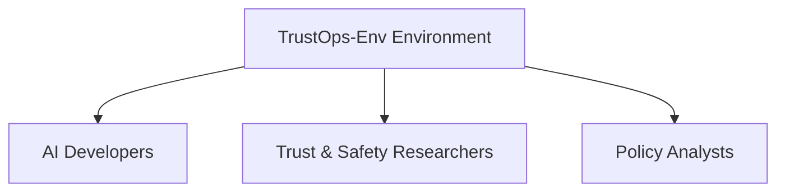

| Category                                 | Details                                                                                                                                                             |
| ---------------------------------------- | ------------------------------------------------------------------------------------------------------------------------------------------------------------------- |
| **Geographical Focus**                   | Global / AI Policy Sector                                                                                                                                           |
| **Type of Task Simulated**               | Moderation challenges of varying difficulties:  • EASY (spam vs. safe)  • MEDIUM (platform policy enforcement)  • HARD (nuanced, context-dependent content)|
| **Data Tracked & Generated**             | Agent Actions (approve, remove, flag, escalate), step count, and reasoning sequences.                                                                               |
| **Current Market Gap**                   | Lack of observable, step-by-step reinforcement learning environments simulating real-world, high-scale trust and safety moderation.                                 |
| **Opportunity Identified**               | A secure, portable research environment capable of real-time logging and reasoning tracking.                                                                        |

### Existing Gap vs TrustOps-Env Improvement
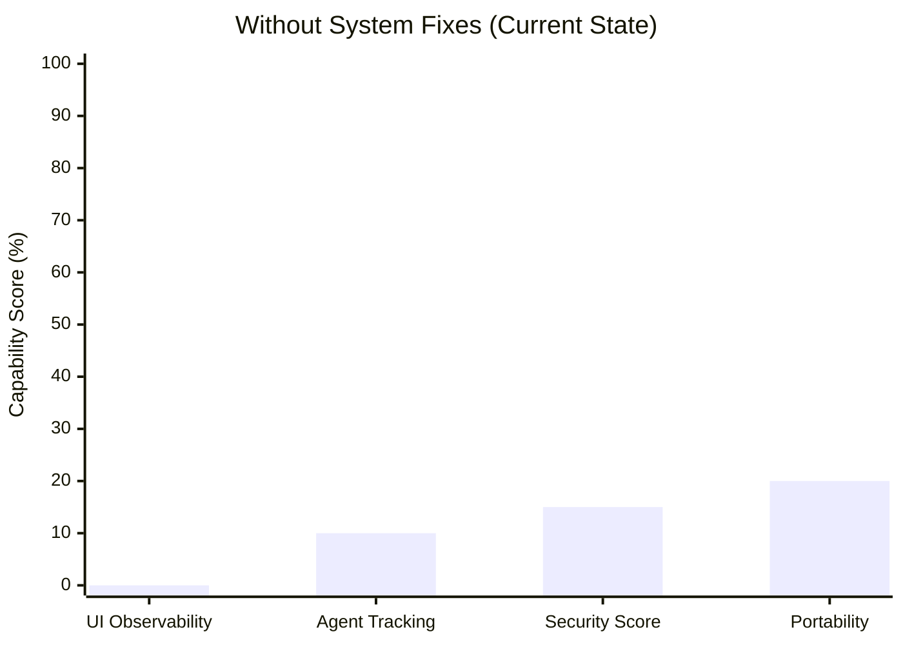

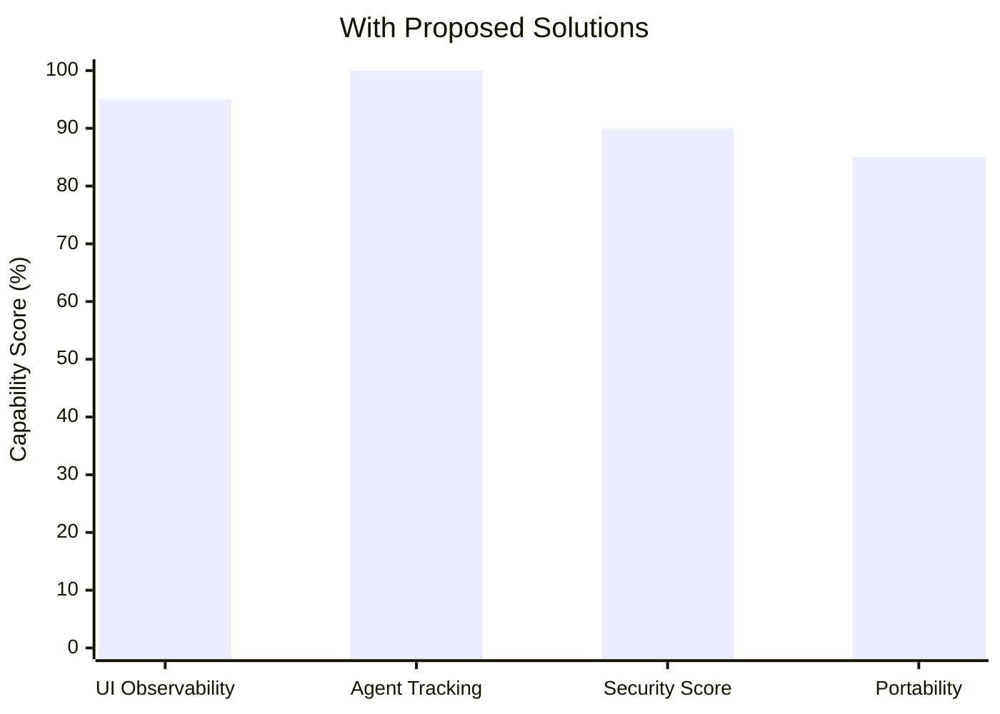

### Root Cause Analysis

| Problem Area             | Root Cause                                                       | Impact on Operations                                                |
| ------------------------ | ---------------------------------------------------------------- | ------------------------------------------------------------------- |
| **Incorrect Runtime**    | A hidden `Dockerfile` dictated incorrect environment deployment  | The UI failed to render, breaking HuggingFace deployment entirely.  |
| **Missing Log Renders**  | Blocking `time.sleep()` functions halted the event loop          | Real-time execution outputs were not rendered to the Gradio UI.     |
| **Environment Security** | HF API tokens were hardcoded inside the python file              | Application triggered GitHub Security flags and was unusable.       |

---

### Solution Strategy
1) **Runtime Correction**: Located and permanently deleted the hidden `Dockerfile`, forcing HuggingFace into its Python runtime. Updated `README` metadata to `sdk: gradio`.
2) **Agent Tracking Enablement**: Implemented a wrapper function to capture backend print logs to display real-time execution steps.
3) **UI Visibility**: Removed the blocking hack (`time.sleep()`), allowing the Gradio UI to stream log metrics (`[START]`, `[STEP]`, `[END]`).
4) **Security & Portability Setup**: Removed all hardcoded credentials and replaced them with secure `.env` variables and dynamic relative paths.

---

### System Workflow
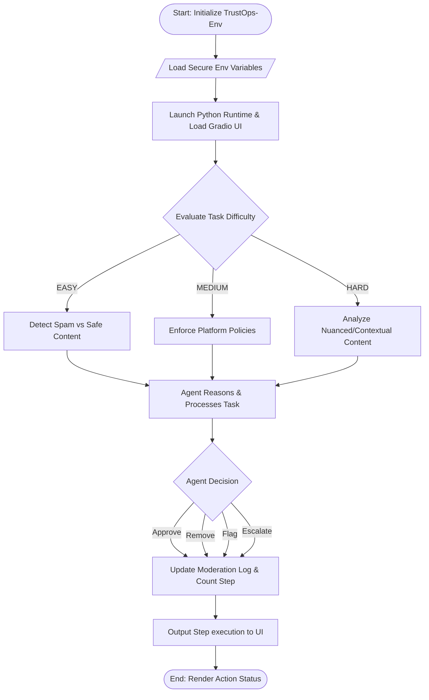

### Architecture Flow
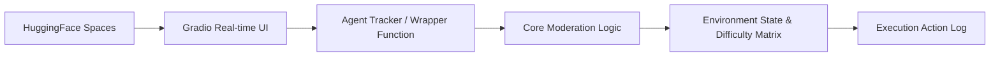

---

### ER Diagram

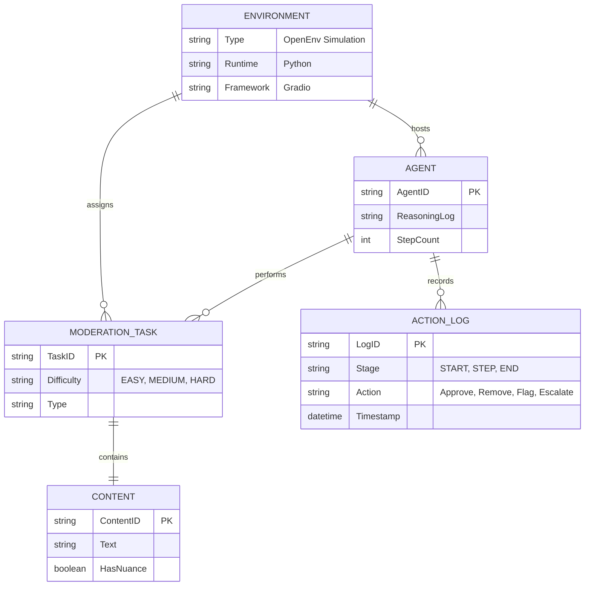

---

### End-to-End Workflow

1. **Initialization:** The environment starts by strictly relying on environment variables, utilizing relative paths to establish a portable baseline.
2. **Setup:** HuggingFace parses the configuration, correctly booting the Python runtime and launching the clean Gradio interface.
3. **Task Delegation:** A content moderation task is pulled from the system. It is immediately classified by an internal matrix ranging from EASY to HARD difficulty. 
4. **Execution Log (START):** Real-time monitoring captures the `[START]` phase of the task.
5. **Agent Action (STEP):** The agent decides to *approve, remove, flag, or escalate* the content. Each distinct step of its logic process is forwarded to the UI via a wrapper function, avoiding UI halts, generating a `[STEP]` print output.
6. **Completion (END):** Actions are appended to the main moderation log and the task counts are resolved, resulting in the final `[END]` state. 

---

### Hackathon / Deployment Deliverables Summary
- Eliminated Docker runtime blockers and established a flawless Python/Gradio instance on HuggingFace Spaces.
- Made the environment actively visual and secure by overhauling its logging system to render immediate reasoning states.
- Stabilized and open-sourced an environment capable of testing agents against robust socio-legal moderation challenges.

### Impact
- **Solves the Core Problem:** Transforms a completely broken, blind script into a seamlessly executing, fully observable application.
- **Enables Research:** Researchers can actually watch the agent's step-by-step reasoning and track actions immediately on the web instead of a local terminal.
- **Ensures Portability:** By purging hardcoded absolute paths and secrets, the TrustOps-Env project becomes instantly cloneable and safe across varying deployment modalities.

---
---

## 🔬 Advanced System Design — Areas Previously Uncovered

> The sections below document the deeper architectural systems, evaluation mechanics, and risk management strategies that form the complete TrustOps-Env design. These were discussed during project development but had not yet been added to the core concept document.

---

### Reward System & Agent Evaluation Mechanics

The TrustOps-Env uses a structured reward-penalty system to evaluate agent quality. This is what transforms the environment from a simple moderation tool into an actual reinforcement learning research platform.

| Reward / Penalty            | Score   | Trigger Condition                                                        |
| --------------------------- | ------- | ------------------------------------------------------------------------ |
| **Correct Classification**  | `+0.5`  | Agent correctly identifies the content type (harmful, safe, borderline). |
| **Correct Action**          | `+0.3`  | Agent selects the right operational action for the given classification. |
| **Reasoning Quality**       | `+0.2`  | Agent provides a logically sound, step-by-step reasoning chain.          |
| **False Negative Penalty**  | `-0.2`  | Agent allows harmful content to pass through (most dangerous failure).   |
| **False Positive Penalty**  | `-0.1`  | Agent incorrectly flags or removes safe content (user trust erosion).    |

**Maximum score per task: `+1.0`** (correct classification + correct action + high reasoning quality).

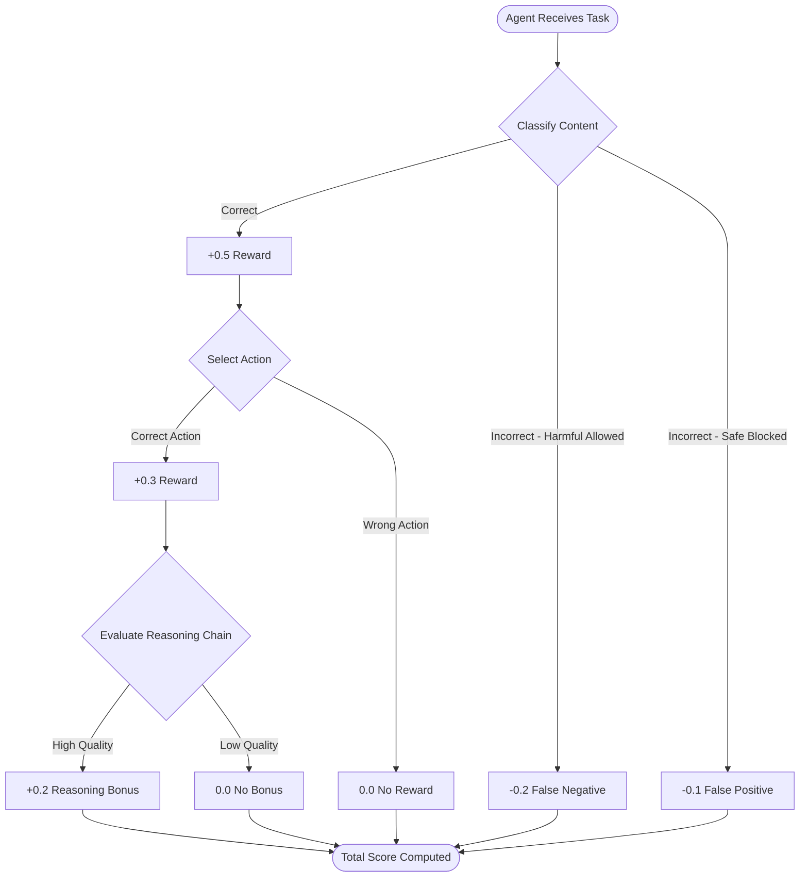

> **Strategic Insight:** The asymmetric penalty design (false negatives penalized more heavily than false positives at -0.2 vs -0.1) reflects real-world platform priorities — allowing genuinely harmful content is always more damaging than over-moderating. This incentivizes agents to err on the side of caution for ambiguous content, which exactly matches how leading social platforms calibrate their moderation policies.

---

### Task Difficulty Matrix — EASY / MEDIUM / HARD

Each task in the environment is assigned a difficulty level that determines the complexity of the moderation challenge and the grading criteria applied.

| Difficulty | Content Type                            | Example Scenario                                                                                  | Agent Challenge                                              |
| ---------- | --------------------------------------- | ------------------------------------------------------------------------------------------------- | ------------------------------------------------------------ |
| **EASY**   | Clear spam vs. clearly safe content     | "BUY CHEAP FOLLOWERS!!!" vs. "Had a great lunch today"                                           | Binary classification; minimal reasoning needed.             |
| **MEDIUM** | Borderline abusive / policy violations  | Heated argument using aggressive tone but no slurs; satire that could be misread as threats.      | Requires policy knowledge and contextual interpretation.     |
| **HARD**   | Nuanced, context-dependent content      | Cultural expressions that appear threatening to outsiders; coded language; whistleblower content.  | Demands deep contextual reasoning, cultural sensitivity.     |

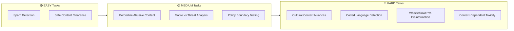

**Simplified Policy Assumption:** The current simulation operates under a simplified policy framework. This design choice isolates the agent's fundamental enforcement mechanics and reasoning quality from the overwhelming legal/ethical complexity of a full-fledged platform policy. It allows focused research on the core moderation challenge without operational paralysis.

---

### Grading & Evaluation Architecture

The TrustOps-Env employs multiple evaluation layers to assess agent performance beyond simple accuracy metrics.

| Evaluation Layer             | Method                              | Purpose                                                               |
| ---------------------------- | ----------------------------------- | --------------------------------------------------------------------- |
| **Classification Accuracy**  | Direct label matching               | Did the agent correctly identify content as harmful/safe/borderline?  |
| **Action Correctness**       | Action-to-policy mapping            | Did the agent take the operationally correct action?                  |
| **Reasoning Quality**        | Embedding similarity scoring        | How well does the agent's reasoning chain align with expert reasoning?|
| **Toxicity Baseline**        | HuggingFace toxicity models         | Pretrained classifier used as a baseline reference for comparison.    |
| **Zero-Shot Classification** | HuggingFace zero-shot classifiers   | Evaluates agent's ability to generalize to unseen content categories. |

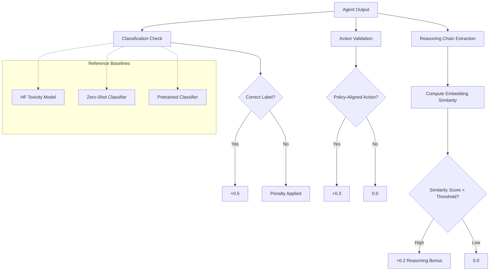

> **Embedding Similarity for Reasoning Quality:** The system does not simply check if the agent got the right answer — it evaluates *how* the agent reasoned. By comparing the agent's reasoning chain against expert-level reasoning embeddings, the grader rewards agents that demonstrate genuine understanding, not just pattern-matched guesswork. This is what makes TrustOps-Env a reinforcement learning research environment, not just a test bench.

---

### Agent Observation & State Tracking

The environment maintains a structured observation space that the agent interacts with at every step of the simulation.

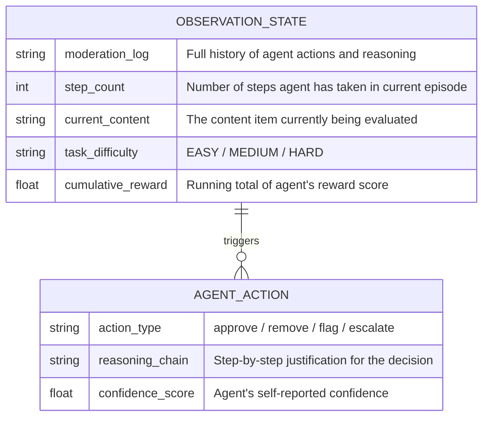

| Observation Field     | Type     | Description                                                                  |
| --------------------- | -------- | ---------------------------------------------------------------------------- |
| `moderation_log`      | `string` | Running log of all actions taken, reasoning chains, and outcomes.            |
| `step_count`          | `int`    | Tracks how many moderation steps the agent has completed in the episode.     |
| `current_content`     | `string` | The text/media currently being presented for moderation.                     |
| `task_difficulty`     | `string` | The assigned difficulty level: EASY, MEDIUM, or HARD.                        |
| `cumulative_reward`   | `float`  | The agent's running reward total, updated after every action.                |

---

### Edge Case Escalation Pipeline

Escalation is not a failure mode — it is a **strategic safety mechanism**. When the agent encounters content that is too ambiguous for a confident decision, escalation prevents catastrophic errors (false negatives or false positives) and routes the content for human review.

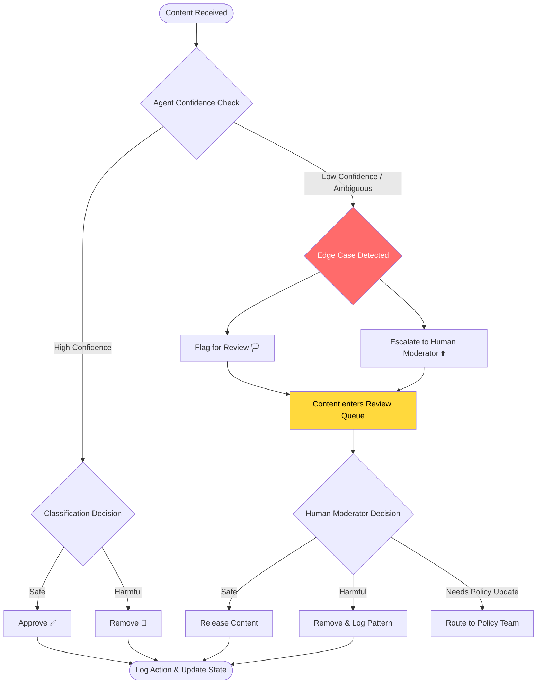

**When does escalation trigger?**
- HARD tasks with nuanced, context-dependent content where cultural sensitivity is required.
- MEDIUM tasks where the content sits exactly on a policy boundary (satire vs. genuine threat).
- Any task where the agent's confidence score falls below the decision threshold.
- Content involving coded language, whistleblower material, or legally sensitive information.

> **Reward-Driven Escalation:** Because false negatives (-0.2) are penalized more heavily than the absence of a positive reward, the agent is mathematically incentivized to escalate uncertain cases rather than guess. This ensures the system errs toward safety, which mirrors how production-grade moderation pipelines operate at major platforms.

---

### Legal & Bias Risk Management

The TrustOps-Env operates in one of the most ethically charged domains in AI. The following risks are explicitly tracked and managed:

| Risk Category                    | Severity | Description                                                                                           | Mitigation Strategy                                                                            |
| -------------------------------- | -------- | ----------------------------------------------------------------------------------------------------- | ---------------------------------------------------------------------------------------------- |
| **False Negative (Harmful slip)**| 🔴 High  | Dangerous content passes through moderation undetected.                                               | Highest penalty (-0.2); escalation mechanism; toxicity baselines as safety nets.                |
| **False Positive (Over-censor)** | 🟡 Medium| Safe content wrongly removed, eroding user trust and potentially causing legal disputes.              | Penalty (-0.1); reasoning quality evaluation prevents blind over-moderation.                   |
| **Dataset Bias**                 | 🔴 High  | Training data carries demographic, cultural, or linguistic biases that distort agent behavior.        | Zero-shot classifiers for generalization; embedding-based evaluation to detect bias patterns.   |
| **Legal / Regulatory Exposure**  | 🔴 High  | Incorrect moderation decisions leading to liability under various national/international laws.         | Simplified policy assumption isolates legal complexity; escalation routes to human reviewers.   |
| **Ethical Implications**         | 🟡 Medium| Automated decisions on speech/expression carry inherent ethical weight.                               | Full reasoning chain transparency; moderation logs available for audit and accountability.      |

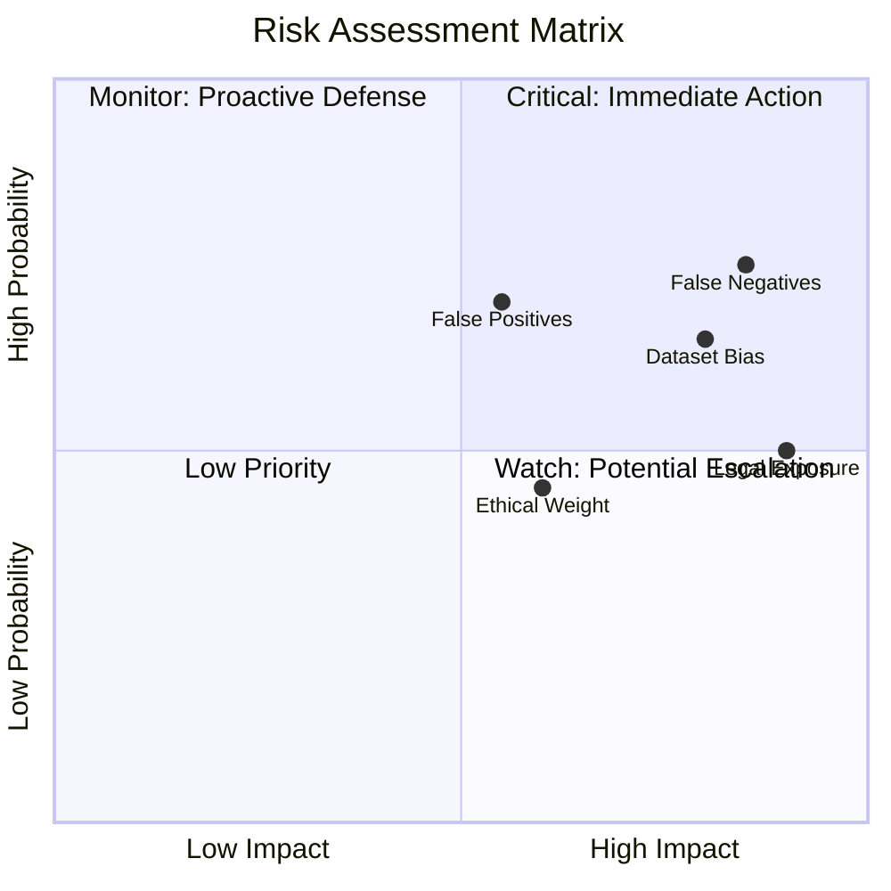

---

### Research Use Case Positioning

Because of the high complexity, ethical sensitivity, and difficulty of early monetization, TrustOps-Env is positioned primarily as a **strong research use case**, not as an immediate commercial SaaS tool.

| Dimension                     | Assessment                                                                                                |
| ----------------------------- | --------------------------------------------------------------------------------------------------------- |
| **Complexity**                | High — involves nuanced NLP, reinforcement learning, policy simulation, and real-time observability.      |
| **Monetization Potential**    | Harder to monetize early — ethical/legal constraints limit commercial deployment without extensive R&D.    |
| **Research Value**            | Very High — provides the only observable, step-by-step RL environment for social platform trust & safety. |
| **Target Users**              | AI researchers, Trust & Safety teams, policy analysts, academic institutions.                             |
| **Competitive Advantage**     | No existing tool provides real-time observable moderation simulation with structured reward mechanics.     |

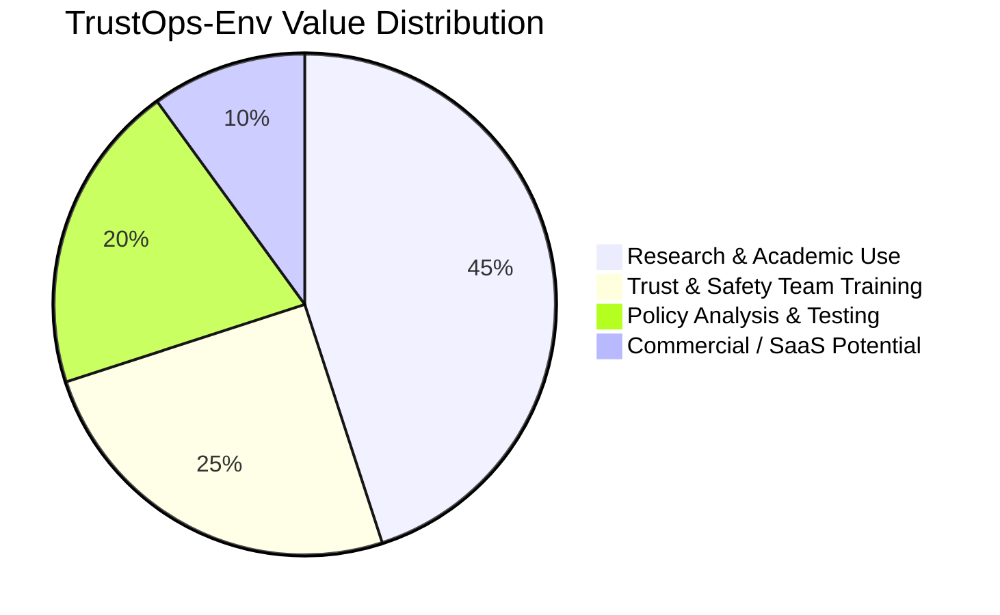

---

### Extended ER Diagram — Full System Model

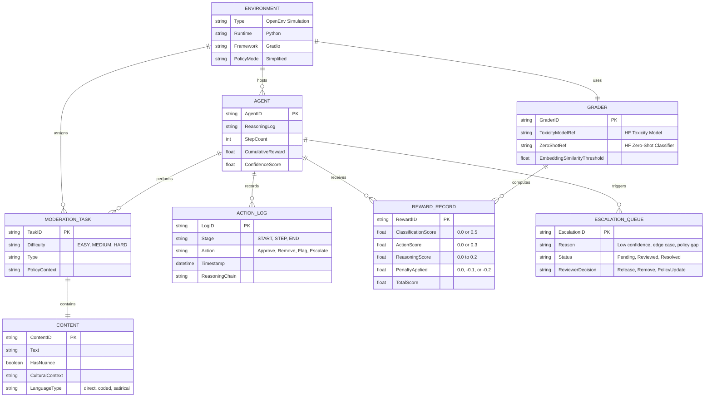

---

### Complete Production Flow — Phase Summary

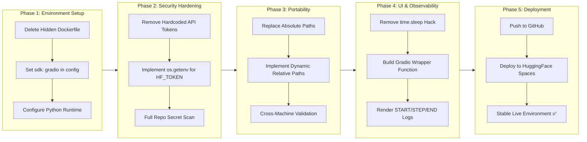

---

