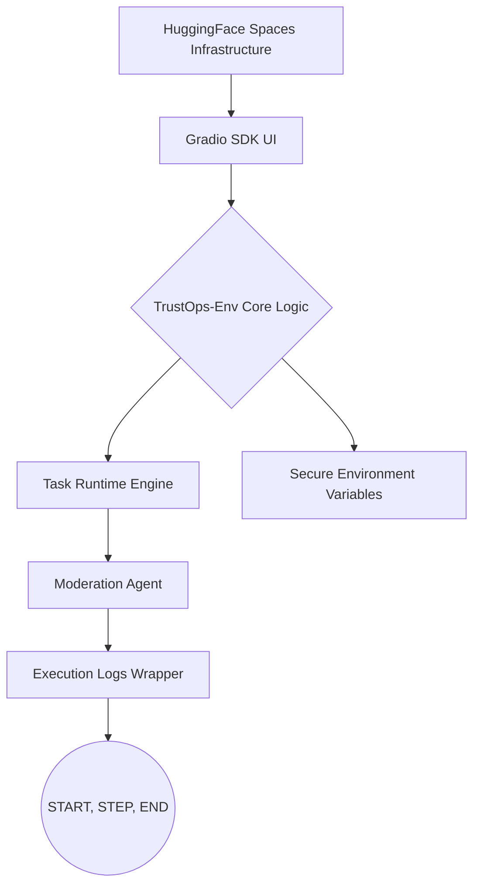
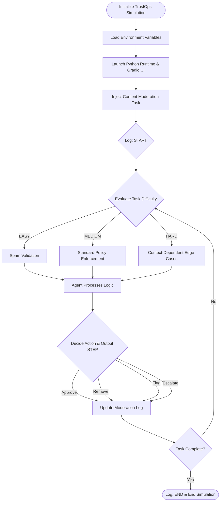
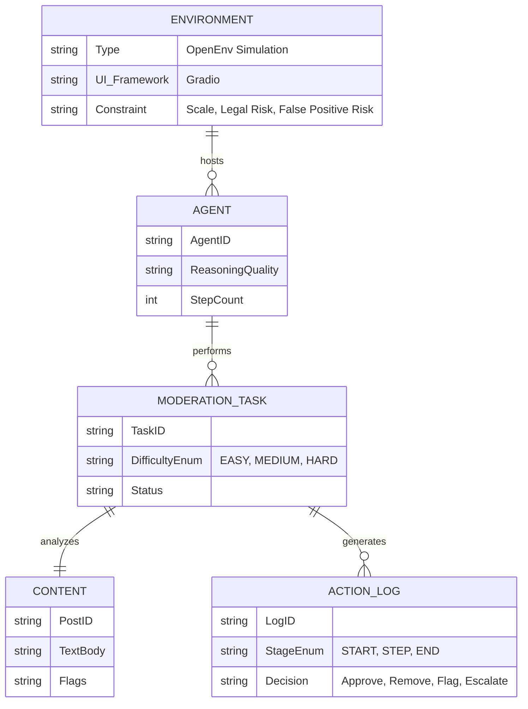

# TrustOps-Env: Core Concept and Architecture

The **TrustOps-Env** (Content Moderation & Trust Safety Environment) is designed as an open environment that simulates the content moderation pipelines used by major social platforms. Its primary objective is to deploy an AI agent capable of detecting harmful content, enforcing policies, and escalating uncertain edge cases.

## The Core Problem

While the theoretical design of TrustOps-Env was robust, the core challenge involved deployment and infrastructure. The application was failing to render properly on HuggingFace Spaces (showing a blank UI) because it incorrectly defaulted to a Docker runtime instead of the intended Python environment (`?docker=true`). 

To function as a viable research tool where users could observe the agent attempting difficult moderation challenges, the underlying deployment needed to be flawlessly executed.

## Proposed Solution

To transform TrustOps-Env from a conceptually sound but broken local script into a cleanly configured, secure, portable, and visually observable application, the developer implemented the following solutions:

- **Runtime & Framework Correction:** Permanently deleted a hidden `Dockerfile` forcing HuggingFace to use the correct Python runtime, and updated the configuration to explicitly use `sdk: gradio`.
- **UI Visibility & Observation:** Replaced a blocking hack (`time.sleep()`) with a clean Gradio UI and a wrapper function to capture backend print logs. This allowed real-time execution steps (`[START]`, `[STEP]`, and `[END]`) to be visibly rendered directly to the user.
- **Security & Portability:** Removed hardcoded HuggingFace API tokens that triggered security blocks, replacing them with secure environment variables. Replaced hard-coded local paths with dynamic relative paths for true portability.

## Key Features

- **Complexity Diversity:** Evaluates agents on tasks ranging from **EASY** (spam vs. safe) to **HARD** (nuanced, context-dependent content).
- **Log Constraints:** Real-time visibility and observation via specific log outputs (`[START]`, `[STEP]`, `[END]`) strictly evaluating reasoning and actions.
- **Action Mapping:** Measures decisions such as whether the agent will *approve*, *remove*, *flag*, or *escalate* cases.
- **Real-World Constraints Simulation:** Handing massive scale, managing legal risk, and mitigating false positives.

## System Architecture

## System Workflow

## Entity-Relationship (ER) Diagram

