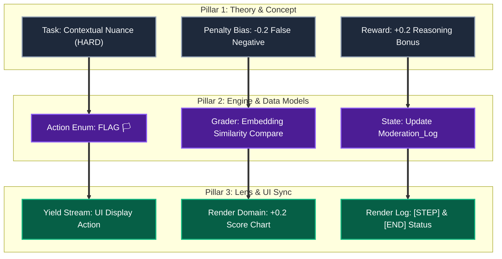
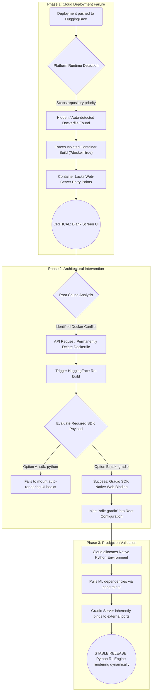
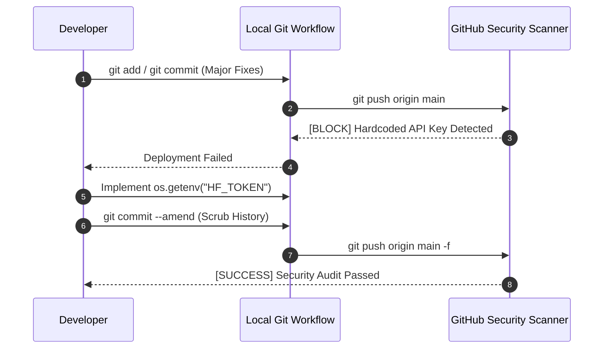
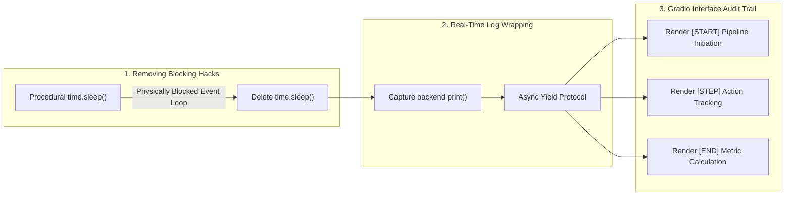

---

# TrustOps-Env : Master Blueprint & Unified Architecture

---

## Overview

Welcome to the **TrustOps-Env** Master Blueprint. This environment simulates the staggering scale and ethical complexity of content moderation on modern social media platforms. It functions as a **Reinforcement Learning (RL) sandbox**, allowing data scientists and Trust & Safety researchers to test autonomous moderation agents against nuanced, policy-rich data streams.

This `README.md` acts as the **central nexus**—mapping the theoretical problem constraints to their explicit technical data models, and definitively tracking how those models execute out to the user's graphical interface. 

---

## The Documentation Matrix

The project is governed by three heavily interlinked architectural pillars. A single conceptual constraint in Pillar 1 always translates directly into a backend model in Pillar 2, and renders explicitly in Pillar 3.

| Pillar Designation       | Context Document                                                              | Engineering Responsibility                                                                 | Output Focus                        |
| ------------------------ | ----------------------------------------------------------------------------- | ------------------------------------------------------------------------------------------ | ----------------------------------- |
| **Pillar 1: Theory**     | [`core_concept.md`](./core_concept.md)                      | Defines the foundational task complexity matrix (EASY, MEDIUM, HARD), the reward structure, and systemic risk vectors. | Reward/Penalty Policy               |
| **Pillar 2: Engine**     | [`Technical_Architecture.md`](./Technical_Architecture.md) | Enforces the strict Python `BaseModel` mappings, Action Space definitions (`APPROVE`, `FLAG`), and HF Embedding grading. | BaseData Serialization                |
| **Pillar 3: Lens**       | [`ui.md`](./ui.md)                                          | Maps backend Python execution loops to the `sdk: gradio` dashboard. Defines real-time observability (`[STEP]`). | Generator Streams / DOM Render      |

---

## Unified Concept-to-UI Architecture

The following diagram maps the structural flow of a single operational task across all three interconnected documents. It proves that no design concept sits isolated; every rule commands a technical execution that drives a UI render.

---

## The Engineering Evolution: Deployment Fixes & Git Workflow

The current production state of TrustOps-Env was forged through a rigid deployment refactoring pipeline. The initial prototype was non-functional; resolving fundamental infrastructure structure flaws was the primary vehicle for transitioning the environment into an optimized, professional state.

### Phase 1: Infrastructure and Runtime Optimization
The most critical failure during early deployment was a persistent "blank screen issue" on HuggingFace Spaces.

| Technical Deficit | Engineering Optimization | Strategic Impact |
| :--- | :--- | :--- |
| **Erronous Docker Runtime** | The platform initialized a hidden `Dockerfile` (triggering a `?docker=true` URL parameter). Developers permanently deleted this file to force a native Python runtime. | Escaped the misconfigured Docker container, allowing Python-based moderation logic to execute natively. |
| **SDK Configuration Failure** | The basic `sdk: python` configuration failed to render any interface. Overrode the `README.md` specifically to `sdk: gradio`. | Gradio SDK preserves Python-driven ML architecture while inherently supporting UI auto-rendering. |

### Phase 2: Security & Git Workflow Management
Deploying real-world applications requires strict credential protection. The Git workflow served as the final stage of deployment fixes, shifting away from a "leaky" prototype.

*   **GitHub Secret Scanning:** During an initial `git push`, automated security protocols blocked the commit because a HuggingFace API key was hardcoded in `hf_deploy.py`.
*   **Credential Protection:** Developers purged the tokens and implemented `os.getenv("HF_TOKEN")` mapping, securing the data pipeline.
*   **History Cleaning:** Developers ran `git commit --amend` to completely remove the historical footprint of the local token.
*   **Final Security Audit:** A manual review of the codebase was conducted prior to release, querying for parameters like `api_key` or `hf_` to ensure only mock placeholders (`sk-mock`) remained.

### Phase 3: Engineering for Portability
A "properly engineered state" requires code to evaluate in any environment without manual adjustments.

| Original Prototype (Leaky) | Production Standard (Engineered) |
| :--- | :--- |
| **Absolute Local Paths:** Hardcoded logic pointing to specific machine directories (`/Users/anubhavgupta/...`). | **Dynamic Path Resolution:** Replaced entirely with `os.path.abspath` and `os.path.join()`. |
| **Result:** Repository is machine-locked. Deployment to servers physically fails. | **Result:** Repository automatically calculates its current directory execution node. Fully portable scaling. |

### Phase 4: UI/UX Observability Overhaul
The final deployment phase transformed the "black box" backend operation into a highly visual auditing tool by removing execution blockers.

---

## Comprehensive System Monitoring

In the TrustOps-Env Project, monitoring is treated as a critical link between development and deployment. It evolves from hidden backend logs into a real-time observability feature designed for extremely precise debugging and absolute research transparency.

### 1. Real-time UI Observability & Log Rendering
A primary goal of the infrastructure overhaul was to ensure that monitoring was not merely a backend function, but a visibly rendered part of the user interface.
*   **Log Wrapper Function:** Developers engineered a wrapper to capture backend logs and pipe them directly into the Gradio UI.
*   **Enhanced Debugging:** This shift from backend-only logs to UI-rendered tracks significantly improves visibility, allowing developers to see exactly where the moderation pipeline is stalling.

### 2. Functional Monitoring of Agent Behavior
Monitoring is deeply integrated into the core moderation logic.
*   **Moderation Logs:** The system's `Observation` class includes a `moderation_log`—a list of dictionaries tracking every action the agent takes ("approve," "remove," or "flag").
*   **Performance Metrics:** Monitoring these operational choices allows the system to accurately calculate rewards or penalties, such as the `+0.2` score for reasoning quality, or the `-0.2` structural penalty for false negatives.

### 3. Strategic Status Tracking: `[START]`, `[STEP]`, `[END]`
The primary monitoring data rendered in real-time includes three critical status markers:
*   **`[START]`**: Indicates the initiation of the moderation pipeline.
*   **`[STEP]`**: Tracks individual actions. Because TrustOps is a high-complexity research environment, viewing step-by-step logs is essential to evaluate *how* an agent handles nuanced, context-dependent content before earning the `+0.2` reasoning reward.
*   **`[END]`**: Signals completion of the task, triggering the final algorithmic evaluations.

---

## Expanding TrustOps-Env

If you are developing against the TrustOps-Env schema, strict adherence to the tri-state architectural flow is mandatory:
1. Define the operational rule or penalty in `core_concept.md`.
2. Construct the logical action mapping or Grader rule in `Technical_Architecture.md`.
3. Assure the exact output logic intercepts cleanly into the wrapper schema for `ui.md`.

Only through rigorous architectural symmetry can the "black box" of Trust and Safety reinforcement learning finally become audible, accessible, and measurable.

---
