---

# TrustOps-Env : Security & Portability

---

## Overview

This document details the **Security and Portability** engineering interventions that were critical to the successful deployment of the TrustOps-Env project. These two concerns are deeply intertwined — both stem from the same root cause (hardcoded, static values in the codebase) and were resolved together as part of a unified engineering initiative to bring the system into a **"production based most optimised form"** and achieve a final **"properly engineered state"**.

> While the [Core Concept](./core_concept.md) covers the project's problem statement and high-level design, the [Technical Architecture](./Technical_Architecture.md) details the data models, action space, and evaluation pipeline, and the [UI](./UI.md) explains the observability layer — this document focuses specifically on how the codebase was transformed from a **broken, insecure, non-portable script** into a **production-grade, secure, and universally deployable application** through the enforcement of strict security best practices and systematic portability optimization.

---

## Engineering Optimization — The Larger Context

Security and portability are not standalone concerns — they represent a mandatory phase of the broader **Engineering Optimization** required to transition TrustOps-Env from a developer prototype into a production-ready research tool. The sources explicitly frame this work as achieving a "production based most optimised form" and a "properly engineered state."

```mermaid
flowchart LR
    classDef raw fill:#7F1D1D,stroke:#EF4444,stroke-width:2px,color:#fff
    classDef optimize fill:#1E3A8A,stroke:#3B82F6,stroke-width:2px,color:#fff
    classDef prod fill:#065F46,stroke:#10B981,stroke-width:2px,color:#fff

    subgraph Before ["Unoptimized State"]
        U1["Hardcoded secrets\nin source code"]
        U2["Hardcoded paths\ntied to one laptop"]
        U3["No security audit\nconducted"]
        U4["GitHub push\nblocked"]
    end

    subgraph Optimization ["Engineering Optimization Phase"]
        O1["Enforce env variables\nos.getenv('HF_TOKEN')"]
        O2["Enforce relative paths\nos.path.join + dirname"]
        O3["Enforce security audit\nsk-, hf_, api_key scan"]
        O4["Enforce compliance\nGitHub Secret Scanning pass"]
    end

    subgraph After ["Properly Engineered State"]
        P1["Secure repository\nzero credential exposure"]
        P2["Portable codebase\nruns on any system"]
        P3["Audit-verified\nonly mock placeholders"]
        P4["Production deployed\nHuggingFace Spaces live"]
    end

    Before --> Optimization --> After

    class U1,U2,U3,U4 raw
    class O1,O2,O3,O4 optimize
    class P1,P2,P3,P4 prod
```

**What "Engineering Optimization" Means in This Context:**

| Optimization Area          | What Was Broken                                          | What Was Enforced                                                | Result                                    |
| -------------------------- | -------------------------------------------------------- | ---------------------------------------------------------------- | ----------------------------------------- |
| **Secret Management**      | API token hardcoded in source (`hf_QOGz...`).            | Secure environment variables (`os.getenv("HF_TOKEN")`).           | Credentials abstracted from codebase.     |
| **Path Portability**       | Absolute path locked to one machine.                     | Dynamic relative resolution (`os.path.join`).                    | Code runs on any system.                  |
| **Compliance Enforcement** | No systematic secret scanning.                           | Full keyword audit (`sk-`, `hf_`, `api_key`, `token`, `secret`).  | Only mock placeholders remain.            |
| **Deployment Readiness**   | GitHub push blocked; code cannot be shared or deployed.  | Clean commit passes all GitHub security checks.                   | Stable GitHub repo + live HF Space.       |

> **The Optimization Mandate:** These were not optional improvements. The project could not function as a "strong research use case" until these engineering optimizations were complete. A research tool that leaks credentials or crashes on other machines has zero value to external collaborators. Achieving the "properly engineered state" was the mandatory prerequisite for the project to serve its intended purpose.

---

## The Security & Portability Crisis

During the Development & Deployment phase of TrustOps-Env, two intertwined engineering flaws actively blocked the project from reaching a production-ready state:

1. **Security Vulnerability:** A hardcoded HuggingFace API key (`hf_QOGz...`) was embedded directly in the deployment automation script (`hf_deploy.py`), which triggered GitHub's Secret Scanning and **blocked the code push entirely**.
2. **Portability Failure:** A hardcoded absolute file path (`/Users/anubhavgupta/Desktop/Scaler1/trustops-env`) tied the application exclusively to the original developer's machine, making it **impossible to run on any other system**.

Both issues shared a common anti-pattern: **hardcoded static values** that should have been dynamic.

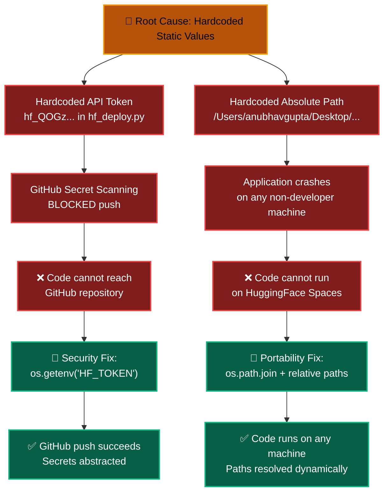

| Problem                              | Type          | Impact                                                                         | Resolution                                         |
| ------------------------------------ | ------------- | ------------------------------------------------------------------------------ | -------------------------------------------------- |
| Hardcoded `hf_QOGz...` API token    | 🔴 Security   | GitHub blocked code push; credentials exposed in source code.                  | Replaced with `os.getenv("HF_TOKEN")`              |
| Hardcoded `/Users/anubhavgupta/...`  | 🔴 Portability| Application only ran on developer's laptop; crashed on every other machine.    | Replaced with `os.path.join` relative resolution   |
| No security audit conducted          | 🟡 Compliance | Other secrets could be lurking in the codebase without detection.              | Full keyword scan for `sk-`, `hf_`, `api_key`      |

---

## Security & Portability within the Development & Deployment Lifecycle

These fixes were not isolated patches — they were the **mandatory final step** of the project's structured development workflow. The deployment could not proceed without resolving both concerns simultaneously.


> **Critical Dependency:** Phase 4 (Deployment) could NOT begin until Phase 3 (Security & Portability) was complete. GitHub's Secret Scanning actively blocked the push in Phase 4 because the Phase 3 security fixes had not yet been applied. This made security and portability the literal gateway to production deployment.

---

## Environment Variables for Secrets

### The Incident

During an attempt to push the TrustOps-Env codebase to GitHub, the push **failed completely**. GitHub's automated Secret Scanning feature detected a hardcoded HuggingFace API key (`hf_QOGz...`) inside the `hf_deploy.py` deployment script, and automatically blocked the commit to prevent sensitive credentials from leaking into a public repository.

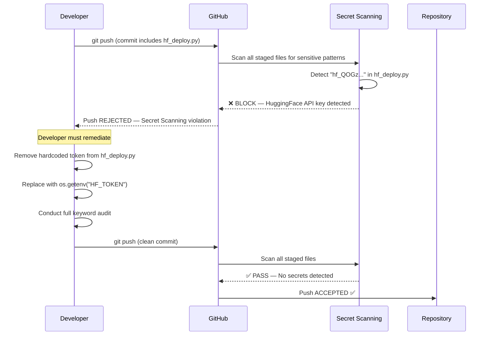

### Environment Variables for Secrets & Configuration

The shift to environment variables is a **mandatory security and operational requirement** for TrustOps-Env. All sensitive credentials and environment-specific configurations are abstracted from the source code and managed via `os.getenv()`.

### Mandatory Environment Variables

To successfully deploy, validate, and run inference against the environment, the following variables must be defined in the host or CI/CD secrets:

| Variable | Requirement | Purpose |
| :--- | :--- | :--- |
| **`HF_TOKEN`** | Mandatory | Authenticates access to HuggingFace Hub for toxicity and zero-shot models. |
| **`API_BASE_URL`** | Mandatory | Defines the API endpoint for the LLM during baseline inference. |
| **`MODEL_NAME`** | Mandatory | Specifies the model identifier (e.g., `Qwen/Qwen2.5-72B-Instruct`) to be used. |

---

### Infrastructure & Runtime Restrictions

TrustOps-Env is optimized to run within constrained environments common in automated research validation. The system is engineered to function reliably under the following **OpenEnv Infrastructure Restrictions**:

| Resource | Constraint | Architectural Response |
| :--- | :--- | :--- |
| **vCPU** | `2` | Lightweight Python runtime; non-blocking async log streaming. |
| **Memory** | `8 GB` | Efficient model loading; content queue limits. |
| **Runtime** | `< 20 minutes` | Optimized episode length (max 8 steps) for rapid validation. |

### The Fix: `os.getenv("HF_TOKEN")`

The developer executed a critical security fix by **entirely removing** the hardcoded token from the source code and replacing it with a secure environment variable call.

**Before (Vulnerable):**
```python
# hf_deploy.py — INSECURE
token = "hf_QOGz..."  # ❌ Hardcoded API key exposed in source
api = HfApi(token=token)
```

**After (Secure):**
```python
# hf_deploy.py — SECURE
token = os.getenv("HF_TOKEN")  # ✅ Token loaded from environment
api = HfApi(token=token)
```

| Aspect                     | Before (Hardcoded)                                              | After (Environment Variable)                                     |
| -------------------------- | --------------------------------------------------------------- | ---------------------------------------------------------------- |
| **Token Location**         | Embedded directly in `hf_deploy.py` source code.               | Abstracted to runtime environment; never in source code.         |
| **GitHub Compliance**      | ❌ Secret Scanning **blocks** push.                              | ✅ Secret Scanning **passes** cleanly.                            |
| **Exposure Risk**          | Token visible to anyone with repository access.                 | Token only available in the deployment runtime environment.      |
| **Rotation Capability**    | Requires code change, commit, and push to rotate token.         | Token rotated in environment without touching code.              |
| **Multi-Developer Safety** | Every clone contains the real token — single breach = total compromise. | Each developer uses their own secure environment token.     |

```mermaid
flowchart TD
    classDef insecure fill:#7F1D1D,stroke:#EF4444,stroke-width:2px,color:#fff
    classDef secure fill:#065F46,stroke:#10B981,stroke-width:2px,color:#fff
    classDef process fill:#1E3A8A,stroke:#3B82F6,stroke-width:2px,color:#fff

    subgraph Before ["❌ Hardcoded Token Flow"]
        B1["Source Code\nhf_deploy.py"] --> B2["Contains\nhf_QOGz..."]
        B2 --> B3["Pushed to GitHub"]
        B3 --> B4["Token exposed\nto all collaborators"]
        B4 --> B5["GitHub Secret Scanning\nBLOCKS push"]
    end

    subgraph After ["✅ Environment Variable Flow"]
        A1["Source Code\nhf_deploy.py"] --> A2["Contains\nos.getenv('HF_TOKEN')"]
        A2 --> A3["Pushed to GitHub"]
        A3 --> A4["No secrets in code\nGitHub passes scan"]
        A4 --> A5["At runtime: Token loaded\nfrom secure environment"]
    end

    class B1,B2,B3,B4,B5 insecure
    class A1,A2,A3,A4,A5 secure
```

### Why Environment Variables Are Architecturally Critical

The shift to environment variables is not merely a "best practice" — it is an **architectural requirement** for the TrustOps-Env system.

The environment integrates directly with HuggingFace ML models (toxicity models, zero-shot classifiers, pretrained baselines) to compute baseline comparisons for the agent's grading pipeline. These API calls require a valid `HF_TOKEN`. If the token is exposed or invalidated, the **entire evaluation pipeline breaks** — the grader cannot compute classification accuracy baselines, and the reward system produces meaningless scores.

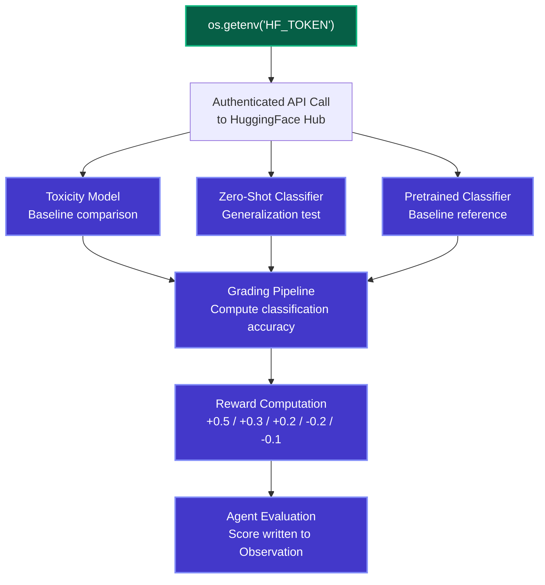

> **The Chain of Dependency:** `os.getenv("HF_TOKEN")` → HuggingFace API access → ML model baselines → Grading pipeline → Reward computation → Agent evaluation. If the first link (secure token access) is broken — through credential leakage, token revocation, or GitHub blocking — the **entire downstream evaluation architecture collapses**.

---

## Relative Path Resolution

### The Portability Problem

The initial TrustOps-Env codebase relied on a hardcoded absolute file path:

```python
# BEFORE — Non-portable
base_dir = "/Users/anubhavgupta/Desktop/Scaler1/trustops-env"
```

This single line created a **fundamental portability failure**: the application was permanently tethered to the original developer's specific laptop. Any attempt to run the code on a different machine — whether a colleague's workstation, a CI/CD pipeline, or HuggingFace Spaces — would result in an immediate `FileNotFoundError` crash.

### The Fix: Dynamic Relative Path Resolution

The developer replaced the static absolute path with Python's dynamic path resolution functions:

```python
# AFTER — Fully portable
base_dir = os.path.join(
    os.path.dirname(os.path.abspath(__file__)),
    "trustops-env"
)
```

**How Each Function Contributes:**

| Function                        | Purpose                                                                              |
| ------------------------------- | ------------------------------------------------------------------------------------ |
| `__file__`                      | Returns the path of the currently executing Python script.                           |
| `os.path.abspath(__file__)`     | Converts the script's path to an absolute path (resolves symlinks and `.` references).|
| `os.path.dirname(...)`          | Extracts the directory containing the script (strips the filename).                  |
| `os.path.join(..., "trustops-env")` | Appends the target folder name relative to the script's detected directory.      |

**Result:** The script automatically detects where it is currently located on any filesystem, then constructs the correct path to the `trustops-env` directory relative to itself. No hardcoded machine-specific paths involved.

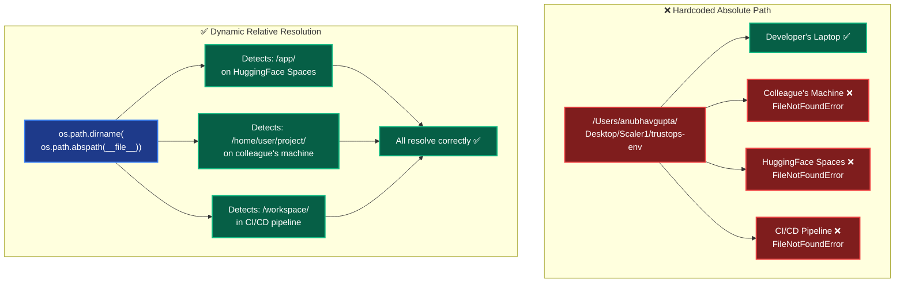

### Cross-System Execution Matrix

| Deployment Target              | Hardcoded Path Result        | Relative Path Result          |
| ------------------------------ | :--------------------------: | :---------------------------: |
| **Original developer laptop**  | ✅ Works (coincidentally)    | ✅ Works                       |
| **Colleague's machine**        | ❌ FileNotFoundError          | ✅ Auto-detected               |
| **HuggingFace Spaces**         | ❌ FileNotFoundError          | ✅ Auto-detected (`/app/`)     |
| **GitHub Actions CI/CD**       | ❌ FileNotFoundError          | ✅ Auto-detected               |
| **Docker container (any)**     | ❌ FileNotFoundError          | ✅ Auto-detected               |
| **Colab / Notebook**           | ❌ FileNotFoundError          | ✅ Auto-detected               |

> **Why Portability is a Research Requirement:** TrustOps-Env is positioned as a "strong research use case" meant to be used by AI researchers, Trust & Safety teams, and policy analysts across different institutions. A non-portable codebase defeats this purpose entirely — no external researcher could run the simulation without manually editing file paths first. Dynamic path resolution transforms the project from a personal script into a **universally cloneable research tool**.

---

## GitHub Security Compliance

### How GitHub Secret Scanning Works

GitHub Secret Scanning is an automated security feature that analyzes every file in a commit for patterns matching known API key, token, and credential formats from major service providers (including HuggingFace, AWS, Google Cloud, etc.).

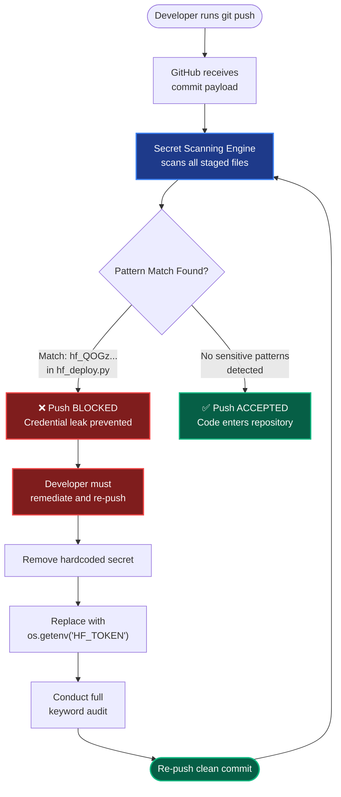

### The TrustOps-Env Incident

| Step | What Happened                                                                                                  |
| :--: | -------------------------------------------------------------------------------------------------------------- |
| 1    | Developer completed all runtime and UI fixes and attempted to push the full codebase to GitHub.                 |
| 2    | `git push` was executed, sending the commit containing all project files including `hf_deploy.py`.             |
| 3    | GitHub Secret Scanning detected the pattern `hf_QOGz...` — a known HuggingFace API key format.                |
| 4    | **Push was automatically rejected.** GitHub displayed a security violation notice.                               |
| 5    | Developer opened `hf_deploy.py` and **removed the hardcoded token entirely**.                                  |
| 6    | Token reference was replaced with `os.getenv("HF_TOKEN")` — the actual key now lives only in the environment.  |
| 7    | Developer conducted a **full project-wide keyword audit** (searching for `sk-`, `hf_`, `api_key`).             |
| 8    | Audit confirmed only safe mock placeholders (e.g., `"sk-mock"`) remained — no real secrets in codebase.        |
| 9    | Amended commit was pushed successfully. GitHub Secret Scanning passed cleanly. ✅                               |

### The Final Security Audit

After remediating the `hf_deploy.py` token, the developer did not assume the rest of the codebase was clean. A **comprehensive project-wide audit** was conducted to catch any other potential credential leaks.

**Audit Keywords Scanned:**

| Keyword Pattern | What It Catches                                            | Result in TrustOps-Env             |
| --------------- | ---------------------------------------------------------- | ---------------------------------- |
| `sk-`           | OpenAI API keys, Stripe secret keys, generic secret keys.  | ✅ Only `"sk-mock"` placeholder.   |
| `hf_`           | HuggingFace API tokens.                                    | ✅ Removed — replaced with env var. |
| `api_key`       | Generic API key variable names across any provider.        | ✅ Clean — no real keys found.      |
| `token =`       | Hardcoded token assignments in Python scripts.             | ✅ Replaced with `os.getenv(...)`.  |
| `secret`        | Secret variable names, secret manager references.          | ✅ No real secrets found.           |

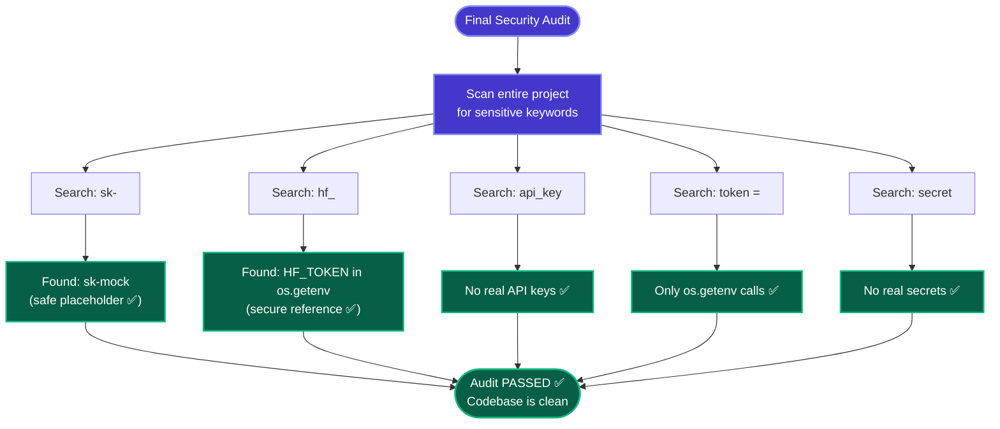

> **Why a Full Audit, Not Just a Single Fix:** Removing one known exposed token is not sufficient for production security. The developer recognized that other files, test scripts, or configuration files might also contain secrets introduced during development. The full keyword audit provided systematic assurance that the entire codebase — not just the known offending file — was free of credential exposure.

---

## The Interdependency: Security × Portability

Security and portability are not independent fixes — they are **two manifestations of the same engineering anti-pattern** (hardcoded static values) and were resolved as a unified initiative.

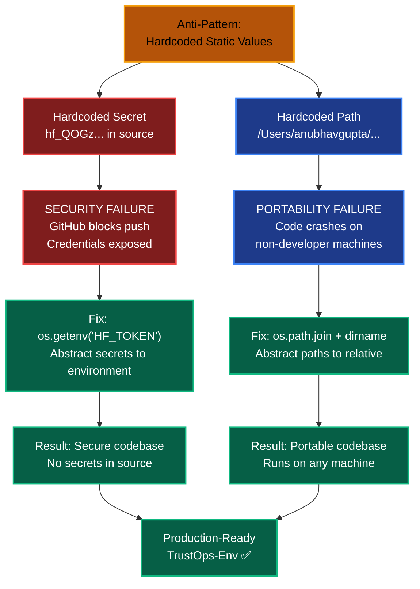

| Dimension         | Security Fix                                      | Portability Fix                                     | Shared Pattern                           |
| ----------------- | ------------------------------------------------- | --------------------------------------------------- | ---------------------------------------- |
| **What was hardcoded** | API token (`hf_QOGz...`)                     | File path (`/Users/anubhavgupta/...`)               | Static values embedded in source code.   |
| **Where it broke** | GitHub (Secret Scanning blocked push)             | Any non-developer machine (FileNotFoundError)       | Failed during deployment/execution.      |
| **How it was fixed** | `os.getenv("HF_TOKEN")`                        | `os.path.join(os.path.dirname(os.path.abspath(__file__)), ...)` | Replaced static with dynamic resolution. |
| **Why it matters** | Prevents credential leaks; enables token rotation.| Enables cross-machine, cross-platform execution.    | Both required for production deployment. |

> **Joint Engineering Principle:** Both fixes follow the same architectural principle — **never hardcode values that vary between environments**. Secrets vary between developers (each has their own token). Paths vary between machines (each has a different filesystem layout). By abstracting both to runtime-resolved values, the codebase becomes environment-agnostic.

---

## Security & Best Practices — Engineering Standards

The security interventions in TrustOps-Env were not ad-hoc patches — they represent the enforcement of formal **security best practices** to elevate the project into a "properly engineered state." Each fix directly addresses a specific violation of industry-standard development practices.

### Best Practice Framework Applied

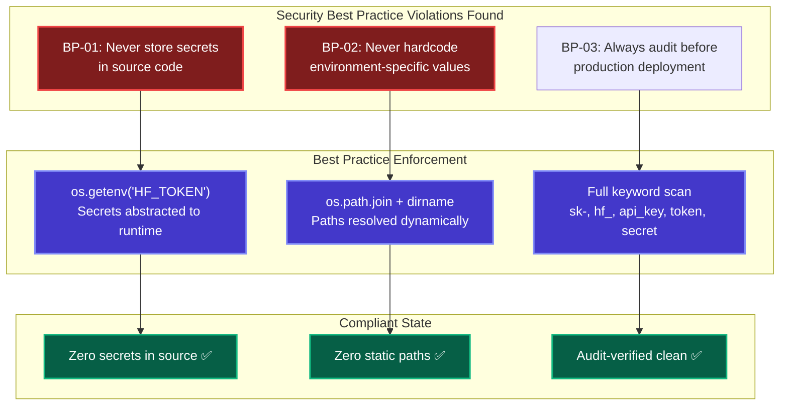

| Best Practice ID | Standard                                   | Violation in TrustOps-Env                                     | Enforcement Applied                               |
| :--------------: | ------------------------------------------ | ------------------------------------------------------------- | ------------------------------------------------- |
| **BP-01**        | Never store secrets in source code.        | `hf_QOGz...` hardcoded in `hf_deploy.py`.                    | Replaced with `os.getenv("HF_TOKEN")`.             |
| **BP-02**        | Never hardcode environment-specific values.| `/Users/anubhavgupta/...` locked to one machine.              | Replaced with `os.path.join` relative resolution. |
| **BP-03**        | Audit all files before production release. | No systematic scan conducted prior to deployment attempt.     | Full keyword scan across entire project.          |
| **BP-04**        | Use only safe placeholders in test data.   | Potential for real secrets in test/dev config files.           | Confirmed only `"sk-mock"` placeholders remain.   |

### Secret Management via `os.getenv` — As a Best Practice Pattern

The use of `os.getenv("HF_TOKEN")` is not just a fix for the TrustOps-Env security incident — it is the **industry-standard optimal method for secret management** in Python applications. Its architectural benefits extend far beyond resolving a single GitHub push failure.

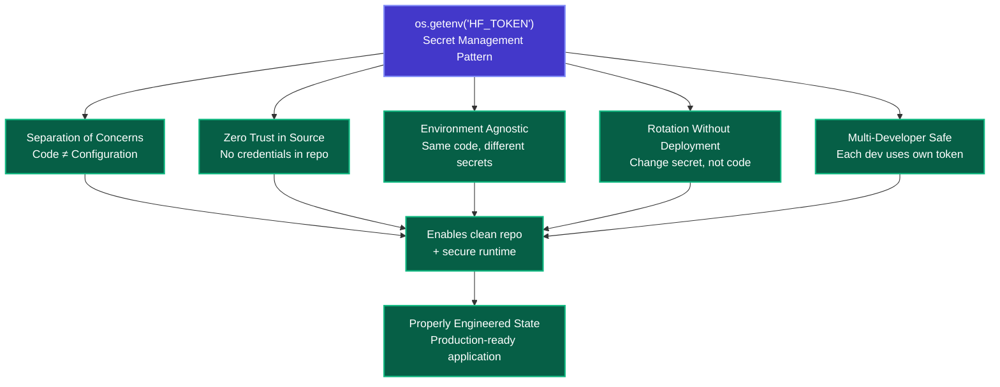

| Benefit                          | How `os.getenv` Provides It                                                                            |
| -------------------------------- | ------------------------------------------------------------------------------------------------------ |
| **Separation of Concerns**       | The code defines *what* token is needed (`HF_TOKEN`); the environment provides *which* token to use.   |
| **Zero Trust in Source**         | The actual credential never appears in any file that is committed, pushed, or shared.                  |
| **Environment Agnostic**         | The same codebase runs in dev, staging, and production — only the environment variable value changes.  |
| **Rotation Without Deployment**  | When a token is compromised or expires, it is rotated in the environment without any code change.      |
| **Multi-Developer Safety**       | Each collaborator sets their own `HF_TOKEN` — no shared secret, no single point of compromise.         |
| **CI/CD Integration**            | Pipeline secrets are injected as environment variables natively — `os.getenv` integrates seamlessly.   |

> **The Defining Step:** Implementing `os.getenv` for secret management was identified as the defining step in elevating TrustOps-Env to a "properly engineered state." It was not a minor cleanup task — it was the intervention that unblocked the GitHub push, enabled secure HuggingFace API integration, and ensured no future collaborator would inherit an exposed credential in data.

---

## Removed Hardcoded API Keys — Best Practice Deep-Dive

The removal of hardcoded API keys was a **mandatory intervention** to align TrustOps-Env with security best practices. This section examines the removal as a distinct engineering action with architectural consequences.

### What Was Removed

The `hf_deploy.py` deployment automation script contained a HuggingFace API key (`hf_QOGz...`) **directly embedded in the Python source code**. This key was used to authenticate API calls during the automated deployment of the TrustOps-Env application to HuggingFace Spaces.

### Why Direct Exposure Is a Severe Vulnerability

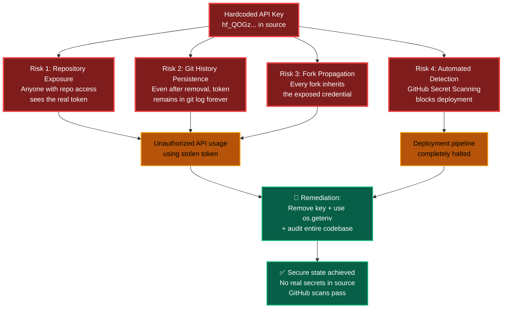

| Risk Vector                    | Severity | Impact on TrustOps-Env                                                    |
| ------------------------------ | :------: | ------------------------------------------------------------------------- |
| **Repository exposure**        | 🔴 High  | Any collaborator or viewer can extract the token and make unauthorized API calls. |
| **Git history persistence**    | 🔴 High  | The token persists in git history even after the file is edited. Requires history rewriting or token rotation. |
| **Fork propagation**           | 🟡 Med   | Public forks inherit the token, expanding the attack surface beyond the original repo. |
| **Automated detection blocks** | 🔴 High  | GitHub Secret Scanning actively prevents deployment, halting the entire workflow. |

### The Removal Process

The developer did not simply delete the token and move on — they followed a structured remediation process that aligns with security best practices:

1. **Identify:** The vulnerability was discovered when GitHub Secret Scanning blocked the push — the system detected `hf_QOGz...` as a known HuggingFace token pattern.
2. **Remove:** The hardcoded token was **permanently removed** from `hf_deploy.py`.
3. **Replace:** The token reference was replaced with `os.getenv("HF_TOKEN")` — the secure environment variable pattern.
4. **Audit:** A comprehensive project-wide scan was conducted for keywords (`sk-`, `hf_`, `api_key`, `token =`, `secret`) to ensure no other secrets existed.
5. **Verify:** The audit confirmed only safe mock placeholders (`"sk-mock"`) remained across the entire codebase.
6. **Deploy:** The amended commit was pushed to GitHub successfully, passing all Secret Scanning checks.

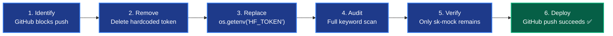

> **Best Practice Enforcement:** The developer did not treat this as a one-off fix. By conducting a full audit after the targeted remediation, they established a systematic verification process — ensuring that the "properly engineered state" was achieved across the **entire** codebase, not just the single offending file.

---

## Deployment Configuration Files

The security and portability fixes directly impacted two critical deployment configuration files:

### `hf_deploy.py` — Deployment Automation Script

This script automates the process of pushing the TrustOps-Env application to HuggingFace Spaces. It was the primary site of both the security vulnerability and the portability issue.

| Change Made                                    | Category      | Before                                          | After                                                   |
| ---------------------------------------------- | ------------- | ----------------------------------------------- | ------------------------------------------------------- |
| API token handling                             | 🔐 Security   | `token = "hf_QOGz..."`                          | `token = os.getenv("HF_TOKEN")`                         |
| Base directory resolution                      | 📂 Portability | `base_dir = "/Users/anubhavgupta/Desktop/..."`  | `base_dir = os.path.join(os.path.dirname(os.path.abspath(__file__)), "trustops-env")` |

### `README.md` — HuggingFace Space Configuration

The README metadata controls how HuggingFace Spaces interprets and boots the application. While the primary security/portability fixes targeted `hf_deploy.py`, the README was also updated to ensure the correct runtime:

| Change Made                          | Category      | Before                              | After                              |
| ------------------------------------ | ------------- | ----------------------------------- | ---------------------------------- |
| SDK declaration                      | ⚙️ Runtime    | Ambiguous / Docker-inferred          | `sdk: gradio` (explicit)           |

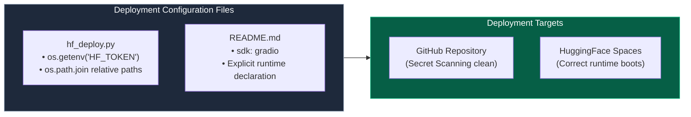

---

## Security & Portability — Before vs After

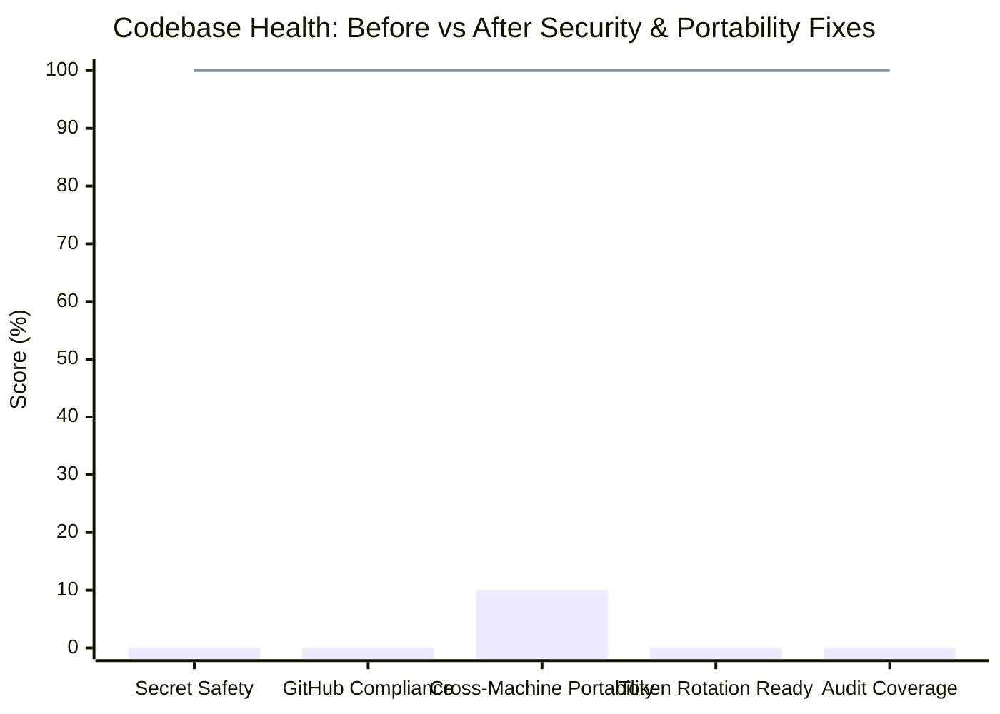

| Metric                         | Before (Broken)                                                        | After (Fixed)                                                            |
| ------------------------------ | ---------------------------------------------------------------------- | ------------------------------------------------------------------------ |
| **Secrets in Source Code**     | ❌ `hf_QOGz...` exposed in `hf_deploy.py`.                             | ✅ Zero real secrets. Only `"sk-mock"` placeholders remain.              |
| **GitHub Push Status**         | ❌ Blocked by Secret Scanning.                                          | ✅ All pushes pass cleanly.                                              |
| **Cross-Machine Execution**   | ❌ Crashes with `FileNotFoundError` on any non-developer machine.       | ✅ Runs on any machine via `os.path.join` dynamic resolution.            |
| **Token Rotation**             | ❌ Requires code edit, commit, and push to change token.                | ✅ Token changed in environment only — no code changes needed.           |
| **Security Audit**             | ❌ No systematic scan conducted.                                        | ✅ Full keyword audit: `sk-`, `hf_`, `api_key`, `token =`, `secret`.    |
| **HuggingFace Integration**   | ❌ Token exposed; could be revoked by HuggingFace at any time.          | ✅ Token securely loaded at runtime via `os.getenv`.                     |
| **Research Collaboration**    | ❌ No external researcher can clone and run the project.                | ✅ Instantly cloneable; each researcher uses their own secure env token. |

---

## ER Diagram — Security & Portability System

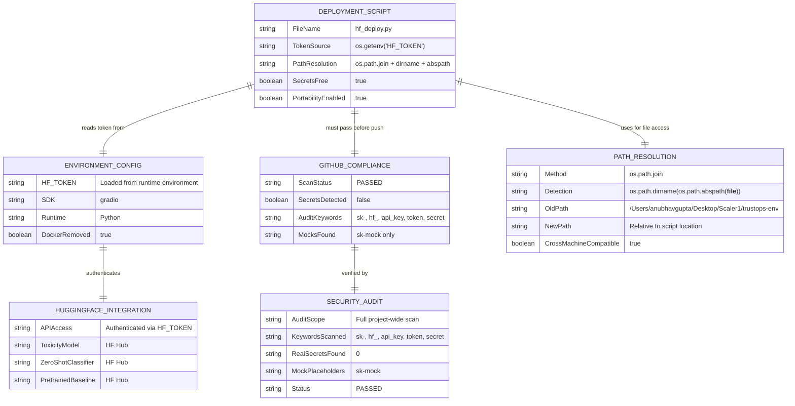

---

## Impact on the Broader System

The security and portability fixes do not exist in isolation — they enable every other component of the TrustOps-Env technical architecture to function in production.

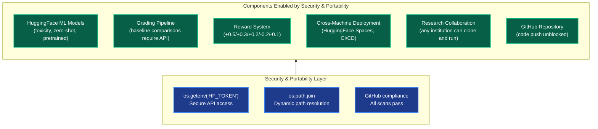

| Downstream Component                | Depends On Security Fix                    | Depends On Portability Fix                  |
| ----------------------------------- | ------------------------------------------ | ------------------------------------------- |
| **HuggingFace ML Model Access**    | ✅ Requires valid, secure `HF_TOKEN`.       | —                                           |
| **Grading Pipeline**               | ✅ API calls for baseline comparisons.      | —                                           |
| **Reward Computation**             | ✅ Grader depends on ML model baselines.    | —                                           |
| **GitHub Repository**              | ✅ Secret Scanning must pass.               | —                                           |
| **HuggingFace Spaces Deployment**  | ✅ Token for deployment automation.         | ✅ Paths must resolve in `/app/` container.  |
| **Cross-Machine Execution**        | —                                           | ✅ Dynamic paths for any filesystem layout.  |
| **Research Collaboration**         | ✅ Each researcher uses own secure token.   | ✅ Each researcher's machine has unique paths.|
| **CI/CD Pipelines**                | ✅ Token injected as pipeline secret.       | ✅ Paths resolve in pipeline workspace.      |
| **Competition Validation**         | ✅ Mandatory `API_BASE_URL` and `MODEL_NAME`.| ✅ Constraints: 2 vCPU / 8GB RAM / <20min. |

> **The Conclusion:** Resolving the security and portability flaws was the mandatory final engineering step — the critical phase of **Engineering Optimization** — that transformed TrustOps-Env from a non-deployable, insecure, developer-locked script into a **"properly engineered state"**: a clean, secure, universally portable production application deployed in its **"production based most optimised form"** — stably hosted on HuggingFace Spaces and safely open-sourced on GitHub. By systematically eliminating every hardcoded element — API tokens replaced with `os.getenv`, absolute paths replaced with `os.path.join`, and the entire codebase verified through a comprehensive security audit — the developer enforced the strict security best practices required for the application to serve its intended research use case.
